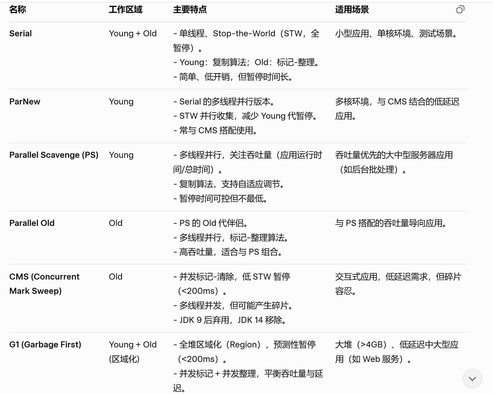
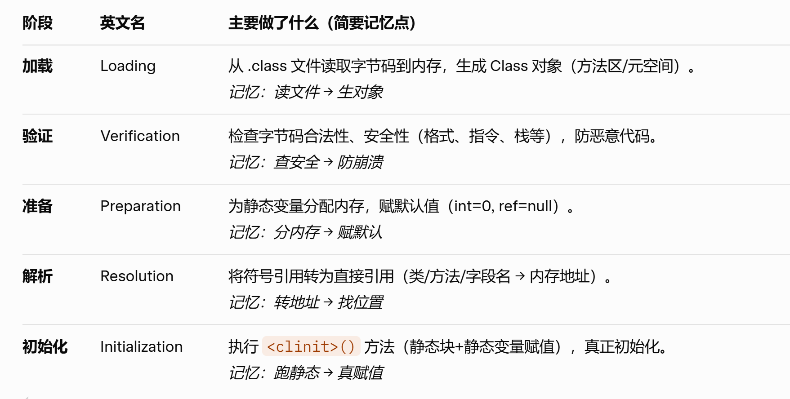
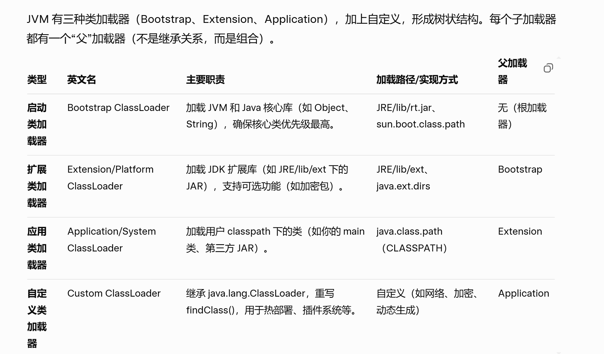

## 一、常见主要问题
### 1、JVM 里面常见的 3 种常量池
Class 文件常量池、运行时常量池、字符串常量池。

关注运行时常量池和字符串常量池随着 JDK 版本更新所在位置的变化。

**相互关系**：Class 文件常量池 → 加载后形成运行时常量池 → 字符串常量池从中分离（JDK 7+）。它们共同支持 JVM 的“类加载-链接-初始化”过程。

各种方式创建的字符串在堆中的存储位置。

### 2、元空间实现的方法区的回收机制

方法区存储的类信息（类元数据）、运行时常量池、静态变量、JIT 即时编译器编译的内容。

JDK8之前永久代实现的方法区内容的回收，是在 Full GC 的时候进行回收，每次 Full GC 都会对方法区的内容进行回收，效率低，GC 的 STW 时间较长。

元空间实现的方法区，Full GC 期间进行类卸载检查和回收（类似于永久代），但不是每次 GC 都触发。JVM 会延迟检查以减少开销，只有当元空间使用率高（接近阈值）时，才在 Full GC 中执行卸载。
虽然类卸载通常在 Full GC 中发生，但元空间 GC 不像像永久代那样“强制 Full GC”，而且回收时不扫描整个堆，只针对类加载器和引用链，速度比永久代快 2-5 倍。

### 3、类卸载的条件

- **无类实例存在**: 该类的所有对象实例（包括数组）已被 GC 回收，无任何强引用指向它们。
- **无 Class 对象引用**: 该类的 Class 对象（通过 Class.forName() 或反射获取）无任何引用。
- **类加载器无引用链**: 加载该类的 ClassLoader（类加载器）本身无引用，且该加载器加载的所有其他类无引用。
  
### 4、类创建的过程

JVM 里面常见一个类（new）包括：**类加载检查、内存分配、对象头初始化、实例变量赋值 和 构造函数执行。** 这个过程从 new 指令或反射调用开始，确保对象在堆中正确分配内存并初始化数据。

#### （1）类加载检查

- 执行 new 指令时，先从常量池获取符号引用；
- 通过类加载器（ClassLoader）检查类是否已加载（加载 → 链接 → 初始化），如果未加载，触发类加载：Bootstrap/Extension/Application Loader 加载 .class 文件，生成 Class 对象。

#### （2）内存分配

在堆（Heap）中分配对象大小（对象头 + 实例字段 + 对齐填充）。

分配方式：
  - 指针碰撞（Bump the Pointer）：空闲内存连续时，移动指针。
  - 空闲列表（Free List）：内存碎片时，维护链表分配。
  
并发安全：使用 CAS（Compare-And-Swap）或 TLAB（Thread Local Allocation Buffer，线程本地缓存）预分配。

#### （3）对象头初始化 

设置对象头（Object Header）：
  - Mark Word（64 位）：哈希码、GC 分代年龄、锁标志、偏向锁等（动态格式）。
  - Klass Pointer：指向方法区 Class 对象（类型信息）。

#### （4）实例变量赋值

为所有实例字段（非静态）赋默认值（int=0, boolean=false, 引用=null 等）

（3）与（4）合并为对象初始化

#### （5）构造函数执行

执行 <init>() 方法（实例初始化方法），包括：调用父类 <init>（super()）、执行实例代码块、赋值显式字段值、调用用户构造函数。完成后，返回对象引用给调用者。

### 5、指针碰撞和空闲列表这两种内存分配算法如何保证分配内存时候的线程安全

在 JVM（HotSpot 实现）中，内存分配是多线程环境下的高频操作，因此指针碰撞和空闲列表算法都需确保线程安全，避免并发分配导致的内存覆盖或数据不一致。

主要通过 **原子操作（如 CAS）和线程本地缓冲（TLAB）** 机制实现。TLAB 是核心优化：每个线程预分配一块私有缓冲区，在缓冲内分配无需同步；缓冲耗尽时，再从全局堆原子申请新 TLAB。

#### （1）指针碰撞

**TLAB 机制：**

每个线程在 Eden 区（新生代）预申请一个 Thread Local Allocation Buffer（TLAB），大小通常为 16KB-1MB。在 TLAB 内，使用指针碰撞分配：线程独占缓冲，无需锁，直接原子更新本地指针（bump-the-pointer）。
TLAB 耗尽时，线程使用 CAS（Compare-And-Swap）从全局 Eden 区原子申请新 TLAB。如果申请失败，退化为全局同步。

优点：分配路径快（几条指令），减少锁竞争；GC 时，TLAB 未用空间直接丢弃。

**CAS 原子操作（全局回退）**：

当无 TLAB 或大对象分配时，使用 CAS 比较并交换全局空闲指针，确保只有一个线程成功移动指针，避免覆盖。

#### （2）空闲列表

**细粒度锁或 synchronized**：

JVM 对空闲列表加 synchronized 锁（Java 层）或 OS 互斥锁（底层），确保原子访问链表。优点是实现简单，缺点是锁粒度大时竞争激烈。
**分配过程**：加锁 → 搜索合适块（First Fit/Best Fit） → 取出块 → 解锁。
**回收时**：加锁 → 插入碎片块 → 解锁。

**CAS 原子操作（优化路径）**：

适用于低竞争场景，重试机制处理失败。

### 6、对象主要包含哪几部分

普通对象主要由对象头、实例数据和对齐填充组成，数组对象额外包含数组长度字段。对象大小通常为 8 字节对齐（64 位 JVM），总大小 = 对象头 + 实例数据 + 填充。

### 7、内存泄露的原因

#### （1）静态集合不当使用
静态集合持有大量无用对象引用，未及时清理，导致 GC 无法回收（静态对象只有在类卸载的时候才会被回收，类卸载的要求较为严格）。

**案例描述**：静态 HashMap 不断添加用户对象，但未移除过期项，导致所有对象无法被 GC 回收。
~~~ java
import java.util.HashMap;
import java.util.Map;

public class StaticCollectionLeak {
    private static final Map<String, User> userCache = new HashMap<>();  // 静态集合

    static class User {
        String name;
        User(String name) { this.name = name; }
    }

    public static void main(String[] args) {
        for (int i = 0; i < 100000; i++) {  // 模拟大量添加
            userCache.put("user" + i, new User("User" + i));  // 未移除，泄漏
            System.out.println("Added user" + i);
            if (i % 10000 == 0) {
                try { Thread.sleep(100); } catch (InterruptedException e) {}  // 延时观察
            }
        }
    }
}
~~~

#### （2）未关闭的资源（字节流、Socket、数据库连接）

资源对象持有外部引用（如文件句柄、连接池），未调用 close()，导致引用链断不开。

**案例描述**：在循环中打开文件输入流，但未关闭，导致流对象和底层文件句柄持续占用内存。

~~~ java
import java.io.FileInputStream;
import java.io.IOException;

public class ResourceLeak {
    public static void main(String[] args) {
        for (int i = 0; i < 10000; i++) {  // 模拟多次打开文件
            try {
                FileInputStream fis = new FileInputStream("test.txt");  // 未 close()
                byte[] buffer = new byte[1024];
                fis.read(buffer);  // 读取但不关闭
                System.out.println("Read file " + i);
            } catch (IOException e) {
                e.printStackTrace();
            }
            // 缺少 fis.close(); 导致泄漏
        }
    }
}
~~~

#### （3）长生命周期对象持有短生命周期引用

案例描述：静态单例持有临时请求对象列表，未释放，导致所有请求对象存活。

#### （4）线程池或线程未正确关闭

案例描述：创建 ExecutorService，但未调用 shutdown()，导致线程和任务对象积累。
~~~ java
import java.util.concurrent.ExecutorService;
import java.util.concurrent.Executors;

public class ThreadPoolLeak {
    public static void main(String[] args) {
        ExecutorService executor = Executors.newFixedThreadPool(10);  // 未 shutdown()

        for (int i = 0; i < 100000; i++) {
            final int taskId = i;
            executor.submit(() -> {  // 提交任务，但线程池不关闭
                try { Thread.sleep(10); } catch (InterruptedException e) {}
                System.out.println("Task " + taskId + " executed");
            });
        }
        // 缺少 executor.shutdown(); 导致线程和任务引用泄漏
    }
}
~~~

### 8、常见的垃圾收集器及其特点
JVM 里面常见的垃圾收集器如下：

各种垃圾收集器详细的介绍与图例参考：https://javaguide.cn/java/jvm/jvm-garbage-collection.html#%E5%9E%83%E5%9C%BE%E6%94%B6%E9%9B%86%E5%99%A8

### 9、各个JDK版本默认的垃圾收集器组合

JVM 的默认垃圾收集器取决于 JDK 版本、运行环境（Server vs. Client）和硬件配置（如 CPU 核心数、内存大小）。早期 JDK 区分 Server（多核、大内存）和 Client（单核、小内存）模式。

### 10、STW 时间和吞吐量的含义

- **STW (Stop-The-World) 时间**：指垃圾收集过程中，JVM 强制暂停所有应用线程（“全世界停顿”）的时间。暂停期间应用（用户线程）无法响应（如 UI 卡顿、网络延迟）。STW 短意味着 GC 对应用干扰小，通常通过并发/并行设计实现（如 CMS/G1 的并发阶段减少 STW）。

- **吞吐量**：指应用有效运行时间占总 CPU 时间比例，即 “应用运行时间 / (应用运行时间 + GC 时间)”。高吞吐表示 GC 开销低，应用高效利用资源，通常通过并行多线程和简单算法实现。

应用场景如下：
- STW 时间短的垃圾收集器适用于：低延迟（Low-Latency）应用。这些应用对响应时间敏感，不能容忍长暂停。例如，Web 服务、在线交易、游戏服务器——用户交互需毫秒级响应。推荐：CMS、G1、ZGC、Shenandoah（STW <200ms，甚至 <10ms）。
  
- 吞吐量高的垃圾收集器适用于：高吞吐（High-Throughput）应用。这些应用注重整体处理量，而非即时响应。例如，后台批处理、科学计算、大数据分析——允许偶发长 GC，但追求最大 CPU 利用。推荐：Parallel Scavenge + Parallel Old（吞吐 >95%）。

### 11、类加载过程
VM 加载类的过程分为 5 个阶段，口诀：载（加载）- 验（验证）- 准（准备）- 析（解析）- 初（初始化）

- **加载**：类加载器（ClassLoader）负责从外部源（如文件系统、JAR包、网络）获取类的二进制字节流（.class 文件），并将其加载到 JVM 内存中。
    - 读取 .class 文件的二进制数据（包括魔数 0xCAFEBABE、版本号、常量池、类信息、字段/方法表等）。
    - 将字节流转换为 JVM 内部数据结构（如方法区中的运行时常量池）。
    - 在堆中创建一个代表该类的 java.lang.Class 对象，作为类的元数据入口（用于反射等操作）。
  - 
通过全类名（e.g., "com.example.MyClass"）唯一标识类；如果已加载，直接返回。支持多种来源：本地文件、远程网络、加密文件，甚至动态生成字节码

- **解析**：支持懒解析（Lazy Resolution）：仅在首次使用时解析（如方法调用时），而非全提前解析，提高启动速度。
- **初始化**：执行类的初始化方法 <clinit>()（隐式生成），真正赋予静态变量正确值，并执行静态代码块。

### 12、类加载器以及双亲委派模型

VM 的类加载过程依赖于类加载器（ClassLoader）子系统，它负责将 .class 文件加载到内存，并通过双亲委派模型确保**加载的安全性和一致性**。

#### （1）类加载器

类加载器是 JVM 的运行时组件，负责加载、链接和初始化类。它不是单体，而是层次化的委托结构，每个加载器都维护一个已加载类的命名空间（**通过全类名 + 加载器唯一标识**）。同一个类如果由不同加载器加载，会被视为不同的类（即使字节码相同）。

类加载器的层次结构如下：

#### （2）双亲委派模型

双亲委派模型核心思想：**子加载器不急于自己加载类，而是先“委托”父加载器尝试；父加载失败（返回 null）后，子加载器才“自己动手”**。这通过 ClassLoader.loadClass(String name, boolean resolve) 方法实现。

执行流程（步骤详解）：
- **检查缓存**：先查本加载器的已加载表（findLoadedClass(name)），若命中，直接返回 Class 对象（避免重复）。
- 委托父加载器：调用父加载器的 loadClass(name)，递归向上（直到 Bootstrap）。如果父链顶（Bootstrap）也失败，返回 null。
- 父失败，自加载：本加载器调用 findClass(name) 尝试加载（自定义加载器需重写此方法，默认从文件系统读 .class）。
- 链接与初始化：加载成功后，如果 resolve=true，触发验证/准备/解析阶段；后续使用时再初始化。
- 缓存结果：成功加载的 Class 存入本加载器的缓存。

优点
- 安全性：核心类（如 java.lang.String）优先由 Bootstrap 加载，防止用户自定义类覆盖；
- 一致性：同一类总由最高优先级加载器加载，避免版本冲突
- 高效性：缓存 + 委托减少重复加载；懒加载（仅需时解析）优化启动时间。

#### （3）双亲委派的破坏与应对

双亲委派模型尽管强大，但某些场景需打破（如动态加载）：

- SPI（Service Provider Interface）：如 JDBC，核心接口由 Bootstrap 加载，但实现类在用户 JAR，由线程上下文加载器（Thread.currentThread().getContextClassLoader()）加载。
  
- 热部署/模块系统：Tomcat/OSGi/Spring Boot 用自定义加载器（如 WebAppClassLoader）先自加载，再委托父。
  
- JDK9+ 模块化：Jigsaw 引入模块路径，部分绕过委派，但核心仍遵循。

破坏方式：**重写 loadClass() 跳过委托，或用自定义 findClass 从网络/加密源加载。**

### 13、发生 OOM 是否一定会导致JVM退出？何时会导致 JVM 退出

发生 OOM 不一定导致 JVM 退出，因为 OOM 是 Error 子类（继承自 Throwable），默认不会被 catch（因为 Error 通常表示系统级问题），但可以手动捕获（try-catch）。如果不捕获，当前线程会异常终止。

**线程级**：只影响抛出 OOM 的线程，其他线程继续运行。
**JVM 整体**：JVM 只有在所有 **非守护线程（non-daemon threads）** 终止时才会退出。如果应用是多线程的（如 Web 服务器），一个线程 OOM 不会立即杀掉 JVM。

JVM 退出的几种情况：
- 程序正常运行完：所有 **非守护线程（non-daemon threads）** 终止时会退出
- System.exit() 被调用：在代码中的任何位置调用 System.exit()，JVM会立刻开始终止过程
- 遇到无法恢复的错误：当 JVM 遇到一个无法恢复的系统错误，如操作系统信号（kill -9）、资源耗尽，它可能会立即退出。

## 二、常见案例以及回答

### 1、垃圾收集器该如何选择，你们业务服务主要使用的是什么垃圾收集器

#### （1）理论基础
首先，大部分情况下我们使用 JVM 默认的垃圾收集器即可，JVM 会根据：CPU 核心数、系统内存、JDK 版本，自动选择一个在吞吐量、延迟和内存占用之间平衡最好的收集器。

现代收集器（尤其是 G1/ZGC/Shenandoah）已经非常智能，除非你对延迟（低于10ms）或大堆（>100GB） 有极端要求，否则默认 GC 足够优秀。调整垃圾收集器的收益有限。

对于JDK 8以及之前版本的 JDK，默认使用的垃圾收集器是“Parallel Scavenge + Parallel Old”，适合批处理或高吞吐业务。对于 JDK9 以及以后版本的 JDK，默认使用的垃圾收集器是G1，G1 平衡系统对吞吐量与延迟的需求。JDK21 之后，ZGC、Shenandoah 都已足够稳定，可在低延迟/超大堆场景中替代默认 G1。**我们大部分服务都是使用的默认的垃圾收集器。**

如果真的要自己来选择垃圾收集器，主要看三个维度：
- 应用场景：在线服务优先考虑延迟，批处理任务优先考虑吞吐量
- 内存规模：堆内存大小决定了适合的GC类型
- JDK版本：不同版本有不同的默认和可选GC
  
**常见的选择是**：
- 4GB以下：ParNew + CMS 或 Parallel GC
- 4-32GB：G1 GC（JDK 9+默认）
- 32GB以上：ZGC 或 Shenandoah（低延迟要求）"

#### （2）调优实战
参考下面 JVM 调优案例（包含垃圾收集器调整）。

### 2、JVM 调优案例

#### （1）理论知识

JVM 调优通常涉及以下几个关键方面：

- 内存管理调优（Memory Tuning）
  - 堆内存（Heap）大小配置： 调整 Eden 区、Survivor区和老年代的大小比例，如使用 -Xms（初始堆大小）和 -Xmx（最大堆大小）。
  - 非堆内存（Non-Heap）配置： 调整元空间 Metaspace 或永久代 (Permanent Generation，仅旧版JVM) 的大小。

- 垃圾收集器（Garbage Collector,GC) 调优
  - 选择合适的 GC 算法，根据应用特点（例如：追求高吞吐量还是低延迟）选择 Serial, Parallel, CMS, G1, ZGC, Shenandoah 等。
  - 调整 GC 相关的参数： 例如 GC 线程数、GC触发条件、最大暂停时间目标等。
  
- 即时编译器（Just-In-Time Compiler, JIT) 调优
  - 调整 JIT 编译相关的参数，例如**优化级别、内联阈值**等，以提高热点代码的执行效率。
  
- 线程管理与同步优化例如
  - 调整线程栈大小、监控线程死锁、优化锁的使用等。

#### （2）调优案例
参考 JVM 调优实战案例的文章

#### 3、几个重要的JVM指标如何查看（容器部署）：
1、总体的线程数：容器云监控的 PROC 指标下面可以查看容器中实际的进程数和线程数
2、full gc次数（其他young gc也是一样的），可以在开启监控 Javaagent 之后，在 应用监控--基础监控--GC查看-GC 查看
3、GC 暂停时间（GC时间），可以在开启监控 Javaagent 之后，在 应用监控--基础监控--GC查看-GC 查看
4、吞吐量：GC时间越短吞吐量越大。
5、GC线程数：一开始的时候就设置好的
6、线程池队列长度：应用监控--基础监控--ThreadPool--详情

#### 4、观察到告警的话术

有一天我收到一系列的告警，包括内存使用率超过90%、Full GC频繁发生、GC暂停时间过长等。登录监控平台后，我发现内存使用呈阶梯式上升，每次GC后回落幅度很小，线程池队列长度持续增长，CPU使用率相比之前也有一定的提升，且GC线程占比异常。通过分析GC日志和代码，我确定了问题的根源在于监听器使用了无界队列的线程池，并且缺乏有效的缓存管理机制。

#### 5、解决的话术

我首先通过代码审查和内存分析，确定了三个主要问题：线程池配置不合理、缺乏批处理机制和缓存无限增长。
然后我制定了五阶段优化计划，逐步进行优化：
- 线程池优化：将无界队列替换为有界队列，调整线程池参数
- 实现批处理机制：添加批处理队列和处理线程，提高处理效率
- 优化缓存管理：限制缓存大小，实现定期清理机制
- JVM参数调优：调整堆内存设置和GC参数
- 垃圾收集器实验：对比G1 GC和Parallel GC的性能表现
  
通过这些优化，系统内存使用从峰值接近90%降至稳定在50-60%，Full GC频率从每小时多次降至每天1-2次，单节点处理能力提升了一倍多。

一开始就是对内存做了扩容，避免后续业务流量增长对应用稳定性的影响。

#### 6、heap dump 和 stack dump
heap dump 和 stack dump 主要用于诊断特定问题（如**内存泄漏或线程死锁**）。

Heap dump 是 JVM 堆内存的快照（通过 jmap、jcmd 或 -XX:+HeapDumpOnOutOfMemoryError 生成），包含：

- 堆中所有对象、类、实例、引用关系。
- 内存占用细节（如每个对象的空间使用）。
- 部分线程栈信息（因为线程是 GC roots，有时会包含在 dump 中）。

Stack dump 是线程栈的快照（通过 jstack、jcmd Thread.print 或 kill -3 生成），包含：

- 所有线程的 ID、状态（RUNNABLE、BLOCKED、WAITING 等）、栈帧（调用栈）。
- 线程数和潜在死锁信息。

监控平台上可以设置 FullGC 告警触发自动 dump 功能，可以在业务容器发生FullGC告警时自动触发 Jvm 的 heap dump 和 thread dump，并将产生的dump 文件上传到OSS，方便用户下载分析。

除此之外，平台对开启自动 dump 功能的服务也提供了手动 dump 的相关功能，在有需要的时候可以手动触发dump。

### 3、开发的过程种有没有遇到过内存泄露，是怎么检测的，怎么解决的

找一个内部内存泄露的案例，最好涉及 nginx/nacos/kong 内存泄露的案例

### 4、CPU 过高、内存飙高、频繁 Full GC、内存泄露怎么排查
-- GC 日志如何查看
-- 结合公司内部监控进行排查

