## 1、项目综述

### 1、项目定义

**定位**：这个项目本质上不是一个简单的 Chat API 服务，而是一个 **集团内部统一的外部大模型接入、治理、运营与计费平台。**

**解决的问题：**

- **统一接入**：业务方不直接各自对接 Azure/OpenAI、AWS Bedrock、Gemini、阿里、火山等厂商。
- **统一鉴权**：业务系统通过统一的 API Key / Access Token 接入，平台识别业务系统和真实用户。
- **统一治理**：模型权限、黑名单、限流、预算阈值、断流、资源调度在平台统一控制。
- **统一统计**：按系统、用户、模型、部门、场景记录调用量、token、费用和账单归因。
- **统一扩展**：文本/多模态能力由 `mip-chat-app` 承载，语音/视频等长任务由 `aigc-multimedia` 承载，未来再演进到 Higress AI 网关 + `ai-core` 新架构。

### 2、旧架构项目代码分析

#### （1） `mip-chat-admin`

定位：老架构的控制面与管理后台。

主要职责：
- **业务方基础信息设置**
- **模型与模型费用管理**
- **账号池管理**
- **账单、费用、使用统计**
- 权限、角色、模块管理
- Prompt 工程、脱敏服务、操作日志等后台管理能力

这部分不直接转发模型请求，但它决定了：
- 谁可以接入
- 能访问哪些模型
- 单价怎么配置
- 超预算后怎么治理
- 账号池和席位资源怎么运营

#### （2）`mip-chat-app`

定位：老架构的在线文本/多模态数据面，也是当前最核心的运行时服务。

主要职责：

- 暴露 `/external/**` 统一外部接口
- 识别调用方 `system/appKey`
- 识别真实用户 `AIGC_USER`
- **做模型权限、黑名单、限流、费用阈值、断流校验**
- **将统一模型名路由到具体厂商适配器**
- **将模型路由到可用资源配置（资源池/账号池，必要时再路由到最终厂商账号或客户端实例**
- **透传同步/流式/标准协议响应**
- **保存调用主记录、问答内容、token、费用**
- 暴露 `/metrics` 供 Prometheus 抓取运行指标

#### （3）`aigc-multimedia`

定位：老架构的异步多媒体数据面。

主要职责：

- 文生视频、图生视频
- 语音转写、会议记录、音频翻译
- 异步任务状态机、轮询、回调、OSS 落盘
- MQ 发送、费用上传、失败补偿

从实现风格看，它更像“任务编排平台”，不是简单的同步代理服务。

### 3、新架构项目代码分析

#### （1）`ai-core`

定位：新架构里的核心数据面与调度内核。

根据 README 和代码结构，它承担的是：

- AI 账号池调度数据面
- 对外 OpenAI 兼容协议入口
- 账户/租户/模型权限校验
- 候选资源构建、资源预占、上游转发、调用结算
- Postgres + Redis 的控制面/运行态分层
- `/metrics` 指标暴露

可以把它理解为：把老项目中越来越重的“在线调度 + 上游适配 + 额度仲裁”能力沉淀成一个更平台化的数据面服务。

#### （2）`mcn-gw-wasm-plugins`

定位：新架构中 Higress AI 网关的数据面插件工程。

当前已能看到的插件类型包括：

- `midea-ai-billing`
- `midea-ai-cache`
- `midea-ai-load-balancer`
- `midea-ai-proxy`
- `midea-log-pusher`
- `midea-4A-sso`
- `midea-4A-user-check`

这说明未来很多横切能力会从业务服务中下沉到网关插件层。

## 2、项目关键点解析

### Q1：用户请求路由解析+token 制&席位制解析

用户在发起一次大模型请求的时候，决定使用哪一个大模型的路由包含 3 个：**模型实现路由、资源池路由、厂商客户端路由**。

可以把这三个路由理解成一条请求在平台内部逐层“缩小范围”的过程，不是一次就直接落到最终厂商账号。

#### （1）模型实现路由

最上层是“模型实现路由”。它解决的问题是：这个请求应该交给哪一类适配器处理，即根据请求里的 model，选择哪一个 AigcApi 实现来处理。比如用户传的是 claude-3-5-sonnet，平台先判断这属于 Claude 模型族，就交给 Claude 的 AigcApi 实现；如果是 gemini-2.5-pro，就交给 Gemini 实现。

**这个阶段选的是“处理这类模型的代码实现”，不是具体账号，也不是具体资源**。

#### （2）资源池路由

中间层是“资源池路由”。当平台已经知道“这是一条 Claude 请求”以后，还要决定“用哪一组 Claude 资源去打”。因为同一个模型往往会配置多条资源，比如多个 URL、多个 API Key、多个节点、不同权重的通道。这里需要在该适配器内部，选择一条可用资源配置（url/apiKey/modelName）。

**这层可能来自普通 chat.resource 配置，也可能来自账号池分配出来的 ChatGptConfig。**
解决的问题是“这次调用具体用哪组连接参数”。

#### （3）厂商客户端路由

最底层是“厂商客户端路由”。有些厂商的资源配置下面还会再细分一层真实执行单元，一条资源后面可能有多个真实执行端（**多账号、多region、多client**）。

最典型的是 Claude 走 Bedrock：资源池里选出来的 ChatGptConfig 可能只说明“走这组 Bedrock 资源”，但这组资源后面还挂着多个 AWS 账号、多个 region、多个同步/异步 client。这时还要再做一次选择，比如**随机、轮询、指定名称**，最终落到某个具体 Bedrock client。这个阶段选的是“真正发请求的厂商账号/客户端”。

在 OpenAI 兼容链路里，这层常表现为“账号池/seat 资源选择”。

#### （4）串起来

把它们串起来，就是：
- 用户传入模型名
- 平台先按模型族找到对应适配器
- 适配器再从这个模型的资源池里选一条资源配置（token制或者席位制，常规使用 token，小龙虾/agent使用席位制）
- 如果该资源后面还有多个厂商账号/client，再继续选最终执行端；最后才真正发请求到上游模型

拿 Claude 举例最容易讲：
- 用户请求 claude-3-5-sonnet，平台先判定这是 Claude，进入 Claude 适配器
- Claude 适配器从 chat.resource 里选一条 Claude 可用资源，这条资源对应的是某组 Bedrock 账号
- ClientSelectionStrategy 再从多个 Bedrock client 里挑一个，最终由这个 client 调 AWS Bedrock

**所以一句话概括就是：**
- 模型实现路由：决定“谁来处理这类模型”
- 资源池路由：决定“用哪条资源配置去处理”
- 厂商客户端路由：决定“最终由哪个真实厂商账号/client 发请求”

#### （5）一些细节

##### （1）资源池的绑定细节

适配器确定后，还要决定“用哪个真实账号/URL/API Key 发请求”。有两条路径：
- **普通资源池**：chat.resource 里按 modelKey 选 ChatGptConfig（含 modelkey、apikey、url等调用信息）
- **账号池/席位池**：先按 appKey+model 找 poolCode，再在池里按**用户绑定、容量、冷却**等策略选具体资源。（席位池是最近新加的逻辑，目前只有`OpenAiExternalController`有，但是面试的时候可以说都覆盖了。）

##### （2）普通资源池的选择原理
厂商根据 token 来进行计费，其流程如下

- 先从 chat.resource.config[] 中筛 enable=true 且 modelKey=当前模型 的资源候选（配置来源）
- 再交给 LoadBalancer 选一条资源，你当前 SIT 配置是 chat.loadBalancer=quotaBased，即配额优先策略
  - quotaBased 细节：先看 Redis 中该模型哪些 key 还有可用配额；若都超限则降级到候选集内“加权+粘性/随机”；粘性是 userId#modelKey 哈希，权重来自 weight（默认 1）
    - 这里选还有可用配额的模型，选取 score >= maxTokens（maxTokens 不是固定值，取决于每次请求：常见是“**预估输入 token + 请求的输出上限**“）
    - 如果可用集合为空（都超限），降级回基础候选集 configList 继续选，这里都超限还回退，意义在于它是可用性优先的软门控，不是硬拒绝，避免因为 Redis 短时不一致/重建窗口造成全量拒绝，业务可继续服务，后续再由预算/账单治理闭环，如果你要“严格超限即拒绝”，这是另一种策略，需要在入口直接 fail-fast。
    - 粘性：offset = hash(userId#modelKey) % totalWeight，同一用户同模型尽量稳定命中同一路由区间，无粘性则随机偏移命中。权重：weight<=0 视为 1；按累计权重区间命中。
  - apiKey 额度在 Redis ZSet 里，写入时机有两类：
    - 初始化/重置：定时任务 recoverQuotaJob（一分钟执行一次） 每次会重建所有模型的 quota ZSet（先删后加，TTL 5 分钟）。初始额度来自枚举 AigcModelQuotaEnum，即会限制模型一分钟内最高调用的 token 数。
    - 调用后扣减：每次调用保存记录时，会按本次 totalToken 对当前 modelKey + apiKey 的 score 做负向扣减。同时，也会记录用户的 token 使用量和费用情况并记录到数据库，然后每天有定时任务去采集数据做预算报表。这里需要注意的是，第一版是先使用（限额）后出报表之后再和用户收费用。
    - TPM = Tokens Per Minute，每分钟可处理的 token 吞吐配额。

##### （3）席位池的选择原理

对厂商侧：厂商按人头卖 seat（每 seat 对应一个或少量可并发用户的 key 资源），我们把这些资源入池。**这里一个厂商提供的 seat 可以调用多种不同的模型，之前厂商提供的 token 也可以调用这个厂商提供的多种不同的模型。**

对用户侧：用户只拿平台发的 API Key，完全不感知厂商 key；调用时平台按 appKey + model + user 去池里调度真实资源。

资源数据模型（一行就是一个 seat 资源单元）在 openai_api_key_pool_resource：pool_code/api_key/api_url/model_configs/max_user_count/status/seat_code。model_configs 决定这个 seat 支持哪些模型，以及模型名映射和计费码映射。如下图：

并发控制靠 max_user_count 和 Redis 绑定/容量键实现，即“一个 seat 只能给 1 或少量用户”。

管理面功能包含：资源详情 + 当前绑定用户数 + 当前绑定账号列表。这里 seat 的信息目前暂时是调用接口来入库的。

**详细的调度流程：**

- 请求进入 OpenAI 兼容入口，完成鉴权与治理校验，拿到 system(appKey) 和 userId。
- 服务层先做“是否走席位池”的路由：按 appKey（systemcode） + modelKey -> poolCode。即查看这个系统及对应的模型名称是否有对应的资源池。如果存在，进入席位调度核心。席位制是否命中取决于 appKey + model 是否在配置中心里配置了 poolCode，也就是说，如果用户系统申请使用席位制（目前是人工通知），这个时候我们就将用户的系统+要使用的模型信息写入配置中心，这样相关系统的调度就会走席位制（如果有资源）。
- 第一步“先复用已绑定”：查 USER_BINDING_KEY，若绑定资源可用且支持当前模型，直接续约返回。
- 第二步“亲和复用”：若无活跃绑定，尝试复用最近一次资源，减少抖动和切换成本。
- 第三步“最空闲窗口抢占”：若亲和复用失败，从 CAPACITY_ZSET_KEY 取占用最小的前 N 个候选，过滤冷却/停用/不支持模型的资源，再随机取一个尝试占用。窗口和重试次数由配置控制。抢占用 Lua 原子执行，保证并发安全：同时更新 user->resource、resource->users、容量计数，并检查 max_user_count。
- 抢占成功后，把资源组装为 ChatGptConfig 返回，包含 openAiPoolCode/openAiPoolResourceId、modelName、responseModelCode。
- 上游调用时如果命中账号级 429，会把该资源冷却移出候选池，再抛可重试异常；入口层重试 1 次，通常会切到其他席位资源。

资源池的调用流程为：
~~~mermaid
flowchart TD
    A["前置配置：业务确认走席位制"] --> B["配置中心写入路由 appKey(system)+model -> poolCode"]
    B --> C["维护池资源（当前接口维护，后续界面化） poolCode 下 apiKey/apiUrl/model_configs/max_user_count/status/seat_code"]

    D["用户请求 /external/openai/v1/chat/completions 携带 App-Access-Token + AIGC_USER + model"] --> E["鉴权与解析 得到 appKey(system) + uid + model"]
    E --> F{"查配置中心路由 appKey+model 是否命中 poolCode?"}

    F -->|否| G["走普通 Token 调度 chat.resource 选资源"] --> H["调用上游并返回"]
    F -->|是| I["进入席位池调度 acquireChatGptConfig(poolCode, model, uid)"]

    I --> J["1. 复用已绑定资源"]
    J --> K{"复用成功?"}
    K -->|否| L["2. 亲和复用（最近资源）"]
    L --> M{"复用成功?"}
    M -->|否| N["3. 最空闲窗口抢占 从容量ZSet选前N候选"]
    N --> O["Lua原子占用 校验max_user_count 更新 user->resource / resource->users / capacity"]
    O --> P{"占用成功?"}
    P -->|否| N
    K -->|是| Q["得到 ChatGptConfig"]
    M -->|是| Q
    P -->|是| Q

    Q --> R["按 apiKey+apiUrl+modelName 调上游厂商"]

    R --> S{"是否429且账号级限流?"}
    S -->|否| T["正常返回"]
    S -->|是| U["资源冷却写入 capacity ZSet（负分）"]
    U --> V["入口触发一次重试（重新调度）"]
    V --> I

    subgraph Redis运行态
      R1["user->resource openai:pool:{pool}:user:{uid}"]
      R2["resource->users(zset) openai:pool:{pool}:res:users:{resourceId}"]
      R3["capacity/cooldown(zset) openai:pool:{pool}:cap"]
    end

    O -.写入.-> R1
    O -.写入.-> R2
    O -.写入.-> R3
    U -.冷却更新.-> R3

~~~

**这里冷却一个 key 的具体机制是：**

- 当上游返回 429 且判定为账号级限流，取当前资源的 poolCode + resourceId，调用 cooldownResource。
- 冷却实现不是删数据，而是在容量 ZSet openai:pool:{pool}:cap 里把该 resourceId 的 score 设为负的冷却到期时间戳（-cooldownExpireAt）。
- 调度候选只取 score >= 0 的资源，所以这个资源会暂时被排除，不再被选中。冷却时长默认 5 小时，可配置。
- 后续 ensureCapacityRegistered/recoverExpiredCooldownResources 会把冷却到期资源恢复回候选池。（亲和复用失败需要选择一个可用的池资源的时候执行冷却到期恢复）

##### （4）一个真实的调用案例

这里`OpenAiExternalController`这个接口类为例，这个类是提供给小龙虾使用的。

用户调用 POST /external/openai/v1/chat/completions，body 里 model=qwen-plus
- 入口接收请求，校验模型、权限、限流，见`OpenAiExternalController`，后面进入 OpenAiServiceImpl，按模型名选适配器（模型实现路由）
- 先尝试账号池路由：按 system(appKey)+model 找 poolCode，如果命中池，按**用户绑定/容量/冷却**挑选具体资源（账号池路由）
- 如果没命中账号池，则走普通资源池 chat.resource 选 ChatGptConfig（资源路由）
- 用选中的 apiUrl + apiKey + modelName 发真实上游请求（客户端落点），若账号池资源命中 429，可在入口触发一次重试

**汇总：先按模型选“哪类适配器代码”，再按策略选“哪条资源配置”，最后再落到“哪个真实账号/客户端”，这是三层路由，不是一层。**

##### （5）Token 制 vs 席位制：各自好处

Token 制 好处：
- 成本与用量线性，按量计费清晰。
- 高并发友好，一个厂商 key 可服务大量用户。
- 接入与扩容简单，适合通用问答和大规模流量场景。
- 对业务方几乎无“席位占用”心智负担。

席位制 好处：
- 适配厂商“按人头/席位”商业模型，采购与合规更匹配。
- 资源隔离更强，可做用户绑定与并发上限控制，服务稳定性更可控。
- 便于做账号池运营：启停、解绑、冷却、回收、容量管理。
- 对高价值用户或特定场景可提供更稳定的资源保障。
- 席位制用于小龙虾时省 50% 费用

**实践上通常是“双模并存”：**
- 通用流量走 Token 制。
- Coding/Agent 等强资源约束场景走席位制。

面试说法:
> 平台早期以 Token 制为主，解决统一鉴权、模型授权、限流和费用治理；后期为适配厂商人头售卖方式，新增席位制能力，并通过账号池调度把多组真实 API Key 抽象成 pool/seat，对用户做绑定、容量控制、冷却切换和后台运营管理。

##### （6）Claude->Bedrock 这类 SDK 场景的说明

对于 apikey 下面还有一层的厂商，如`Claude->Bedrock`，请求的顺序如下：

- 请求层（外部入参）：model/messages/stream/... 从接口进来，进入统一调用链。
- 平台编排层：选 AigcApi 适配器（模型实现路由），Claude 模型走 Claude 适配器。
- 资源层（ChatGptConfig）：常见字段：modelKey/apiKey/url/modelName/responseModelCode/...
- Bedrock账号层（配置中心）：amazon.bedrock.configs[].name/awsAccessKeyId/awsSecretAccessKey/region/service/enabled
- 这种模式需要引入 Claude SDK，先在配置中心维护 amazon.bedrock.configs（name/ak/sk/region/enabled），启动时根据配置初始化同步/异步 Bedrock client map，运行时按 AK 过滤 + 负载策略（随机，指定 name）选具体 client，用选中的 client 调 converse/converseStream。

**总结：对于普通调用模式，是直接 HTTP url + Bearer apiKey 调上游，而Claude-Bedrock不是直接按 URL 发 HTTP，而是走 AWS SDK client（签名、region、credentials 都在 SDK 客户端里）。**

##### （7）席位制请求返回429

下游返回 429 且错误码是账号级限流，时，先把该资源打入冷却，再抛 OpenAiPoolRetryableException。入口层捕获后只重试一次，并在响应尚未提交时 reset() 后重调，这次会重新调度到其他资源。冷却实现是把资源从容量候选集中暂时移除。

设计收益：
- 减少用户侧直接失败
- 避免同一个已限流账号被连续命中
- 不做多次重试，控制尾延迟和放大效应

这机制主要是席位/池化模式的稳定性保护，不是 token 模式的通用机制。

### Q2：鉴权、风控、流量限制与预算断流流程说明

#### （1）整体流程
##### （1）用户身份预校验（AIGC_USER）

LoginNameInterceptor 在进入 Controller 前执行。它会读取 AIGC_USER，校验用户在组织/4A中的有效性，并写入 UserUtils 线程上下文，后续限流、统计、归因都使用这个用户标识。

##### （2）系统鉴权 + 黑名单拦截（App-Access-Token）

@CheckAccessToken 触发 AccessTokenAspect。
核心动作：
- 读取 App-Access-Token 并用 aesKey 解密为 AccessKeyDto(appKey,time,aKey)；
- 校验 appKey 对应系统是否存在（接入系统合法）；
- 校验签名 MD5(secretKey + time)；
- 校验 token 时效（1小时）；
- 将 system(appKey) 写入 request：request.setAttribute("system", appKey)；
- 校验黑名单：isUserBlack(userName, appKey)，命中直接拒绝。

##### （3）请求参数解析与基础合法性检查

进入 OpenAiExternalController#doStandardMode(...)：

- 解析请求体中的 model、stream 等字段；
- 若 stream=true，补齐 stream_options.include_usage=true；
- 校验 checkOpenAiMode(model)，不合法模型直接拒绝。

##### （4）模型权限 + 核心治理入口

调用 checkUtil.checkModel(model, system)，这里是最关键治理点：

- 校验系统是否存在；
- 校验系统模型白名单（fdModels）是否包含当前模型；
- 执行 flowControl(system, model)：**时段阈值限流 + 费用阈值检查**；
- 执行 checkCutoff(systemDto)：**断流状态检查（欠费/停服）**。

##### （5）外部接口次数限流（system-user-model）

调用 openAiExternalCallLimitService.checkAndIncrement(system, user, model)：
- 用 Redis+Lua 原子计数，键为 openai:external:call:limit:{date}:{system}:{user}:{model}；
- 超过额度直接拒绝。

##### （6）进入模型调用链路

以上全部通过后，才会调用 openAiService.standardMode(...) 进入模型路由与上游调用（席位池或 token 资源）。

**池化429容错（调用阶段）**：若上游返回可重试的池化 429，入口会触发一次重试（executeWithPoolRetry），提升成功率。

##### （7）串联

**请求进入后，平台先做“用户身份 + 系统鉴权 + 黑名单”校验，再做“模型合法性 + 模型权限 + 时段/费用/断流治理 + 次数限流”，只有全部通过才进入模型路由与上游调用，实现了“先治理、后调用”的前置风控闭环。**

相应的流程图如下：
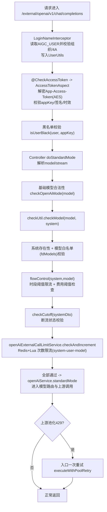

#### （2）细节说明

##### （1）@CheckAccessToken 与 @CheckSecretKey 两种鉴权方式

@CheckAccessToken：适合标准平台接入，安全性更强（加密载荷 + 时间戳 + 签名），并天然支持过期控制。**（最常用）**

**客户端建议流程：**
- 用户在请求里面带如下 header
> --header 'Authorization: Bearer apikey*' \
--header 'Aimp-Biz-Id: qwen3.5-plus' \
--header 'AIGC-USER: ex_dengyj5' \
--header 'Content-Type: application/json' 
- 请求经过算法平台的网关（参考 `SystemController.java-accessTokenTest`），会被转换为`App-Access-Token`，那后端使用`@CheckAccessToken`就可以进行解析鉴权，用户则不需要关系`secret-key`

**服务端（AccessTokenAspect）流程：**
- 取 App-Access-Token，用配置的 aesKey 解密，反序列化成 AccessKeyDto。
- 校验字段完整性（appKey/time/aKey）。
- 按 appKey 查系统是否存在。
- 用库里的 secretKey 重新计算 MD5(secretKey + time)，比对 aKey。
- 校验时效（当前代码是 1 小时内有效）。zuos'fe
- 写入 request.setAttribute("system", appKey)；再做黑名单校验。
- 后续 LoginNameInterceptor 读取 AIGC_USER 放入 UserUtils。

@CheckSecretKey：适合 OpenAI 兼容/对外简单接入，调用方只需 Bearer 一个密钥。**（只有 `OpenAiExternalController` 使用）**

**客户端：**
- Authorization: Bearer <API Key>
- 另外仍建议带 AIGC_USER（用于归因、黑名单）。

**服务端（SecretKeyAspect）流程：**
- 取 Authorization，校验前缀 Bearer 。
- 取出 token（即 secretKey）。
- selectAccessSystemBySecretKey(secretKey) 查系统；不存在就拒绝。
- 写入 request.setAttribute("system", appKey)。
- 做黑名单校验后放行。

##### （2）时段阈值限流 + 费用阈值检查

核心在 ChatGptLimitingServiceImpl.java (line 100) 的 flowControl(system, modelKey)。

**时间阈值限流执行逻辑：**

先过滤模型：只对 chat.limiting.setting.models 配置的模型启用治理。
时段计数限流：
- 计数键：chat:limiting:{system}:{model}:{HH:mm}（按小时窗口）。
- 每次请求 increment；再取当前值 number。
- 阈值 config 由 getConfig(system, model, time) 计算：
    - 先查 DB 动态配置（appModelLimitConfigService.getDbConfig）；
    - 再查 chat.limiting.config 静态规则；
    - 再退化到 defaultNumber。

- 若 number > config，抛 CHAT_GPT_LIMITING 拒绝。

**费用阈值检查执行逻辑（同一个 flowControl 内）：**
- 先用 getConfigFee(system, model, time) 取当日费用阈值（同样 DB 优先，其次配置，最后 defaultFee）。
- 再 computeModelFee(...)（或 computeModelFeeByTimes(...)）读取日累计 usage/fee 缓存，按模型单价换算当日费用。
  - 主流模型走 computeModelFee(...)：按 token/金额累计来判断阈值。
  - 少数模型（如 agent 模型）走 computeModelFeeByTimes(...)：按请求次数 * 单次单价来算。
- 超过阈值抛 CHAT_GPT_FEE_OVER_LIMIT。
- 在 80%/100% 阈值会触发告警消息（IM），100%会拦截。

##### （3）断流状态检查

核心在 ChatGptLimitingServiceImpl.java (line 194) 的 checkCutoff(systemDto)。

**执行逻辑：**
- 判断系统 systemDto.isCutoff 是否为 YES。
- 判断全局开关 bill.manage.isCutoff 是否开启。
- 两者都满足则抛 CHAT_GPT_SYSTEM_CUTOFF_YES，请求直接拒绝。

这个断流状态不是在请求里算出来的，**通常由后台欠费任务更新系统状态，例如 OverduePaymentAlertDayJob.java (line 193)**

##### （4）外部接口次数限流
核心在 OpenAiExternalCallLimitService.java (line 56) 的 checkAndIncrement(...)。

**执行逻辑：**

- 先检查总开关和 system 是否在支持名单。
- 通过 OpenAiExternalCallLimitConfig.java (line 42) 的 resolveQuota 算额度：
    - system 默认额度
    - user 白名单额度
    - model 白名单额度
    取有效值。
- 生成日维度键：openai:external:call:limit:{date}:{system}:{user}:{model}。
- 用 Lua 原子脚本做“判断+计数”：
    - 不存在则置 1 并设置 TTL；
    - 已达额度返回负值；
    - 未达额度则 incr。
返回负值即抛 OPEN_AI_CALL_LIMITING，请求拒绝。

**这条链路是“先 flowControl(时段+费用)，再 checkCutoff(断流)，再 externalCallLimit(次数)”，三道闸都过了才会真正进入模型调用。**

##### （5）时间阈值维度 与 次数校验的关系

**时段阈值限流（flowControl）（按 token 算+按次数算）**

- 维度：system + model + 时段规则
- 粒度：偏“系统级总量控制”
- 规则：支持分时段阈值（如 08:00-12:00 不同于夜间）
- 目的：防系统级流量冲击，保护整体容量与成本

**外部接口次数限流（按次数算）**（OpenAiExternalCallLimitService）

- 维度：date + system + user + model
- 粒度：偏“用户级配额控制”
- 规则：按天累计，支持 system 默认 + 用户白名单 + 模型白名单额度
- 目的：防单用户/单模型滥用，做精细化配额治理

一句话：**前者管“这套系统在这个时段总共能打多少”，后者管“这个用户今天在这个模型上还能打多少”。两层叠加是“总量保护 + 个体约束”。**

##### （6）费用阈值检查 和 断流状态检查 的关系

两个确实都“在控费用”，但本质不一样：

- 费用阈值检查（在 flowControl/flowControlByTimes 里）是实时算账+动态拦截；
- 断流状态检查（checkCutoff）是预先打标+开关式拦截。

**费用阈值检查（动态）:**

每次请求前会：
- getConfigFee(system, model, now) 取该时段预算；
- computeModelFee(...) 或 computeModelFeeByTimes(...) 读当日 usage/fee 缓存换算成本；
- 超过阈值直接抛 CHAT_GPT_FEE_OVER_LIMIT。
- 同时它还带“时段次数限流”（rateLimitPerMinute + 规则）并发告警。

**断流状态检查（静态/策略开关）:**

逻辑非常直接：只有当systemDto.isCutoff == 1 且 bill.manage.isCutoff == 1,才拦截并抛 CHAT_GPT_SYSTEM_CUTOFF_YES,它不做实时费用计算，只是读系统状态位

isCutoff 通常由账务/欠费任务异步更新（例如 OverduePaymentAlertDayJob.java (line 194) 会把系统置为断流），而不是在请求线程里临时算出来。

##### （7）限流与费用限制整体流程图

**如下：先判断是否断流（超预算），然后判断时段是否超限制，最后实时判断费用是否超预算。**

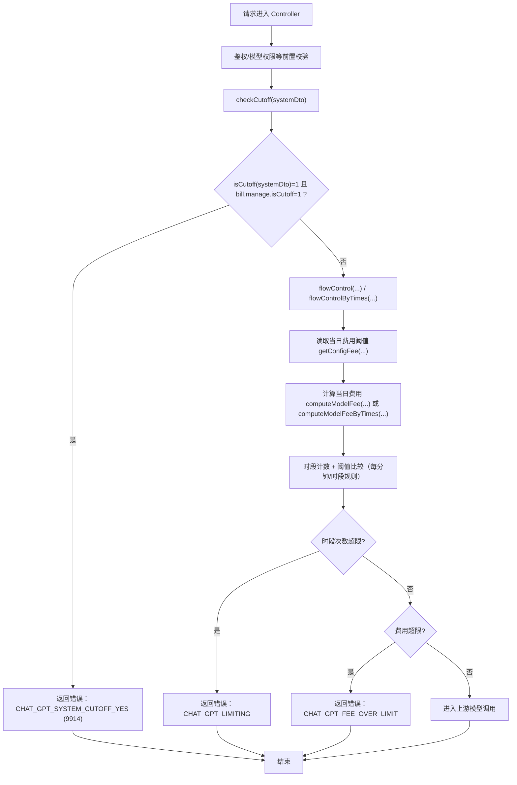

### Q3：鉴权+限流+调用流程串联

2 个注意点：
- 席位制也要走同一套前置校验（鉴权、黑名单、模型权限、时段阈值限流、费用阈值、checkCutoff、外部次数限流）。
- 大部分限制都在上游调用前执行，但有一个重要例外：上游返回账号级 429 后，会回写资源冷却，然后入口层做一次重试（这是调用后触发的治理动作）。

总流程图如下：
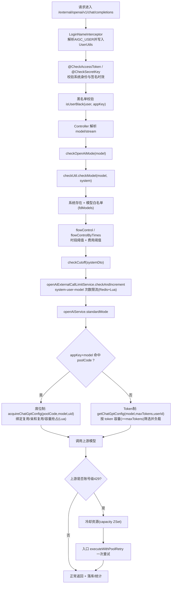

“调用前限制 vs 调用后治理”的双泳道图：
```mermaid
flowchart LR
    subgraph PRE["调用前限制（Pre-Call Controls）"]
        A["请求进入 /external/openai/v1/chat/completions"]
        B["登录用户识别<br/>LoginNameInterceptor(AIGC_USER)"]
        C["系统鉴权<br/>AccessToken/SecretKey 校验"]
        D["黑名单校验<br/>isUserBlack(user, appKey)"]
        E["模型合法性校验<br/>checkOpenAiMode(model)"]
        F["模型权限校验<br/>system + fdModels"]
        G["时段阈值限流<br/>flowControl / flowControlByTimes"]
        H["费用阈值检查<br/>token计费 or 次数计费"]
        I["断流校验<br/>checkCutoff"]
        J["外部调用次数限流<br/>system-user-model (Redis+Lua)"]
        K{"资源分流"}
        L["席位制调度<br/>poolCode 命中后绑定/复用/抢占"]
        M["Token制调度<br/>按 maxTokens 选择可用apikey"]
    end

    subgraph POST["调用后治理（Post-Call Governance）"]
        N["调用上游模型"]
        O{"是否账号级429?"}
        P["冷却资源<br/>capacity ZSet写负分/冷却到期"]
        Q["入口一次重试<br/>executeWithPoolRetry"]
        R["返回响应"]
        S["调用结果落库<br/>主记录/内容/token/费用"]
        T["指标与统计上报<br/>监控/报表/聚合"]
    end

    A --> B --> C --> D --> E --> F --> G --> H --> I --> J --> K
    K -->|席位制| L --> N
    K -->|Token制| M --> N

    N --> O
    O -->|否| R
    O -->|是| P --> Q --> R
    R --> S --> T

```

### Q4：大模型请求与响应相关问题解析

#### （1）同步 / 流式 / 异步 / 全双工 / 本地通信 等请求有什么区别？这个项目入口如何选择？

参考下面的表：

| 调用模式 | 适用大模型类型 | 典型应用场景 | 底层传输协议 |
| :--- | :--- | :--- | :--- |
| 同步调用 (非流式) | 文生图 / 视频生成 *(如 DALL-E, Stable Diffusion)* | 用户输入提示词，等待几秒到几分钟，最后一次性展示生成的图片或视频。因为中间过程无法“流式”展示（图片缺了一半没法看），所以适合等做完了再返回。 | HTTP / HTTPS (标准请求-响应) |
| 流式调用 (打字机效果) | 文本生成 (LLM) 代码生成 多模态理解 *(如 GPT-4o, Claude, Llama 3)* | 聊天对话、写文章、写代码。这类内容具有“线性”特征，用户可以边读边思考，因此必须用流式来降低感知延迟。 | SSE (Server-Sent Events) *(基于 HTTP)* |
| 异步调用 (轮询/Webhook) | 超长任务模型 *(如长视频生成 Sora, 大规模数据分析)* | 生成一段 1 分钟的视频，或者分析几百兆的财报数据。这种任务耗时太久（几分钟甚至几小时），直接 HTTP 连接会超时，所以必须先拿任务 ID，稍后再去取结果。 | HTTP + 轮询/Webhook |
| 全双工交互 (实时流) | 语音对话模型 实时翻译 *(如 Whisper, GPT-4o Realtime API)* | 像打电话一样跟 AI 聊天。需要一边把麦克风录音传上去（上行），一边把 AI 的声音听下来（下行），且要求极低延迟，不能有任何卡顿。 | WebSocket (WSS) |
| 本地/插件通信 (MCP) | 工具调用 / 智能体 *(Agent Frameworks)* | AI 需要读取你本地的文件、操作数据库或运行代码解释器。这通常发生在本地环境或内网中。 | stdio (标准输入输出) |

**项目里面如何区分不同的接口：**

- **按接口路径分流（老接口）**：/external/sync/...、/external/stream/...（显式分开）
- **按请求参数 stream 分流（OpenAI兼容）**：/external/openai/v1/chat/completions 同一路径，根据 body 的 stream 判断
- **异步任务按业务接口分流**：
    - chat-app 有部分异步入口（如 /aiDraw/async/{modelKey}/submitTask）
    - multimedia 典型是 createTask + task/status + callback

#### （2）调用外部模式，结果是透传给用户还是归一化处理后再返回给用户

**透传：**
- 请求体基本不改，响应也尽量原样返回（只做少量头/字段增强）。
- 典型是 OpenAI兼容透传接口，见 `OpenAiExternalController.java + BaseOpenAiImpl.java`

**归一化：**
- 入口把不同请求DTO统一成内部DTO（`ContextCompletionDto/New/4V`）。
- 出口把不同厂商响应映射成统一结构（包括模型名映射、tool_calls等兼容）。
- 典型是 /external/standard/* ，见 `ChatStandardExternalController.java + ChatStandardUtil.java`

**如何选择** ：走哪个接口就决定了策略：`/external/openai/*` 偏透传，`/external/standard/*` 偏归一化。

#### （3）使用不同的协议的时候，应用如何在调用方和模型提供方之间调度

可以把它理解成一句话：**调度核心一致，协议只是“传输形态”不同。**

**统一调度骨架（四种协议都共用）**
- 入口鉴权（appKey/secret、用户识别、黑名单）
- 前置治理（模型权限、时段限流、费用阈值、cutoff）
- 资源路由
    - 命中 poolCode：走席位池（绑定复用/亲和/抢占）
    - 未命中：走 Token 资源路由（按 model + maxTokens 选可用 key）
- 选到 ChatGptConfig（url/apiKey/modelName）后，才真正调用上游
- 调用后治理（429 冷却、一次重试、日志/计费/统计落库）

##### （1）HTTP（同步）

- 调用方体验：一个请求拿完整响应。
- 调度方式：按上面统一骨架选好资源后，用 HTTP/SDK 发起同步调用（如 OkHttp 或 Bedrock SDK converse）。
- 返回：完整 JSON 一次性返回；失败按错误码返回，池化 429 可触发一次重试。

如：`POST /external/sync/contextCompletions`，入口在 `ChatGptExternalController.java (line 77)`，实际同步调用在 `ChatGptServiceImpl.java (line 115)`。

**这里，同步 chat直接 http 调用外部大模型的接口将结果封装返回给客户端。**

##### （2）SSE（流式）

- 调用方体验：持续收到增量 token/chunk。
- 调度方式：前置治理与资源选择和同步完全一致；只是上游调用改为流式端点。
- 返回：chat-app 边读上游边 flush 到下游；必要时做轻量归一化（比如模型名映射），最后落库统计。
（不用修改代码，只需要在请求加一个 Accept: text/event-stream，这样响应就会变成 SSE 流式）

如：`POST /external/stream/contextCompletions`，入口在 `ChatGptExternalController.java (line 262)`，流式转发在 `ChatGptServiceImpl.java (line 192)（aigcApi.streamChatGpt(...)）`。

这里，真正“边读边回传”发生在 `streamChatGpt 内部：
- 从上游连接逐行读流：`BaseOpenAiServiceImpl.java (line 168)`
- 每读到一段就写入当前 HTTP 响应输出流：
`BaseOpenAiServiceImpl.java (line 197)`
- `writeOutputStream` 里明确 `outputStream.write(...); outputStream.flush()`;：
`BaseOpenAiServiceImpl.java (line 718)`
- 方法返回的 `streamResponse` 是“最终态对象”，随后用于保存问答：`ChatGptServiceImpl.java (line 221)`

所以整体是：实时回传靠 ServletOutputStream，返回对象主要给服务端日志/持久化。

SSE 响应的流程图如下：
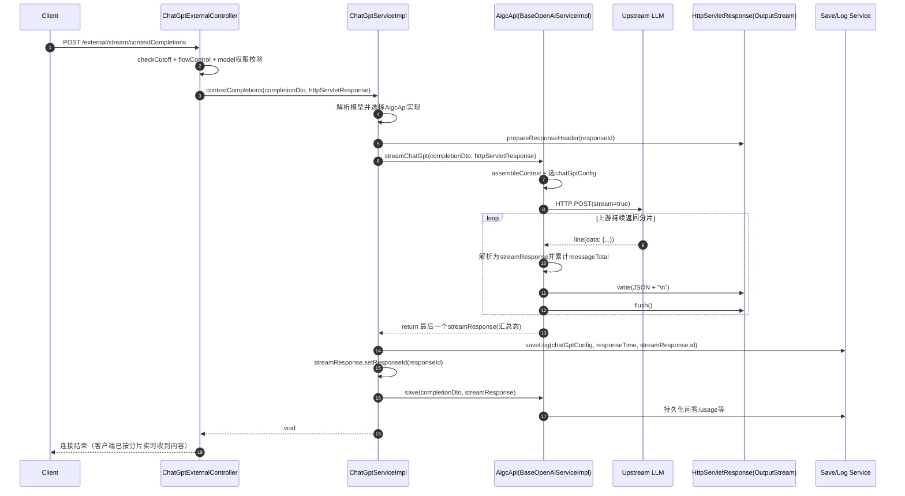

##### （3）WebSocket（双工）

- 调用方体验：全双工实时交互（音频/实时会话）。
- 调度方式：**chat-app 建立“下游客户端会话 ↔ 上游模型 WS 会话”的 NextHop 桥接**。上游 URL/API Key 仍由资源路由选出（同样可走配额/路由策略）。
- 返回：双向帧透传；会话级生命周期管理（连接、转发、断开清理）。

如：`WebSocket` 路由注册在 `ProxyWebSocketConfigurer.java (line 60)`（默认如 `openai/realtime`）。服务端处理在 `WebSocketProxyServerHandler.java (line 49)`，上游 WS 握手与转发在 `NextHop.java (line 57)`。

##### （4）HTTP + Webhook（异步）

- 调用方体验：先拿任务ID，后查状态或等回调。
- 调度方式：提交阶段先做前置校验，再选资源/节点并创建上游异步任务；本地先落任务表（submitted/processing）。
- 返回与闭环：
    - create 立即返回 taskId/externalTaskId
    - status 轮询上游或查本地状态
    - callback(webhook) 回写任务状态、下载产物、更新费用/token、触发后续处理

如：`POST /aiDraw/async/{modelKey}/submitTask`
入口在 `AiDrawController.java (line 92)`。

### Q5：AigcApi 这里使用了什么设计模式，作用是什么？

核心是 **策略模式 + 模板方法 + 适配器思路**

**策略模式（按模型/厂商切实现）：**

`ChatGptServiceImpl` 里通过 `Map<String, AigcApi> aigcApiMap` 取具体实现，再调用统一方法（`syncChatGpt/streamChatGpt/...`）。

**模板方法（基类沉淀公共流程）**

很多实现继承 BaseOpenAiServiceImpl，把“组包、选资源、发请求、流读取、落日志”等公共流程放基类，子类按模型差异**覆盖/扩展**。

**适配器思路（统一多厂商能力面）**

AigcApi 定义了统一入口，同时通过 default 方法覆盖不同协议能力（OpenAI/Gemini/DeepSeek/图像/视频等），把上游差异“适配”成统一调用面。

好处：**平台通过 AigcApi 把平台能力面和厂商实现面解耦，新增模型时优先复用抽象和保存链路，只在适配层补厂商差异。**

### Q6：各种模型调用说明

#### （1）千问

当前系统（QwenExternalController）对外提供的接口
见 QwenExternalController.java
- POST /external/qwen/standard/v1/chat/completions
- POST /external/qwen/standard/{mode}/v2/chat/completions（mode=stream|sync）

**当前系统已落地的能力**

- 同步/流式两种调用
    - v1：通过 body 的 stream 决定
    - v2：通过路径 stream/sync 决定

- OpenAI 兼容 Chat 能力（v1）
    - 对应上游 .../compatible-mode/v1/chat/completions

- DashScope 原生能力（v2）
    - 文本：/api/v1/services/aigc/text-generation/generation
    - 多模态：/api/v1/services/aigc/multimodal-generation/generation，见 ChatGptQwenServiceImpl.java (line 63)

- 流式 token 统计返回
    - v1 流式时自动注入 stream_options.include_usage=true
    - v2 流式时带 X-DashScope-SSE: enable

- 多模态输入（图/视频）可走
    - 是否可用取决于你传入模型（如 qwen3-vl-* / qwen3.6-plus）与请求体结构

- 联网搜索参数透传
    - v1 读 enable_search
    - v2 读 parameters.enable_search

**当前没在这个 Controller 暴露的能力**

- 没有单独暴露 Embedding / Image Generation / Batch / File 等专用接口（这里只是 chat/completions 这条线）。
- 这些能力即使百炼平台支持，当前系统也未在 QwenExternalController 直接开放独立路由。

##### （1）什么是 openai 兼容

兼容 OpenAI 的接口协议（主要是请求/响应结构），典型就是 POST /v1/chat/completions 这套格式：model/messages/stream/tools/usage...。

常见 OpenAI 兼容接口族一般包括：
- chat/completions（对话）
- embeddings（向量）
- images（文生图/图编辑，是否支持看供应商）
- audio（TTS/STT，是否支持看供应商）
- files（文件上传/管理）
- batches（批量离线任务）
- 部分平台还支持 responses/conversations 兼容

##### （2）DashScope 原生能力是什么意思

就是不走 OpenAI 兼容层，而是直接按阿里云百炼 DashScope 自己的原生协议调。原生接口通常参数命名、结构（如 input/parameters）和兼容层不完全一样，但能覆盖百炼的一些特色能力和细粒度参数。

##### （3）Embedding / Image Generation / Batch / File 是什么

这些是不同能力域，通常不在同一个 chat 路由里：

- Embedding：把文本/图像转成向量，用于检索/RAG。
- Image Generation：文生图/图编辑。
- Batch：异步批量推理任务。
- File：上传文件给长文档问答/批处理使用。

#### （2）ChatGPT

当前提供的接口（模型能力相关）

**文本对话（同步）**
- /external/sync/contextCompletions
- /external/sync/contextCompletionsV2

**多模态对话（图文，GPT-4V）**
- /external/sync/contextCompletions4V
- /external/stream/contextCompletions4V
- /external/stream/webContextCompletions4V

**文本对话（流式）**
- /external/stream/contextCompletions
- /external/stream/contextCompletionsV2
- /external/stream/webContextCompletions
- /external/stream/webContextCompletionsV2

**千问VL（在这个 GPT 外部控制器里也有）**
- /external/sync/completionsQwenVl
- /external/stream/contextCompletionsQwenVl

**配套接口（非推理）**
- /external/getAccessToken（系统换 token）
- /external/sys/getUserConfig
- /external/promptTemplate/page

**当前系统已实现的核心能力**
- 同步 + 流式（SSE 输出流）双模式
- 文本 + 图文多模态（4V / QwenVL）
- 模型级鉴权与白名单校验（fdModels）
- 限流/断流前置（checkCutoff + flowControl）
- 场景透传（SCENE）、来源透传（platform-source）
- 登录态与无登录态两类流式入口（@CheckAccessToken 的 type 不同）

**实现里几个重要限制（你对接时要注意）**

- 流式接口禁用 functions/tools（会直接报 NOT_SUPPORT_MODEL）
- o1/o1-mini 禁止流式（会报 STREAM_NOT_SUPPORT）
- 某些模型被标记为“ban mode”，要求改走“标准新接口”
- 部分同步场景有 PTU 优先和回退逻辑（gpt-4o-ptu -> gpt-4o）

##### （1）PTU 优先 + 回退逻辑 解析

PTU 一般是 Provisioned Throughput Unit（**预置吞吐单元/预留吞吐能力**）。

在你这套系统里，GPT_4O_PTU 可以理解成“**专用容量通道**”：
- 先走 PTU：优先用预留资源，延迟和稳定性通常更好。
- PTU 不可用或触发限制：回退到普通共享通道（如 GPT_4_O）。

##### （2）为什么流式禁用 functions/tools

- 当前流式链路是“文本增量分片”的实现，重点在 delta.content 的持续下发；对 tool/function call 这种结构化增量（参数拼接、调用编排、回填结果）并没有完整支持。
- 另外你这套里也有上游能力约束（例如某些增量输出与 tools 组合本身就受限）。

**所以入口直接拦截并报 NOT_SUPPORT_MODEL，是为了避免“半支持”导致协议不一致、前端状态机错乱。**

#### （3）Claude

这套 Claude 外部接口主要走的是 AWS Bedrock Converse/ConverseStream，不是直接调用 Anthropic POST /v1/messages。

当前系统对外提供的 Claude 接口：
- POST /external/claude/standard/sync/v1/chat/completions
- POST /external/claude/standard/stream/v1/chat/completions
- POST /external/claude/standard/sync/v2/chat/completions
- POST /external/claude/standard/stream/v2/chat/completions
- POST /external/claude/standard/sync/v3/chat/completions
- POST /external/claude/standard/stream/v3/chat/completions
- POST /external/claude/cache/reDeal（历史缓存重算运维接口）

##### （1）当前系统 Claude 能力

- **文本+图像多模态对话**：支持 text、image_url，图像可 URL 或 base64
- **工具调用（function/tools）**：支持工具定义下发、tool_use / tool_result 往返，流式和同步都处理了 TOOL_USE 分支
- **思考链/推理输出**（thinking/reasoning）：支持 thinking 参数透传（特定模型）和 reasoning_content/signature 处理
- **流式返回**：stream 接口通过输出流持续写回分片（非一次性返回）
- **Prompt Cache 计量解析**：解析 cacheReadInputTokenCount、cacheWriteInputTokenCount、cacheDetails.ttl
- **V3 的区域路由与错误透传控制**：region 和 dealError 通过 query 参数控制

在 ClaudeExternalController 这条链路里，没有单独暴露 Embedding / Batch / Files / Image Generation / Audio-Video 专用接口；**它是以“标准 chat（sync/stream）+ 多模态 + tool + thinking + cache统计”为主。**

##### （2）Bedrock Converse/ConverseStream vs 直接调 Claude，有什么区别？

**接入层不同**
- 直接 Claude：对接 Anthropic 原生 API。
- 现在这套：对接 AWS Bedrock 的 converse / converse-stream

**鉴权与网络治理不同**
- 直接 Claude：用 Anthropic key。
- Bedrock：走 AWS 签名、AWS 账号与区域治理，更符合企业统一云管控。

**协议与字段会有适配层**
- 你平台做了一层标准化：对上游 Bedrock，对下游业务方保持统一接口风格。

**企业能力更强：**
- 区域路由、统一监控、限流、计费、审计、模型池路由、fallback 等，更容易在一个平台里统一做。

**为什么要这样设置？**
- 因为你们是“外部大模型管理平台”场景：重点不是“最短路径调用模型”，而是**统一治理、稳定性、合规、成本可控、可观测。**Bedrock 方案更符合这个目标。

##### （3）Tool 到底怎么用？为什么请求里要定义 tool？

完整闭环就是你说的那样：**声明工具 -> 模型判断 -> 返回 tool call -> 业务执行 -> 回传 tool result -> 模型生成最终答案。**

**关键细节：**
- tools 里通常不是“用户指定必须调用哪个工具”，而是“声明可用工具列表”。模型会自主判断要不要调用、调用哪个。
- 工具真正执行一般在你业务侧（或 tool server），不是模型自己直接去执行本地函数。

**“Tool 调用闭环”的时序图**

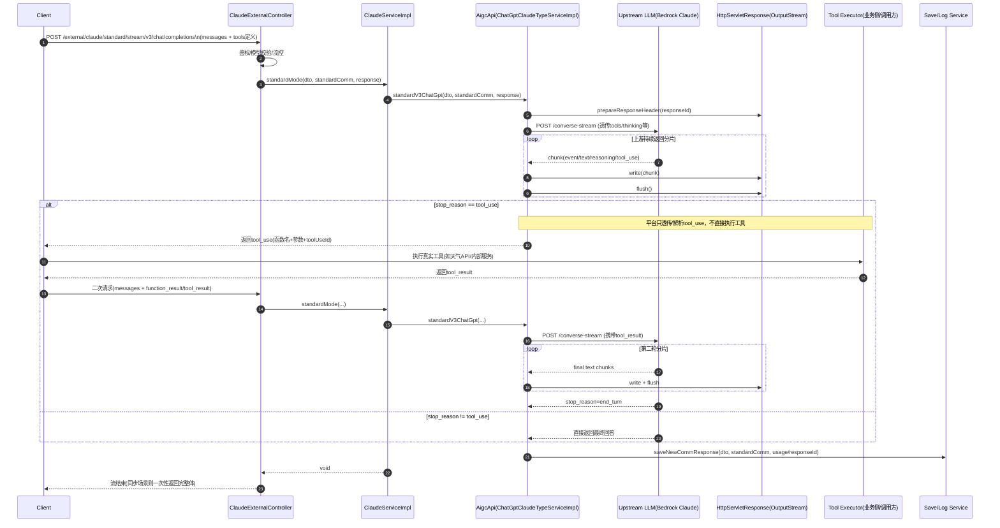

##### （4）“thinking 参数透传 + reasoning_content/signature 处理”是什么意思？

- thinking 透传：你在请求里放 additionalModelRequestFields.thinking，系统会把它传给上游模型（特定模型生效）。

- reasoning_content/signature 处理：模型返回推理片段时，代码会把推理文本/签名字段解析和拼装到响应对象里（主要在 Claude 类型实现中处理）。

**简单说：前者是“请求控制模型推理行为”，后者是“响应里把推理内容结构化拿出来”。**

##### （5）V3 的区域路由与错误透传控制，有什么价值？

V3 支持 query 参数控制：
- region：选择区域模型路由（见 ChatGptClaudeTypeServiceImpl.java (line 1574)）
- dealError：是否把上游错误状态码+错误体尽量透传给调用方（见 ChatGptClaudeTypeServiceImpl.java (line 1706)）

**相比 v1/v2，v3 的实用优化是：**
- 区域可控（多区域弹性/合规/可用性更好）
- 错误语义更透明（联调更快）
- 流式处理更稳（字节流方式对上游分块更鲁棒）

##### （6）Prompt Cache 计量解析

**Prompt Cache 计量解析 是在解析这次请求里，有多少输入 token 走了缓存读/缓存写，用于计费和观测。**

你代码里主要解析这些字段（Claude/Bedrock 返回的 usage）：

- inputTokens：本次输入 token（常规）
- outputTokens：本次输出 token
- cacheReadInputTokenCount：本次从缓存命中的输入 token 数
- cacheWriteInputTokenCount：本次写入缓存的输入 token 数
- cacheDetails[].ttl、cacheDetails[].inputTokens：每段缓存的 TTL （**TTL 是 Time To Live（生存时间），就是“这份缓存能保留多久”。**）和写入 token 明细

**它的具体作用：**
- 精确计费：缓存读/写通常价格和普通输入不一样，必须单独统计。
- 成本优化：你可以看命中率：cacheReadInputTokenCount 越高，说明复用越好、成本可能更低。
- 运营排障：能看出是“没命中缓存”还是“缓存策略/TTL不合适”。

#### （4）Gemini （含翻译、图片生成、视频生成）

**当前系统对外接口：**
- 聊天（旧版）
    - POST /external/gemini/sync/contextCompletions
    - POST /external/gemini/stream/contextCompletions
- 标准 Chat（统一协议）
    - POST /external/gemini/standard/sync/v1/chat/completions
    - POST /external/gemini/standard/stream/v1/chat/completions
    - POST /external/gemini/standard/stream/v2/chat/completions（流式改进版）
- 翻译 （**比较简单，也是文生文的样式，只不过这是是给翻译专门使用的接口**）
    - POST /external/gemini/translate
- 视频生成（Veo）
    - POST /external/gemini/standard/v1/video/{model}/generate
    - POST /external/gemini/standard/v1/video/{model}/fetch
- 图片生成
    - POST /external/gemini/standard/sync/v1/{model}/image
- Deep Research
    - POST /external/gemini/standard/stream/v1/{model}/completions

**当前系统已支持的 Gemini 能力：**
- 同步 + 流式聊天
- 多模态输入：文本 + 图片 + 视频（请求构造时支持 image_url、video_url）
- Function Calling：可声明函数并解析 functionCall
- Thinking/推理 token 统计：读取 thoughtsTokenCount
- 缓存计量：读取 cachedContentTokenCount 并落到 usage
- Google Search 相关标志透传/计费扩展
- Deep Research 流式透传
- Veo 视频任务：发起长任务 + 查询任务结果
- 图片生成并回传 OSS 地址

官方模型页显示 Gemini 家族支持矩阵（不同模型能力不同）：**函数调用、缓存、thinking、搜索接地、图像/视频生成、Live 等。**

你当前系统已经覆盖的主干能力：**Chat(同步/流式) + Function Calling + Caching计量 + Thinking计量 + Image + Veo + Deep Research。**
未见独立外部接口：**Embeddings、Batch、Live API(WebSocket 实时音频)、独立 File API 管理。**

另外一个重要点：你这套 Gemini 调用并非纯 Developer API 直连，而是明显包含 Vertex AI / Discovery Engine 路径（OAuth token + aiplatform.googleapis.com / discoveryengine.googleapis.com），属于企业化接入形态。

##### （1）Thinking / 推理 token 统计 是什么意思？

意思是：Gemini 某些模型会返回一部分“思考/推理”相关的 token 计量，你们系统把它算进 usage 里，它不是单独一份“展示给用户的思维链内容”，**而是统计模型内部推理消耗了多少输出 token**。

##### （2）缓存计量是什么意思

Gemini 这里当前主要是 读缓存 token，**统计“这次请求有多少输入 token 是从缓存命中的”**，目前代码里没有像 Claude 那样拆出明显的 cache write 计量字段。

所谓的“缓存命中”，指的是Gemini 上游模型侧的上下文缓存 / cached content 在复用之前已经处理过的输入内容。也就是说，你这次发给模型的 prompt 里，有一部分内容以前已经提交过并被缓存了，模型这次不需要从头重新处理这一段，所以这部分 token 会记到 cachedContentTokenCount。

**这个过程可以理解成：**
- 第一次请求
    - 你把一大段上下文、文档、提示词发给 Gemini
    - Gemini 侧可能把它缓存起来
- 后续请求
    - 你继续引用同一份 cached content
    - 上游识别出这部分已缓存，不再重复完整计入普通 prompt token
    - 返回 cachedContentTokenCount

**所以这里的“缓存”是：** Gemini/Vertex 侧的 prompt context cache， 不是你们 Java 本地内存缓存，也不是 Redis 直接回答用户问题

它的作用主要是：
- 降低重复上下文处理成本
- 降低延迟
- 提高长上下文复用效率

整体的流程如下：
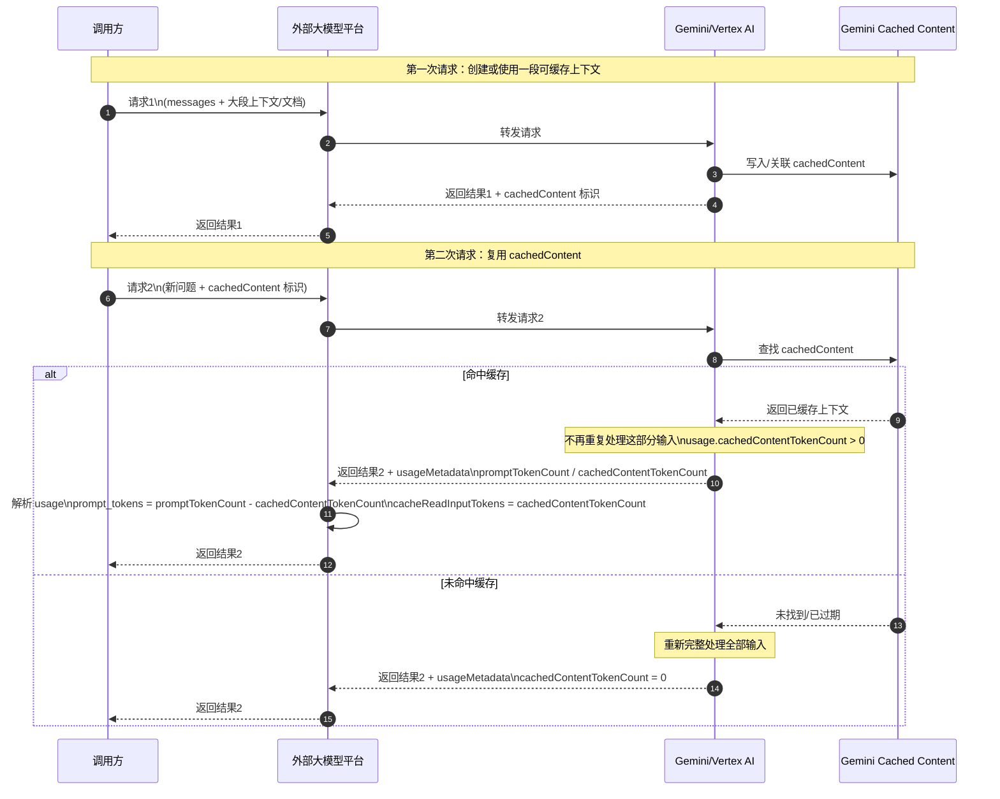

理解：
- 第一次请求，把一大段文档、系统提示词、背景材料交给模型，这段内容被缓存成 cachedContent

- 第二次请求，你不再让模型从头“消化”这大段背景，而是直接引用这份缓存，然后只处理新问题

所以缓存命中的本质是： **复用旧输入上下文的处理成本
不是复用旧回答结果本身** ，这也是为什么代码里统计的是cachedContentTokenCount（命中的输入 token），而不是“命中的输出 token”或“命中的回答条数”。

##### （3）Google Search 相关标志透传 / 计费扩展 是什么意思？

意思是：如果请求里启用了 Google Search 相关工具或搜索能力，系统会：
- 把“开启了搜索”这个标志带到调用链路里
- 在计费/埋点时按“搜索增强调用”单独记账或扩展统计

本质上是：**搜索不是普通文本生成，要单独识别和统计成本/调用类型。**

##### （4）Deep Research 流式透传 是什么意思？

意思是：这个接口不是把上游结果重新封装成你们自定义 chunk 格式，而是把上游 Deep Research 的流式响应几乎原样转发给客户端。

所以“流式透传”就是：上游怎么流出来，平台就怎么尽量原样流给下游。

##### （5）Gemini Developer API vs Vertex AI / Discovery Engine，有什么区别？

现在这套不是简单 api key -> Gemini API 的直连方式，而是更偏企业接入：

**Developer API**
- 更像产品原生 API，通常用 API Key
- 接入更轻，适合直接开发和快速试验
- 能力以 Gemini 官方 API 暴露为主

**Vertex AI**
- 是 Google Cloud 体系里的企业级接入方式
- 你们代码里是 OAuth/JWT 换 token，再去调 aiplatform.googleapis.com
- 更适合做统一鉴权、配额、企业网络、区域路由、项目隔离、成本治理

**Discovery Engine**
- 不是普通聊天主链路，更偏“检索增强 / research / enterprise search assistant”
- 你们的 deepResearch 就是走它

**所以一句话：**
- Vertex AI：企业化托管 Gemini 模型调用
- Discovery Engine：企业检索/研究型增强服务
- Developer API：更轻量的原生直连方式

Vertex AI 的调用流程，放到你们这套代码里看，其实是一个很标准的“服务账号鉴权 -> 换 access token -> 调 Vertex AI endpoint -> 解析响应”流程。

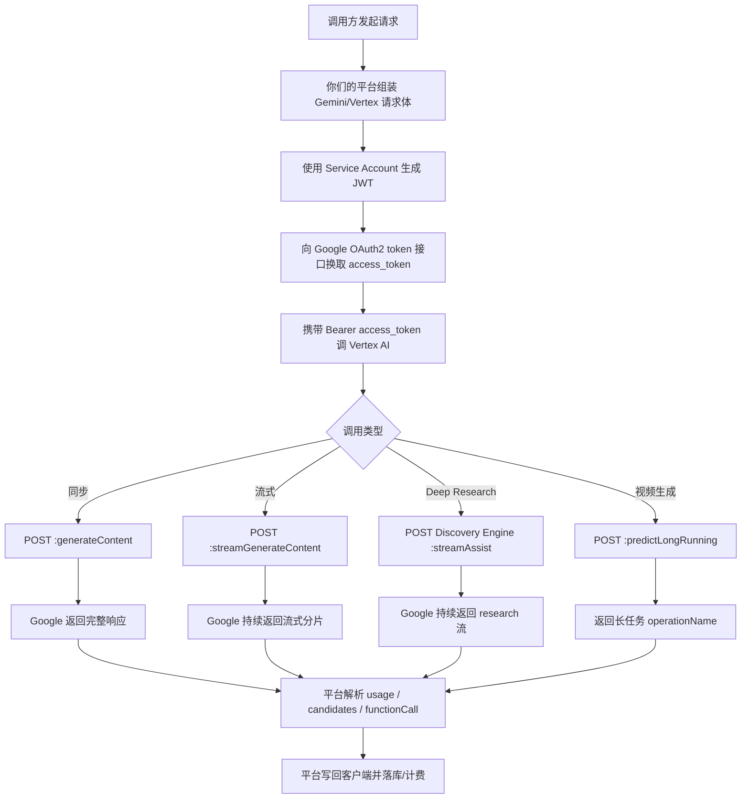

**我们在 Google Cloud 项目里配置好服务账号与权限（或由平台团队统一发放），然后你们用该服务账号换 access_token 去调 Vertex AI / Discovery Engine。这样就能落到你说的这些企业能力：区域控制、统一鉴权、配额和计费治理。**

##### （6）Function calling 的流程

流程：
- 调用方在请求里声明可用函数
- 平台把函数定义按 Gemini 协议发给模型
- 模型判断是否需要调用函数，如果需要，模型返回 functionCall
- 平台解析这个 functionCall，把函数名和参数回给调用方
- 调用方自己执行函数，再把函数结果作为下一轮输入发给模型

**所以平台的角色是：** 协议适配器+函数调用信息的透传/解析器，而不是自动执行函数的运行时。

#### （5）图片生成模型

这个项目的生图能力，整体上是两条线：
- 通用生图网关线（AiDraw）：通过 AiDrawExternalController 按模型名路由到不同实现。
- 厂商专线（Gemini）：独立 controller/service，不走 AiDraw 接口。

##### （1）按厂商维度梳理当前项目的实现:
- OpenAI/Azure 系：DallE2Draw、DallE3Draw、GptImage1Draw
- MidJourney 系：MidJourneyDraw
- Stable Diffusion 系：SdDraw
- 火山/豆包系：VolcengineVisualServiceImpl(doubaoDraw)、DoubaoSeedream4P0Draw/5P0LITE
- Google Gemini 系：GeminiExternalController + GeminiServiceImpl + ChatGptGeminiServiceImpl

##### （2）同步/异步是怎么处理的

**同步直出型（一次请求拿最终图）：**
- GptImage1Draw、DallE3Draw、Gemini syncStandardV1Image、DoubaoSeedream4P0(非任务轮询场景)
- 典型处理：**请求上游 -> 拿结果 -> 上传 OSS（或替换 URL）-> 保存历史/图片 -> 返回**。

这里上传 OSS 后再保存历史/图片到数据库，本质是做可追溯与可查询闭环
- 图片文件本体在对象存储（OSS）里，数据库不存二进制。
- 库里存两类记录：
    - ai_draw_history：任务级信息（请求、模型、进度、token/expense 等）
    - ai_draw_pic：图片级 URL（resultUrl 原始地址、ossUrl 平台地址）

**异步任务型（先拿 taskId，后续查结果）**
- MidJourneyDraw、DallE2Draw、SdDraw、VolcengineVisualServiceImpl（按 action 可 async）
- 典型处理：**submit 返回 accepted + taskId -> history/getResult 轮询上游（提供接口） -> 成功后写 draw_pic 并更新进度。**

异步查询接口成功拿到图后：
- 将图片上传到 OSS，把图片 URL写入 ai_draw_pic
- 把 ai_draw_history.progress 更新为完成（代码里常见 103）

**所以“图片放哪里”**：放在 OSS；数据库只是索引/元数据。
**“怎么查看图”**：调用 history 接口读库回放 choices[].delta 里的 URL。

##### （3）计费方式

**Draw 普通计费（按 feeType 策略，常见是按张/规格）**

- 适用：多数传统生图链路（如 DallE3、MidJourney、部分豆包链路）。

- 核心逻辑：
    - 先按模型+时间窗口查计费规则 ChatgptModelFee。
    - 走 feeType 对应的计费策略组件计算总价。
    - 你可以理解成：总价 = 模型用量(modelDosage) × 对应单价（用量可能是**张数、规格档位**等）。

**Draw Token 计费（按输入/输出 token 分段计价）**
- 适用：Gemini/GPT-Image 这类会返回细粒度 token 的图片模型。

- 核心逻辑：
    - 读取 DrawHistory 里的 inputTokens/outputTokens/textTokens/imageTokens。
    - 按 text/image 两套费率分别算，再求和。
- 常规 token 生图（项目里的 buildDrawStatComponentWithToken）：

- 输出费 = outputTokens / tokenUnit_text × completionPrice_text
- 输入文本费 = textTokens / tokenUnit_text × promptPrice_text
- 输入图片费 = imageTokens / tokenUnit_image × promptPrice_image
- **总价 = 输出费 + 输入文本费 + 输入图片费**

**Duration/时长计费（按时长或时长衍生用量）**
- 适用：多媒体类更常见（视频/音频链路），你项目里也有统一能力。
- 核心逻辑：
    - 用 DurationStatDto（任务时长、分辨率、sourceType等）+ 计费规则计算。
    - 不是简单“responseTime=计费时长”，而是根据业务字段走 feeType 策略。
    - 你可口语化说：**总价 = 有效时长/单位时长 × 单价（可能叠加分辨率/来源档位）**。

**图片计费是三路并存：按 feeType 的普通 Draw 计费、按 text/image token 的精细计费、按时长维度的多媒体计费，最终都统一上报到供应商计费服务。**

如下：
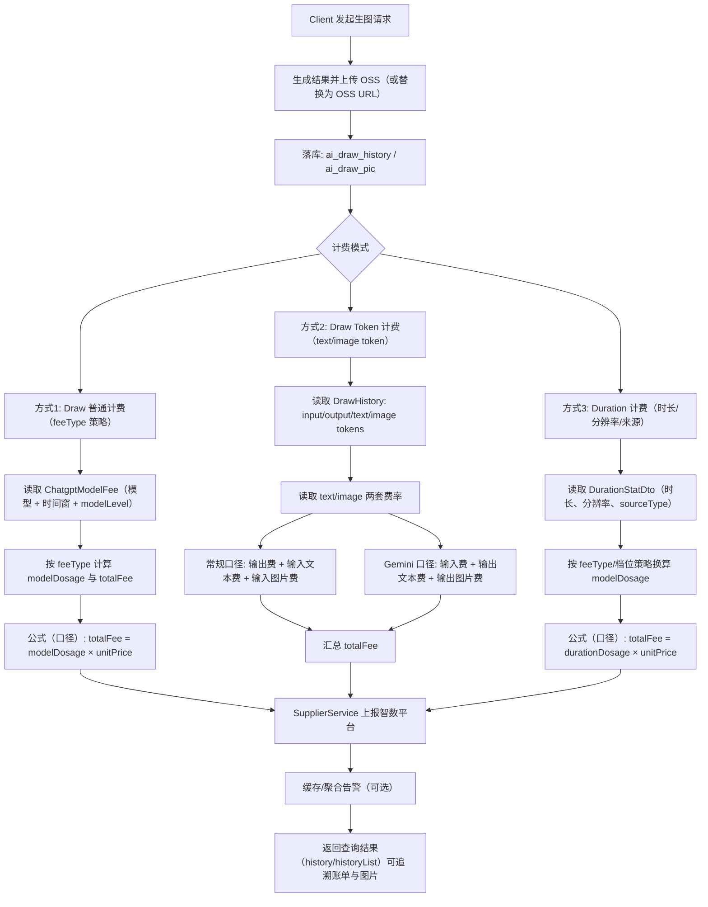

#### （6）视频生成模型

我们项目视频生成是多厂商异步任务架构：Gemini Veo、Sora、Volcengine、Kling 都是先提交任务再查询结果。

##### （1）异步视频生成通用流程

**相关流程图如下：**

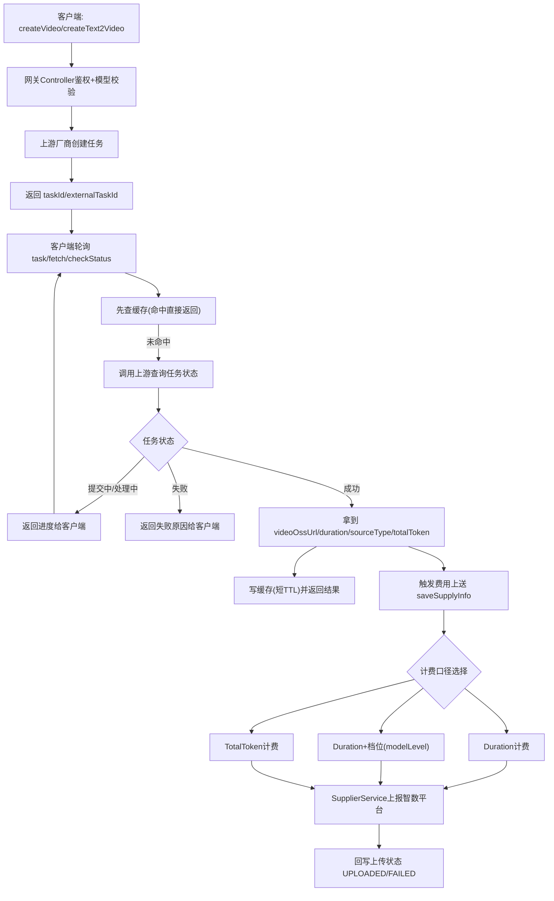

##### （2）计费方式

**Duration 时长计费**：按视频生成持续时间以及模型类型计费，适用于 Sora/Veo 等按时长计费链路

**Duration + 档位计费**：在 Duration 基础上，按 sourceType + resolution 选 modelLevel 再计费。sourceType 可以理解成“**视频生成来源/形态标签**”，比如 Veo 里区分有声/无声；resolution 就是**分辨率**（如 1080p、4k）。系统会用 模型名 + sourceType + resolution 去匹配一个计费档位 modelLevel，匹配到就按该 modelLevel 计费；匹配不到就回退到通用时长计费。**其实就是先按视频标签+分辨率匹配一个档位计费（还要算上生成时长），匹配失败直接使用通用时长计费。**

**TotalToken 计费**：按使用的全部 token 数计费，适用于部分火山视频链路

**Sora 价格表计费**：单价由 **分辨率 + 秒数区间** 决定，再乘视频时长秒数，算出最后的价格。

**当前项目的视频计费核心是“按任务完成后结果计费”**：主路径以时长计费为基础，部分模型会进一步根据 sourceType + resolution 映射到 modelLevel 做差异化单价；少数厂商按返回的 token/固定规格走专门规则。整体上先拿到任务完成结果，再统一做费用计算、落库和回传，保证计费与任务状态解耦且可补偿。

### Q7： 视频/音频/图片/多模态 等能力入口说明

结论先说：视频/音频/图片/多模态都已有不少入口；但 Embedding 标准接口（/embeddings）在这个服务里没找到，batch/files 也不是 OpenAI 标准那套路由。

#### （1）文本与多模态对话（外部）

**Qwen:**
- POST /external/qwen/standard/v1/chat/completions
- POST /external/qwen/standard/{mode}/v2/chat/completions (stream|sync)
见 QwenExternalController.java

**OpenAI兼容总入口:**
- POST /external/openai/v1/chat/completions
见 OpenAiExternalController.java

**通用标准入口（含 multiMode）:**
- POST /external/standard/contextCompletions
- POST /external/standard/multiMode
- POST /external/openai/standard/v1/chat/completions
见 ChatStandardExternalController.java

#### （2）图片能力

**AI 绘图/改图/图生图/描述图/异步任务：**
- 基础前缀 /external/aiDraw/...
- 见 AiDrawExternalController.java

**图片分析（流式）：**
- POST /external/analyzeImage/streamAnalyzeImage
- 见 AnalyzeImageController.java

**Gemini 生图：**
- POST /external/gemini/standard/sync/v1/{model}/image
- 见 GeminiExternalController.java

#### （3）视频能力

**Gemini Veo:**
- POST /external/gemini/standard/v1/video/{model}/generate
- POST /external/gemini/standard/v1/video/{model}/fetch

**Sora:**
- POST /external/sora/{aigcmodel}/createText2Video
- GET /external/sora/{aigcmodel}/task
- GET /external/sora/{aigcmodel}/checkStatus
- 见 SoraExternalController.java

**Volcengine 视频:**
- POST /external/volcengine/{aigcmodel}/createVideo
- GET /external/volcengine/{aigcmodel}/task
- 见 VolcengineVideoController.java

**KlingAI 多类视频任务:**
- /external/klingai/{aigcmodel}/createText2Video、createPhoto2Video、createMultiPhoto2Video、createEffects2Video、createOmni2Video 等
- 见 KlingAiExternalController.java

#### （4）音频能力

**火山音频：**
- POST /external/volcengine/audio/standard/v1/{model}/upload
- POST /external/volcengine/audio/standard/v1/{model}/status
- POST /external/volcengine/audio/standard/v1/{model}/tts
- 见 VolcengineAudioExternalController.java

**讯飞实时转写：**
- /external/iFlyRec/realTime/initTask|stopTask|queryTask|createOrUpdateHotWords|queryHotWords
- 见 IFlyRecExternalController.java

**通义听悟实时/离线：**
- /external/realtimeTrans/submitTask|stop|getTaskInfo|submitOffLineTask
- 见 TingWuExternalController.java

**Speech 通用接口：**
- POST /external/speech/{aigcmodel}/completions
- GET /external/speech/{aigcmodel}/history
- 见 SpeecExternalController.java

#### （5）文件/翻译相关

**文档翻译、上传、下载：**
- /external/azure/translateDocument
- /external/azure/uploadNewTranslateDocument
- /external/{id}/downLoadDocument
- 见 AiTranslateExternalController.java

**内部上传接口（非 external）：**
- POST /chatGpt/uploadFile
- 见 ChatGptController.java (line 233)

#### （6）WebSocket 实时通道

**已配置 WS 代理入口（Gemini/Qwen Omni/SAUC 等）：**

**默认路径来自配置：**
- openai/realtime
- external/gemini/live/official/standard/v1/chat/completions
- external/doubao/sauc/realtime
- external/qwen/omni/realtime
- 见 ProxyWebSocketConfigurer.java

#### （7）你关心的 Embedding / Batch / Files 结论

在这个服务代码里没扫到标准 POST /embeddings 路由（只看到 tokenizer 里有 embedding 模型名映射，不是接口）。也没扫到 OpenAI 标准 files / batches 路由。

说明这些能力如果有，大概率在别的服务（比如你们的 multimedia 或其他网关服务）里。

### Q8：同步接口与流式接口返回的问题

同步的接口都有一个返回值：ResponseVO<ChatGptResponse>，而流式接口返回值都是 void。原因：

- 同步接口是“一次性返回完整结果”，所以走标准 MVC 返回值：ResponseVO<...>。
- 流式接口虽然方法签名是 void，但它通过 HttpServletResponse 的输出流持续 write + flush 把分片数据推给客户端（SSE/chunked）。**所以流式“不是没返回”，而是“边算边写到连接里”，返回通道不在 Java 方法返回值，而在 HTTP 长连接本身。**

### Q9：chat-app 和 aigc-multimedia 

#### （1）对比解析
##### （1）chat-app
**chat-app 处理的任务：**

- 主要是文本/多模态对话类（GPT、Claude、Qwen、Gemini、DeepSeek 等）和部分绘图/实时能力。
- 更偏“低延迟在线请求-响应”，主要的协议是**同步 + 流式**，就是实时绘图生成视频，流式文本对话（SSE）。也有少量异步任务入口（比如部分绘图/任务提交接口）和 WebSocket 实时链路（语音处理）。

**chat-app 的多模态对话主要包括：**
- GPT-4V / GPT-4o 这类图文对话（contextCompletions4V、/external/standard/multiMode）
- Qwen-VL（视觉理解）
- 一些工具调用场景下的多模态统一入口（multiMode + tools）
- 另外还有一部分“实时多模态/语音交互”是通过 websocketreverseproxy 做 WS 代理（如 Gemini realtime、Qwen Omni realtime、SAUC）

**chat-app 的核心链路：**

收到请求后做 access token 校验、模型权限检查、参数标准化，然后按模型能力走同步或流式。流式场景通常是上游分片返回，我们边读边写边 flush 给前端；异步视频类接口则更多是转发到下游中台并提供统一查询入口，同时做短期缓存和费用上报触发。

##### （2）aigc-multimedia（异步任务）

**处理的任务：**

- 视频生成任务：Sora / Gemini Veo / Kling / Volcengine（创建、查任务、回调、定时补偿、计费回传）。
- 语音相关：实时转写、语音识别/合成、回调、热词。
- 更偏“任务编排”：**提交任务、轮询状态、回调落库、下载/转存OSS、失败补偿。**

**异步任务的流程：**

提交任务 -> 落库（SUBMITTED）-> 抢占并发槽位后发起上游任务 -> 更新为 PROCESSING + 记录 taskId -> 回调或轮询拿结果 -> 下载媒体并上传 OSS -> 更新结果与状态为 SUCCESS/FAILED -> 费用上传状态从 PENDING 变更为 UPLOADED/CANCELED。

它同时有定时补偿能力：对处理中或长时间未闭环任务做二次检查，避免任务丢失或计费漏传。

##### （3）核心差异

**chat-app：请求即执行，重点是鉴权/限流/资源路由/实时返回。**
**multimedia：任务状态机，重点是队列、锁、回调、结果持久化与重试。**

##### （4）介绍说辞

我们的 AI 网关整体分两层。
- 第一层是 chat-app，我主要负责这块，它面向业务方提供统一 API，做鉴权、模型路由、流量控制、计费上传、实时与流式响应处理，核心场景是文生文、图生文、实时生图等低延迟交互。
- 第二层是 aigc-multimedia，它更像异步任务中台，承接视频/图片异步生成、实时语音转写等长任务，负责任务状态机、回调/轮询、文件落 OSS、计费上传和失败补偿。两层拆分后，实时链路更轻，异步链路更稳，职责也更清晰。

#### （2）异步任务一些问题分析处理

##### （1）抢占并发槽位后发起上游任务，为什么这样操作？

就是“先拿执行名额，再真正调用厂商 API”，逻辑：
- 任务先落库为 SUBMITTED。
- 通过 `updateVideoStatus(..., maxProcessNum, SUBMITTED -> PROCESSING)` 这种方式，只有抢到名额的任务才能从 SUBMITTED 变成 PROCESSING，然后才会调用上游创建任务。
- 没抢到名额的任务继续排队，不会直接打上游。
- 后续在下面几个时机触发调度抢占
  - 新任务提交后会触发一次调度
  - 某个任务完成后会再触发一次调度（腾出槽位后拉下一个）
  - 定时/清理逻辑会触发补偿调度（防卡死、防漏处理）

**作用：**
- 防止瞬时高并发把上游打崩/限流。
- 控制系统资源（线程、连接、回调处理压力）。
- 保证队列有序推进（先提交先处理）。

总结：**并发槽位就是异步任务的流控阀门，先抢槽位再发任务，避免上游雪崩。**

##### （2）对处理中或长时间未闭环任务做二次检查，怎么做的？

核心是“**定时补偿 + 状态门控 + 回传确认**”。

**典型做法是：**

- 定时扫描一段时间窗口内的数据（不是扫全表），只扫 chargeUploadStatus = PENDING 的任务。
- 对 PROCESSING 的任务再去查一次上游状态：
    - 还在跑：保持原样，下次继续。
    - 已成功：补下载、补上传 OSS、补落库、补计费上传。
    - 已失败：标失败并取消上传状态。
- 对已成功但未上传计费的任务，补做费用上报。
- 上报完成后通过 chargeUploadCallBack 把状态改成 UPLOADED；失败则 FAILED/CANCELED，避免重复上传。

**所以它解决的是两类问题：**
- 任务层面：回调丢了、查询中断、状态卡住导致“任务丢失”。
- 计费层面：业务成功了但费用没上报导致“漏计费”。

##### （3）如何避免重复计费或漏计费

用 chargeUploadStatus 做幂等门控，只允许 PENDING 进入计费上传，回传成功再改 UPLOADED，失败改 CANCELED/FAILED，避免重复入账。

##### （4）如何避免任务卡死（一直 processing）

有超时清理和定时补偿机制，超过窗口会重查上游状态并兜底置失败或补齐结果

### Q10：项目支持的 6 种外部调用形态

#### 1. 同步 HTTP

适用场景：
- 一次请求，一次完整响应
- 兼容文生文，文生图，文生视频等多模态一次性推理，一次性响应非流式

存在原因：
- 兼容最传统的 API 调用方式
- 适合对接业务后端、批处理调用、函数式调用场景

#### 2. 流式 HTTP

适用场景：
- 大模型边生成边返回，前端逐字输出
- 对延迟敏感但又不需要双向长连接

存在原因：
- 比同步 HTTP 体验更好
- 兼容 SSE/流式响应的前端和服务端

#### 3. 标准兼容 HTTP

适用场景：
- 业务方希望按 OpenAI/Claude/Gemini 标准协议接入
- 平台内部统一做模型路由和厂商适配

存在原因：
- 降低业务接入成本，让业务方按标准协议调用，但平台内部可替换真实厂商和资源

典型接口：
- `/external/openai/standard/v1/chat/completions`
- `/external/claude/standard/...`
- `/external/gemini/standard/...`

#### 4. WebSocket 实时会话

适用场景：
- 实时语音翻译等持续双向会话，上游主动推送事件流

存在原因：
- HTTP 不适合持续双向通信，需要建立“业务端 <-> 平台 <-> 上游模型”双链路，需要在事件流关键节点补 usage 和主记录

典型接口：
- `openai/realtime`
- `external/gemini/live/official/standard/v1/chat/completions`

#### 5. 异步任务接口

适用场景：
- 生成长视频大图片
- 文档翻译
- 长音频转写
- 长耗时异步媒体任务

存在原因：
- 上游本身是任务制，不会立即给出结果
- 任务耗时长，不能阻塞同步请求

典型接口：
- Sora 视频：`createText2Video` + `task/checkStatus`
- Gemini Veo 视频：`generate` + `fetch`
- 火山视频：`createVideo` + `task`
- 翻译文档：提交任务后按 `taskId` 查状态
- 语音转写/会议：`initTask/queryTask/getTaskInfo/history`

#### 6. XXL-JOB 后台补偿/收敛链

适用场景：
- 补偿外部任务状态
- 上传费用
- 修正卡住任务
- 完成态收敛

存在原因：
- 业务方不一定持续轮询
- 平台自己也必须确保账务和状态一致

典型 Job：

1. `translateStatusJob`
2. `soraVideoTaskJob`
3. `veoVideoTaskJob`
4. `volcengineJob`
5. `iFlyTekTaskJob`
6. `tingWuTaskJob`

### Q11：项目各种模型的计费口径

平台不是用统一一把尺子去量所有模型，而是根据模型能力本身选择最合理的计量口径，再统一折算进费用治理和账务体系。

**文本/标准对话类**：主口径是 token。

**计费链路：**
文本模型主链 = 调用结束 -> 保存 ChatGptMain（各类 token 使用数等） -> 累计 token -> 折算 fee -> 上报智数平台

**图片生成类**：主口径是图片张数、档位、尺寸，还有一些按 token 计费的情况

**翻译类**：主口径是 characters，即按处理的字符数来计费

**音视频 / 语音转写 / 视频生成**：主口径是 duration（时长），费用通常和**时长、档位、来源类型**强相关。部分视频按 token 或者次数计费。

### Q12：如果让你概括这个项目最复杂的地方是什么（这个项目难点）

最复杂的不是接厂商 SDK，而是把不同厂商、不同协议、不同产品形态和不同计费口径统一收敛起来。项目里既有同步 HTTP、流式 HTTP、WebSocket、异步任务，也有 token、duration、图片张数、characters、frequency、actionUsage 等不同统计口径。平台要在不暴露这些复杂性的前提下，对外提供统一接口，对内又能完成资源路由、状态收敛、费用治理和共享平台上报。

### Q13：数据统计（含计费）流程详解

#### （1）计费整体流程

平台会对请求过程返回的数据进行详细的记录，统一统计分两层：
- 请求级明细统计（实时）
- 日/月聚合统计（账单视角）

请求级 + 聚合链路图如下：

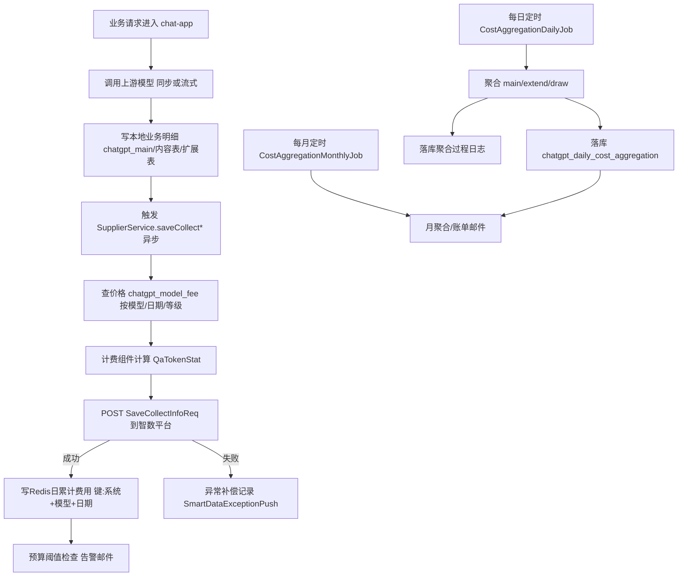

#### （2）请求级明细（实时）

触发点：一次模型调用完成（同步返回，或流式结束）后。会先落业务明细到 chatgpt_main 库，并查价格明细计算费用，然后将费用上传到智数平台。

##### （1）本地落库保存的信息

- chatgpt_main：核心调用明细
    - 用户：fd_user_id
    - 系统：system_sign
    - 模型：fd_model
    - 场景：scene
    - token：prompt_tokens/completion_tokens/total_tokens
    - 成本快照：total_cost
    - 缓存token：cache_read_tokens/cache_write_tokens

- 相关业务表（按场景）
    - 文本内容/会话内容表（如 chat content）
    - 画图/视频/扩展用量表（draw、extend等）

##### （2）查询价格明细并计算请求费用

计费的大致的流程如下
- **识别计费场景**：token / duration / frequency / characters / drawings / composite
- **选价格**：根据模型类型和日期选择费用详情：chatgpt_model_fee
- **选择计费组件**：根据计算场景，选择一个计费的组件，这些组件包含这种场景的计费逻辑，将价格信息传入进行费用计算。组件输出 QaTokenStat：
    - 用量（ask/answer或时长等）
    - 单价
    - 分项费用与总费用
    - 币种、feeType、modelDosage、orderTime
- 上传智数 + 本地治理缓存累计 + 阈值告警

**常见的计算组件：**
- TokenFeeComponent
- DurationFeeComponent
- FrequencyFeeComponent
- CharactersNumFeeComponent
- DrawingsNumFeeComponent
- CompositeFeeComponent（组合计费）

通过 ChatGptFeeCompositeFactory 统一编排，最常用的是 TokenFeeComponent，原因是 chat-app 主流是文本/多模态对话，请求量最大，token口径最通用；其他组件主要在语音时长、翻译字符、绘图次数等场景占主导。

**上传到智数平台什么**

会将下面的信息上传到智数平台，包括：
- ask/answer token与费用
- totalFee
- realRequestAppId/requestMip/remark(scene)
- 扩展：fdModel/modelType/feeType/modelDosage/orderTime

**上传到智数平台的作用**：

**缓存里保存什么：**

每次调用费用上报智数成功后，chat-app 会把这笔费用同时累加到 Redis 的日维度键（**系统 + 模型 + 日期**）里，形成实时费用水位。随后读取该系统该模型的日预算阈值，判断当前累计费用是否跨过告警档位（如 80%、100%）。如果触发且当天该档位还没发过，就通过分布式锁控制只发一次告警邮件，避免重复轰炸。

##### （3）一段话描述

- 请求完成后先查找模型价格，然后按**模型、计费类型和生效价格规则**计算本次费用；

- 随后把调用明细（用户、系统、模型、token/时长、费用等）落到 chatgpt_main 等业务表，保证本地可追溯；

- 最后再将标准化统计数据上报到智数平台，支撑跨系统的统一统计、成本分析和后续的数据挖掘与治理。

#### （3）