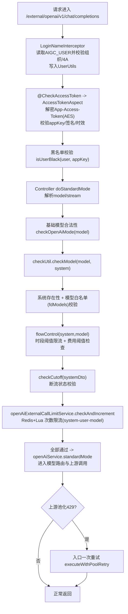

## 1、项目综述

### 1、项目定义

**定位**：这个项目本质上不是一个简单的 Chat API 服务，而是一个 **集团内部统一的外部大模型接入、治理、运营与计费平台。**

**解决的问题：**

- **统一接入**：业务方不直接各自对接 Azure/OpenAI、AWS Bedrock、Gemini、阿里、火山等厂商。
- **统一鉴权**：业务系统通过统一的 API Key / Access Token 接入，平台识别业务系统和真实用户。
- **统一治理**：模型权限、黑名单、限流、预算阈值、断流、资源调度在平台统一控制。
- **统一统计**：按系统、用户、模型、部门、场景记录调用量、token、费用和账单归因。
- **统一扩展**：文本/多模态能力由 `mip-chat-app` 承载，语音/视频等长任务由 `aigc-multimedia` 承载，未来再演进到 Higress AI 网关 + `ai-core` 新架构。

### 2、旧架构项目代码分析

#### （1） `mip-chat-admin`

定位：老架构的控制面与管理后台。

主要职责：
- **业务方基础信息设置**
- **模型与模型费用管理**
- **账号池管理**
- **账单、费用、使用统计**
- 权限、角色、模块管理
- Prompt 工程、脱敏服务、操作日志等后台管理能力

这部分不直接转发模型请求，但它决定了：
- 谁可以接入
- 能访问哪些模型
- 单价怎么配置
- 超预算后怎么治理
- 账号池和席位资源怎么运营

#### （2）`mip-chat-app`

定位：老架构的在线文本/多模态数据面，也是当前最核心的运行时服务。

主要职责：

- 暴露 `/external/**` 统一外部接口
- 识别调用方 `system/appKey`
- 识别真实用户 `AIGC_USER`
- **做模型权限、黑名单、限流、费用阈值、断流校验**
- **将统一模型名路由到具体厂商适配器**
- **将模型路由到可用资源配置（资源池/账号池，必要时再路由到最终厂商账号或客户端实例**
- **透传同步/流式/标准协议响应**
- **保存调用主记录、问答内容、token、费用**
- 暴露 `/metrics` 供 Prometheus 抓取运行指标

#### （3）`aigc-multimedia`

定位：老架构的异步多媒体数据面。

主要职责：

- 文生视频、图生视频
- 语音转写、会议记录、音频翻译
- 异步任务状态机、轮询、回调、OSS 落盘
- MQ 发送、费用上传、失败补偿

从实现风格看，它更像“任务编排平台”，不是简单的同步代理服务。

### 3、新架构项目代码分析

#### （1）`ai-core`

定位：新架构里的核心数据面与调度内核。

根据 README 和代码结构，它承担的是：

- AI 账号池调度数据面
- 对外 OpenAI 兼容协议入口
- 账户/租户/模型权限校验
- 候选资源构建、资源预占、上游转发、调用结算
- Postgres + Redis 的控制面/运行态分层
- `/metrics` 指标暴露

可以把它理解为：把老项目中越来越重的“在线调度 + 上游适配 + 额度仲裁”能力沉淀成一个更平台化的数据面服务。

#### （2）`mcn-gw-wasm-plugins`

定位：新架构中 Higress AI 网关的数据面插件工程。

当前已能看到的插件类型包括：

- `midea-ai-billing`
- `midea-ai-cache`
- `midea-ai-load-balancer`
- `midea-ai-proxy`
- `midea-log-pusher`
- `midea-4A-sso`
- `midea-4A-user-check`

这说明未来很多横切能力会从业务服务中下沉到网关插件层。

## 2、项目关键点解析

### Q1：用户请求路由解析+token 制&席位制解析

用户在发起一次大模型请求的时候，决定使用哪一个大模型的路由包含 3 个：**模型实现路由、资源池路由、厂商客户端路由**。

可以把这三个路由理解成一条请求在平台内部逐层“缩小范围”的过程，不是一次就直接落到最终厂商账号。

#### （1）模型实现路由

最上层是“模型实现路由”。它解决的问题是：这个请求应该交给哪一类适配器处理，即根据请求里的 model，选择哪一个 AigcApi 实现来处理。比如用户传的是 claude-3-5-sonnet，平台先判断这属于 Claude 模型族，就交给 Claude 的 AigcApi 实现；如果是 gemini-2.5-pro，就交给 Gemini 实现。

**这个阶段选的是“处理这类模型的代码实现”，不是具体账号，也不是具体资源**。

#### （2）资源池路由

中间层是“资源池路由”。当平台已经知道“这是一条 Claude 请求”以后，还要决定“用哪一组 Claude 资源去打”。因为同一个模型往往会配置多条资源，比如多个 URL、多个 API Key、多个节点、不同权重的通道。这里需要在该适配器内部，选择一条可用资源配置（url/apiKey/modelName）。

**这层可能来自普通 chat.resource 配置，也可能来自账号池分配出来的 ChatGptConfig。**
解决的问题是“这次调用具体用哪组连接参数”。

#### （3）厂商客户端路由

最底层是“厂商客户端路由”。有些厂商的资源配置下面还会再细分一层真实执行单元，一条资源后面可能有多个真实执行端（**多账号、多region、多client**）。

最典型的是 Claude 走 Bedrock：资源池里选出来的 ChatGptConfig 可能只说明“走这组 Bedrock 资源”，但这组资源后面还挂着多个 AWS 账号、多个 region、多个同步/异步 client。这时还要再做一次选择，比如**随机、轮询、指定名称**，最终落到某个具体 Bedrock client。这个阶段选的是“真正发请求的厂商账号/客户端”。

在 OpenAI 兼容链路里，这层常表现为“账号池/seat 资源选择”。

#### （4）串起来

把它们串起来，就是：
- 用户传入模型名
- 平台先按模型族找到对应适配器
- 适配器再从这个模型的资源池里选一条资源配置（token制或者席位制，常规使用 token，小龙虾/agent使用席位制）
- 如果该资源后面还有多个厂商账号/client，再继续选最终执行端；最后才真正发请求到上游模型

拿 Claude 举例最容易讲：
- 用户请求 claude-3-5-sonnet，平台先判定这是 Claude，进入 Claude 适配器
- Claude 适配器从 chat.resource 里选一条 Claude 可用资源，这条资源对应的是某组 Bedrock 账号
- ClientSelectionStrategy 再从多个 Bedrock client 里挑一个，最终由这个 client 调 AWS Bedrock

**所以一句话概括就是：**
- 模型实现路由：决定“谁来处理这类模型”
- 资源池路由：决定“用哪条资源配置去处理”
- 厂商客户端路由：决定“最终由哪个真实厂商账号/client 发请求”

#### （5）一些细节

##### （1）资源池的绑定细节

适配器确定后，还要决定“用哪个真实账号/URL/API Key 发请求”。有两条路径：zh
- **普通资源池**：chat.resource 里按 modelKey 选 ChatGptConfig（含 modelkey、apikey、url等调用信息）
- **账号池/席位池**：先按 appKey+model 找 poolCode，再在池里按**用户绑定、容量、冷却**等策略选具体资源。（席位池是最近新加的逻辑，目前只有`OpenAiExternalController`有，但是面试的时候可以说都覆盖了。）

##### （2）普通资源池的选择原理
厂商根据 token 来进行计费，其流程如下

- 先从 chat.resource.config[] 中筛 enable=true 且 modelKey=当前模型 的资源候选（配置来源）
- 再交给 LoadBalancer 选一条资源，你当前 SIT 配置是 chat.loadBalancer=quotaBased，即配额优先策略
  - quotaBased 细节：先看 Redis 中该模型哪些 key 还有可用配额；若都超限则降级到候选集内“加权+粘性/随机”；粘性是 userId#modelKey 哈希，权重来自 weight（默认 1）
    - 这里选还有可用配额的模型，选取 score >= maxTokens（maxTokens 不是固定值，取决于每次请求：常见是“预估输入 token + 请求的输出上限“）
    - 如果可用集合为空（都超限），降级回基础候选集 configList 继续选，这里都超限还回退，意义在于它是可用性优先的软门控，不是硬拒绝，避免因为 Redis 短时不一致/重建窗口造成全量拒绝，业务可继续服务，后续再由预算/账单治理闭环，如果你要“严格超限即拒绝”，这是另一种策略，需要在入口直接 fail-fast。
    - 粘性：offset = hash(userId#modelKey) % totalWeight，同一用户同模型尽量稳定命中同一路由区间，无粘性则随机偏移命中。权重：weight<=0 视为 1；按累计权重区间命中。
  - apiKey 额度在 Redis ZSet 里，写入时机有两类：
    - 初始化/重置：定时任务 recoverQuotaJob（一分钟执行一次） 每次会重建所有模型的 quota ZSet（先删后加，TTL 5 分钟）。初始额度来自枚举 AigcModelQuotaEnum，即会限制模型一分钟内最高调用的 token 数。
    - 调用后扣减：每次调用保存记录时，会按本次 totalToken 对当前 modelKey + apiKey 的 score 做负向扣减。同时，也会记录用户的 token 使用量和费用情况并记录到数据库，然后每天有定时任务去采集数据做预算报表。这里需要注意的是，第一版是先使用（限额）后出报表之后再和用户收费用。
    - TPM = Tokens Per Minute，每分钟可处理的 token 吞吐配额。

##### （3）席位池的选择原理

对厂商侧：厂商按人头卖 seat（每 seat 对应一个或少量可并发用户的 key 资源），我们把这些资源入池。**这里一个厂商提供的 seat 可以调用多种不同的模型，之前厂商提供的 token 也可以调用这个厂商提供的多种不同的模型。**

对用户侧：用户只拿平台发的 API Key，完全不感知厂商 key；调用时平台按 appKey + model + user 去池里调度真实资源。

资源数据模型（一行就是一个 seat 资源单元）在 openai_api_key_pool_resource：pool_code/api_key/api_url/model_configs/max_user_count/status/seat_code。model_configs 决定这个 seat 支持哪些模型，以及模型名映射和计费码映射。如下图：

并发控制靠 max_user_count 和 Redis 绑定/容量键实现，即“一个 seat 只能给 1 或少量用户”。

管理面功能包含：资源详情 + 当前绑定用户数 + 当前绑定账号列表。这里 seat 的信息目前暂时是调用接口来入库的。

**详细的调度流程：**

- 请求进入 OpenAI 兼容入口，完成鉴权与治理校验，拿到 system(appKey) 和 userId。
- 服务层先做“是否走席位池”的路由：按 appKey（systemcode） + modelKey -> poolCode。即查看这个系统及对应的模型名称是否有对应的资源池。如果存在，进入席位调度核心。席位制是否命中取决于 appKey + model 是否在配置中心里配置了 poolCode，也就是说，如果用户系统申请使用席位制（目前是人工通知），这个时候我们就将用户的系统+要使用的模型信息写入配置中心，这样相关系统的调度就会走席位制（如果有资源）。
- 第一步“先复用已绑定”：查 USER_BINDING_KEY，若绑定资源可用且支持当前模型，直接续约返回。
- 第二步“亲和复用”：若无活跃绑定，尝试复用最近一次资源，减少抖动和切换成本。
- 第三步“最空闲窗口抢占”：若亲和复用失败，从 CAPACITY_ZSET_KEY 取占用最小的前 N 个候选，过滤冷却/停用/不支持模型的资源，再随机取一个尝试占用。窗口和重试次数由配置控制。抢占用 Lua 原子执行，保证并发安全：同时更新 user->resource、resource->users、容量计数，并检查 max_user_count。
- 抢占成功后，把资源组装为 ChatGptConfig 返回，包含 openAiPoolCode/openAiPoolResourceId、modelName、responseModelCode。
- 上游调用时如果命中账号级 429，会把该资源冷却移出候选池，再抛可重试异常；入口层重试 1 次，通常会切到其他席位资源。

资源池的调用流程为：
~~~mermaid
flowchart TD
    A["前置配置：业务确认走席位制"] --> B["配置中心写入路由 appKey(system)+model -> poolCode"]
    B --> C["维护池资源（当前接口维护，后续界面化） poolCode 下 apiKey/apiUrl/model_configs/max_user_count/status/seat_code"]

    D["用户请求 /external/openai/v1/chat/completions 携带 App-Access-Token + AIGC_USER + model"] --> E["鉴权与解析 得到 appKey(system) + uid + model"]
    E --> F{"查配置中心路由 appKey+model 是否命中 poolCode?"}

    F -->|否| G["走普通 Token 调度 chat.resource 选资源"] --> H["调用上游并返回"]
    F -->|是| I["进入席位池调度 acquireChatGptConfig(poolCode, model, uid)"]

    I --> J["1. 复用已绑定资源"]
    J --> K{"复用成功?"}
    K -->|否| L["2. 亲和复用（最近资源）"]
    L --> M{"复用成功?"}
    M -->|否| N["3. 最空闲窗口抢占 从容量ZSet选前N候选"]
    N --> O["Lua原子占用 校验max_user_count 更新 user->resource / resource->users / capacity"]
    O --> P{"占用成功?"}
    P -->|否| N
    K -->|是| Q["得到 ChatGptConfig"]
    M -->|是| Q
    P -->|是| Q

    Q --> R["按 apiKey+apiUrl+modelName 调上游厂商"]

    R --> S{"是否429且账号级限流?"}
    S -->|否| T["正常返回"]
    S -->|是| U["资源冷却写入 capacity ZSet（负分）"]
    U --> V["入口触发一次重试（重新调度）"]
    V --> I

    subgraph Redis运行态
      R1["user->resource openai:pool:{pool}:user:{uid}"]
      R2["resource->users(zset) openai:pool:{pool}:res:users:{resourceId}"]
      R3["capacity/cooldown(zset) openai:pool:{pool}:cap"]
    end

    O -.写入.-> R1
    O -.写入.-> R2
    O -.写入.-> R3
    U -.冷却更新.-> R3

~~~

**这里冷却一个 key 的具体机制是：**

- 当上游返回 429 且判定为账号级限流，取当前资源的 poolCode + resourceId，调用 cooldownResource。
- 冷却实现不是删数据，而是在容量 ZSet openai:pool:{pool}:cap 里把该 resourceId 的 score 设为负的冷却到期时间戳（-cooldownExpireAt）。
- 调度候选只取 score >= 0 的资源，所以这个资源会暂时被排除，不再被选中。冷却时长默认 5 小时，可配置。
- 后续 ensureCapacityRegistered/recoverExpiredCooldownResources 会把冷却到期资源恢复回候选池。（亲和复用失败需要选择一个可用的池资源的时候执行冷却到期恢复）

##### （4）一个真实的调用案例

这里`OpenAiExternalController`这个接口类为例，这个类是提供给小龙虾使用的。

用户调用 POST /external/openai/v1/chat/completions，body 里 model=qwen-plus
- 入口接收请求，校验模型、权限、限流，见`OpenAiExternalController`，后面进入 OpenAiServiceImpl，按模型名选适配器（模型实现路由）
- 先尝试账号池路由：按 system(appKey)+model 找 poolCode，如果命中池，按**用户绑定/容量/冷却**挑选具体资源（账号池路由）
- 如果没命中账号池，则走普通资源池 chat.resource 选 ChatGptConfig（资源路由）
- 用选中的 apiUrl + apiKey + modelName 发真实上游请求（客户端落点），若账号池资源命中 429，可在入口触发一次重试

**汇总：先按模型选“哪类适配器代码”，再按策略选“哪条资源配置”，最后再落到“哪个真实账号/客户端”，这是三层路由，不是一层。**

##### （5）Token 制 vs 席位制：各自好处

Token 制 好处：
- 成本与用量线性，按量计费清晰。
- 高并发友好，一个厂商 key 可服务大量用户。
- 接入与扩容简单，适合通用问答和大规模流量场景。
- 对业务方几乎无“席位占用”心智负担。

席位制 好处：
- 适配厂商“按人头/席位”商业模型，采购与合规更匹配。
- 资源隔离更强，可做用户绑定与并发上限控制，服务稳定性更可控。
- 便于做账号池运营：启停、解绑、冷却、回收、容量管理。
- 对高价值用户或特定场景可提供更稳定的资源保障。
- 席位制用于小龙虾时省 50% 费用

**实践上通常是“双模并存”：**
- 通用流量走 Token 制。
- Coding/Agent 等强资源约束场景走席位制。

面试说法:
> 平台早期以 Token 制为主，解决统一鉴权、模型授权、限流和费用治理；后期为适配厂商人头售卖方式，新增席位制能力，并通过账号池调度把多组真实 API Key 抽象成 pool/seat，对用户做绑定、容量控制、冷却切换和后台运营管理。

##### （6）Claude->Bedrock 这类 SDK 场景的说明

对于 apikey 下面还有一层的厂商，如`Claude->Bedrock`，请求的顺序如下：

- 请求层（外部入参）：model/messages/stream/... 从接口进来，进入统一调用链。
- 平台编排层：选 AigcApi 适配器（模型实现路由），Claude 模型走 Claude 适配器。
- 资源层（ChatGptConfig）：常见字段：modelKey/apiKey/url/modelName/responseModelCode/...
- Bedrock账号层（配置中心）：amazon.bedrock.configs[].name/awsAccessKeyId/awsSecretAccessKey/region/service/enabled
- 这种模式需要引入 Claude SDK，先在配置中心维护 amazon.bedrock.configs（name/ak/sk/region/enabled），启动时根据配置初始化同步/异步 Bedrock client map，运行时按 AK 过滤 + 负载策略（随机，指定 name）选具体 client，用选中的 client 调 converse/converseStream。

**总结：对于普通调用模式，是直接 HTTP url + Bearer apiKey 调上游，而Claude-Bedrock不是直接按 URL 发 HTTP，而是走 AWS SDK client（签名、region、credentials 都在 SDK 客户端里）。**

##### （7）席位制请求返回429

下游返回 429 且错误码是账号级限流，时，先把该资源打入冷却，再抛 OpenAiPoolRetryableException。入口层捕获后只重试一次，并在响应尚未提交时 reset() 后重调，这次会重新调度到其他资源。冷却实现是把资源从容量候选集中暂时移除。

设计收益：
- 减少用户侧直接失败
- 避免同一个已限流账号被连续命中
- 不做多次重试，控制尾延迟和放大效应

这机制主要是席位/池化模式的稳定性保护，不是 token 模式的通用机制。

### Q2：鉴权、风控、流量限制与预算断流流程说明

#### （1）整体流程
##### （1）用户身份预校验（AIGC_USER）

LoginNameInterceptor 在进入 Controller 前执行。它会读取 AIGC_USER，校验用户在组织/4A中的有效性，并写入 UserUtils 线程上下文，后续限流、统计、归因都使用这个用户标识。

##### （2）系统鉴权 + 黑名单拦截（App-Access-Token）

@CheckAccessToken 触发 AccessTokenAspect。
核心动作：
- 读取 App-Access-Token 并用 aesKey 解密为 AccessKeyDto(appKey,time,aKey)；
- 校验 appKey 对应系统是否存在（接入系统合法）；
- 校验签名 MD5(secretKey + time)；
- 校验 token 时效（1小时）；
- 将 system(appKey) 写入 request：request.setAttribute("system", appKey)；
- 校验黑名单：isUserBlack(userName, appKey)，命中直接拒绝。

##### （3）请求参数解析与基础合法性检查

进入 OpenAiExternalController#doStandardMode(...)：

- 解析请求体中的 model、stream 等字段；
- 若 stream=true，补齐 stream_options.include_usage=true；
- 校验 checkOpenAiMode(model)，不合法模型直接拒绝。

##### （4）模型权限 + 核心治理入口

调用 checkUtil.checkModel(model, system)，这里是最关键治理点：

- 校验系统是否存在；
- 校验系统模型白名单（fdModels）是否包含当前模型；
- 执行 flowControl(system, model)：**时段阈值限流 + 费用阈值检查**；
- 执行 checkCutoff(systemDto)：**断流状态检查（欠费/停服）**。

##### （5）外部接口次数限流（system-user-model）

调用 openAiExternalCallLimitService.checkAndIncrement(system, user, model)：
- 用 Redis+Lua 原子计数，键为 openai:external:call:limit:{date}:{system}:{user}:{model}；
- 超过额度直接拒绝。

##### （6）进入模型调用链路

以上全部通过后，才会调用 openAiService.standardMode(...) 进入模型路由与上游调用（席位池或 token 资源）。

**池化429容错（调用阶段）**：若上游返回可重试的池化 429，入口会触发一次重试（executeWithPoolRetry），提升成功率。

##### （7）串联

**请求进入后，平台先做“用户身份 + 系统鉴权 + 黑名单”校验，再做“模型合法性 + 模型权限 + 时段/费用/断流治理 + 次数限流”，只有全部通过才进入模型路由与上游调用，实现了“先治理、后调用”的前置风控闭环。**

相应的流程图如下：

#### （2）细节说明

##### （1）@CheckAccessToken 与 @CheckSecretKey 两种鉴权方式

@CheckAccessToken：适合标准平台接入，安全性更强（加密载荷 + 时间戳 + 签名），并天然支持过期控制。**（最常用）**

**客户端建议流程：**
- 用户在请求里面带如下 header
> --header 'Authorization: Bearer apikey*' \
--header 'Aimp-Biz-Id: qwen3.5-plus' \
--header 'AIGC-USER: ex_dengyj5' \
--header 'Content-Type: application/json' 
- 请求经过算法平台的网关（参考 `SystemController.java-accessTokenTest`），会被转换为`App-Access-Token`，那后端使用`@CheckAccessToken`就可以进行解析鉴权，用户则不需要关系`secret-key`

**服务端（AccessTokenAspect）流程：**
- 取 App-Access-Token，用配置的 aesKey 解密，反序列化成 AccessKeyDto。
- 校验字段完整性（appKey/time/aKey）。
- 按 appKey 查系统是否存在。
- 用库里的 secretKey 重新计算 MD5(secretKey + time)，比对 aKey。
- 校验时效（当前代码是 1 小时内有效）。zuos'fe
- 写入 request.setAttribute("system", appKey)；再做黑名单校验。
- 后续 LoginNameInterceptor 读取 AIGC_USER 放入 UserUtils。

@CheckSecretKey：适合 OpenAI 兼容/对外简单接入，调用方只需 Bearer 一个密钥。**（只有 `OpenAiExternalController` 使用）**

**客户端：**
- Authorization: Bearer <API Key>
- 另外仍建议带 AIGC_USER（用于归因、黑名单）。

**服务端（SecretKeyAspect）流程：**
- 取 Authorization，校验前缀 Bearer 。
- 取出 token（即 secretKey）。
- selectAccessSystemBySecretKey(secretKey) 查系统；不存在就拒绝。
- 写入 request.setAttribute("system", appKey)。
- 做黑名单校验后放行。

##### （2）时段阈值限流 + 费用阈值检查

核心在 ChatGptLimitingServiceImpl.java (line 100) 的 flowControl(system, modelKey)。

**时间阈值限流执行逻辑：**

先过滤模型：只对 chat.limiting.setting.models 配置的模型启用治理。
时段计数限流：
- 计数键：chat:limiting:{system}:{model}:{HH:mm}（按小时窗口）。
- 每次请求 increment；再取当前值 number。
- 阈值 config 由 getConfig(system, model, time) 计算：
    - 先查 DB 动态配置（appModelLimitConfigService.getDbConfig）；
    - 再查 chat.limiting.config 静态规则；
    - 再退化到 defaultNumber。

- 若 number > config，抛 CHAT_GPT_LIMITING 拒绝。

**费用阈值检查执行逻辑（同一个 flowControl 内）：**
- 先用 getConfigFee(system, model, time) 取当日费用阈值（同样 DB 优先，其次配置，最后 defaultFee）。
- 再 computeModelFee(...)（或 computeModelFeeByTimes(...)）读取日累计 usage/fee 缓存，按模型单价换算当日费用。
- 超过阈值抛 CHAT_GPT_FEE_OVER_LIMIT。
- 在 80%/100% 阈值会触发告警消息（IM），100%会拦截。

##### （3）断流状态检查

核心在 ChatGptLimitingServiceImpl.java (line 194) 的 checkCutoff(systemDto)。

**执行逻辑：**
- 判断系统 systemDto.isCutoff 是否为 YES。
- 判断全局开关 bill.manage.isCutoff 是否开启。
- 两者都满足则抛 CHAT_GPT_SYSTEM_CUTOFF_YES，请求直接拒绝。

这个断流状态不是在请求里算出来的，**通常由后台欠费任务更新系统状态，例如 OverduePaymentAlertDayJob.java (line 193)**

##### （4）外部接口次数限流
核心在 OpenAiExternalCallLimitService.java (line 56) 的 checkAndIncrement(...)。

**执行逻辑：**

- 先检查总开关和 system 是否在支持名单。
- 通过 OpenAiExternalCallLimitConfig.java (line 42) 的 resolveQuota 算额度：
    - system 默认额度
    - user 白名单额度
    - model 白名单额度
    取有效值。
- 生成日维度键：openai:external:call:limit:{date}:{system}:{user}:{model}。
- 用 Lua 原子脚本做“判断+计数”：
    - 不存在则置 1 并设置 TTL；
    - 已达额度返回负值；
    - 未达额度则 incr。
返回负值即抛 OPEN_AI_CALL_LIMITING，请求拒绝。

**这条链路是“先 flowControl(时段+费用)，再 checkCutoff(断流)，再 externalCallLimit(次数)”，三道闸都过了才会真正进入模型调用。**

##### （4）时间阈值维度 与 次数校验的关系

两者都是“按次数”，但维度和目的不同：

**时段阈值限流（flowControl）**

- 维度：system + model + 时段规则
- 粒度：偏“系统级总量控制”
- 规则：支持分时段阈值（如 08:00-12:00 不同于夜间）
- 目的：防系统级流量冲击，保护整体容量与成本

**外部接口次数限流**（OpenAiExternalCallLimitService）

- 维度：date + system + user + model
- 粒度：偏“用户级配额控制”
- 规则：按天累计，支持 system 默认 + 用户白名单 + 模型白名单额度
- 目的：防单用户/单模型滥用，做精细化配额治理

一句话：**前者管“这套系统在这个时段总共能打多少”，后者管“这个用户今天在这个模型上还能打多少”。两层叠加是“总量保护 + 个体约束”。**

