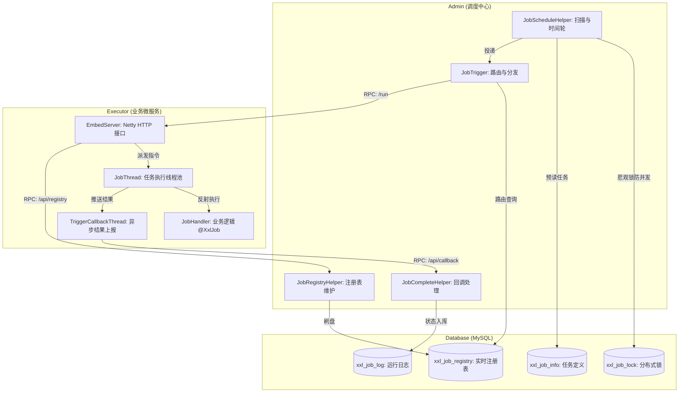

## 1、原生 xxl-job 相关问题

### Q1：原生 xxl-job 涉及的数据库表及其作用

**执行器组/注册：**
- xxl_job_group 定义“执行器集群”（appName，一组实例）；
- xxl_job_registry 存每个实例的心跳/地址，调度时从这里选实例（非分片广播场景下一次只调一个地址，分片广播才全量触发）。

**任务定义：**
- xxl_job_info 是任务主表（调度类型、路由策略、执行参数、阻塞/超时/重试）；
- xxl_job_logglue 存 GLUE 历史版本，当前 GLUE 源码在 xxl_job_info.glue_source。

**执行日志：**
- xxl_job_log 记录每次触发与执行结果；
- xxl_job_log_report 做按天统计。

**治理：**
- xxl_job_lock 保证多 Admin 只一台抢到调度；
- xxl_job_user 管控账号和执行器权限。

说明：
（1）**GLUE vs BEAN**：BEAN 是随应用发布的本地 handler；GLUE 是在控制台写脚本/Groovy，代码存 DB，触发时下发给执行器动态跑（无需改包/重启）。

### Q2：用户实际使用 XXL‑JOB 的执行流程

**用户使用 XXL‑JOB 的流程是：**

- 先保证 Admin 调度中心启动并连库，然后启动业务服务里的执行器。执行器启动后会定时向 Admin 注册心跳，把实例地址写入 xxl_job_registry。

- 在控制台“执行器管理”里创建执行器组（appName）。如果选择自动注册，Admin 会按 appName 周期性从 xxl_job_registry 聚合在线地址，刷新到 xxl_job_group.address_list；如果选择手动录入，就直接使用填写的地址列表。任务必须绑定执行器组，否则无法调度。

- 随后在控制台配置任务（调度规则、路由策略、handler/GLUE、参数等）。到触发时间，Admin 扫描任务、路由选中一个实例，构造 TriggerRequest 下发到执行器的 /run 接口。执行器根据 @XxlJob("handlerName") 或 GLUE 代码找到任务并执行，执行完回调 Admin，Admin 更新日志、统计和告警。

### Q3：xxl-job-admin 里面关键的类及其设计

xxl-job-admin：调度中心 + 控制面，核心职责：

- 管理任务与执行器配置（UI + DB 持久化）
- 调度扫描与触发执行（时间轮 + 线程池）
- 维护执行器注册表（自动注册/失活剔除）
- 接收执行器回调并完结日志
- 失败告警、运行报表、权限控制

 admin 核心模块划分如下：
1. **启动与容器管理**：`XxlJobAdminBootstrap` 是整个后台运行引擎的枢纽。
2. **调度核心**：`JobScheduleHelper`（扫表调度+时间轮）、**调度策略与错失**（`ScheduleTypeEnum`/`Cron`/`Misfire`）。
3. **分发触发核心**：`JobTrigger`（请求组装） -> 路由策略引擎 -> `JobTriggerPoolHelper`（快慢双线程池异步调用）。
4. **服务发现核心**：`JobRegistryHelper`（心跳探活与机器摘除）。
5. **结果处理与补偿监控**：`JobCompleteHelper`（异步回调处理）、`JobFailAlarmMonitorHelper`（重试与告警）、`JobLogReportHelper`（报表统计与历史日志清理）。
6. **业务与API封装**：`XxlJobServiceImpl`（管理台的CRUD基石）与 OpenAPI (`AdminBizImpl` 暴露给执行器的回调心跳接口)。

#### （1）`XxlJobAdminBootstrap` (启动引导与资源大总管)
**设计定位：** Spring 容器启动完毕后的生命周期大管家。
**深入原理：**
- 实现了 Spring 的 `InitializingBean` 和 `DisposableBean` 接口。
- **职责一：集中启停后台线程。** 在 `afterPropertiesSet` 中，按严谨的依赖顺序启动所有核心的单例守护线程（Helper）：先启动池子 (`JobTriggerPoolHelper`)，再启动心跳、监控等，最后启动时间轮调度核心 (`JobScheduleHelper`)。
- **职责二：管理底层 RPC 客户端。** 内部维护了一个 `ConcurrentMap<String, ExecutorBiz>`（由 `getExecutorBiz()` 控制），缓存了向各个执行器发起调用的 Http 客户端代理对象，降低每次频繁重新创建连接实例的开销。

#### （2）`JobScheduleHelper` (核心调度引擎 - 最重点)
**设计定位：** 扫表找任务，计算时间，推送到内存时间轮实现高精度触发。
**深入原理：** 包含两根守护线程。
- **`scheduleThread` 扫描线程**：
  - 基于 MySQL `for update` 的悲观表级/行级锁防并发，保证一台 Admin 扫库时不会有别人抢资源（当前线程扫描完提交后其他线程才能尝试重新获取锁）。
  - **预读机制**：每次拉大数据库未来 5 秒内需触发的任务。
  - **分发机制**：如果任务“过期超过 5 秒”（Misfire，**控制台挂机/重启、线程饥饿或数据库卡顿** 等原因导致），走 Misfire 补偿：
    - DO_NOTHING（默认）：什么都不做。
    - FIRE_ONCE_NOW：立刻马上强行触发一次。
  - 如果在未来 5 秒内，则将其“秒级别刻度”放入时间轮 `ringData` (一个 `ConcurrentHashMap<Integer, List<Integer>>`) 中。

- **`ringThread` 时间轮线程**：
  - 每秒钟苏醒一次，从 `ringData` 移除并获当前秒的 Job 集合，将需要触发的 JobId 推送给 `JobTriggerPoolHelper` 处理。

#### （3）时间轮的原理

时间轮（Time-Ring）是 XXL-JOB 做到毫秒级精准触发且不直接阻塞扫描线程的神级操作。

工作原理详细流程：

- 数据结构：ringData 在内存里表现为一个巨大的 Map：ConcurrentHashMap<Integer, List<Integer>>。它的 Key 取值范围是 0 ~ 59，代表一分钟内的 60 个秒级别刻度；Value 是在这个秒数需要触发的 JobId 集合。
- 推入（生产者）：当 scheduleThread 扫描出“还有 3 秒就要触发”的任务时，假设它的触发时间是 10:05:23，那么它就会计算出秒数 23。然后把 这个任务的 JobId 塞进 ringData.get(23) 的列表里，随后扫描线程就去干别的了。
- 取出（消费者）：ringThread 是一个后台线程，它的外层循环开头有一行代码： TimeUnit.MILLISECONDS.sleep(1000 - System.currentTimeMillis() % 1000); 这句话的作用是让这个线程极其精准地在每一秒的第 000 毫秒醒来一次。

获取与执行：
- 当 ringThread 醒来时（比如此时是 10:05:23），它拿到当前的秒数 23，然后去 ringData.remove(23) 把列表端走。
- **重点来了**：为了防止因为 GC (垃圾回收) 停顿或者 CPU 抖动导致 ringThread 第 23 秒根本没醒过来（错过了刻度），它每次不仅取当前秒，还会往前多取 2 个刻度（取 23、22、21 的数据）。
将这几个刻度里拿到去重的 JobId，统统甩给 **JobTriggerPoolHelper** 这个真正的 HTTP 发送线程池去调用执行微服务。

一句话总结：**scheduleThread 负责按“批量”预取任务摆盘，放到对应的 0-59 秒空格子里；ringThread 是个巡逻兵，每一秒钟醒来一次，走到当秒对应的格子里把任务全部倒出来拿去执行。这就完美解决了数据库定时轮询不精准的问题！**

#### （4）`JobTriggerPoolHelper` (快慢物理线程池隔离)
**设计定位：** 负责实际发起 HTTP 请求给 Executor，采用 **舱壁模式(Bulkhead)** 防雪崩。

**深入原理：**
- **快慢池分离机制**：维护 `fastTriggerPool` 和 `slowTriggerPool` 两个线程池。

- **智能降级保护**：它有一个 `jobTimeoutCountMap`，记录过去一分钟内每个 Job 耗时大于 500ms 的次数。执行前检测：如果某任务最近一分钟超时超过 10 次，则自动将其隔离丢弃到 `slowTriggerPool`。每到新的一分钟，就会把 jobTimeoutCountMap 全局清空归零，给那些从卡死中恢复的慢任务重新做人的机会。

- **作用**：确保个别执行器网络卡顿或处理极慢的任务，只会占用慢线程池容量，不会拖垮全局所有的定时任务（快池依然畅通）。

#### （5）`JobTrigger` 与 路由策略 (`ExecutorRouteStrategyEnum`)
**设计定位：** 将模型转换成具体的 RPC 请求 (`TriggerRequest`) 并决定发给哪台机器。

**深入原理：**
- `JobTrigger` 负责生成本次执行唯一的 `logId`，根据 `xxl_job_info` 配置拼装 `TriggerRequest`，包括传递运行参数、设置分片广播总数/索引等。

- **路由策略**（非常容易被问）：
  - **一致性 HASH (`ExecutorRouteConsistentHash`)**：采用 `TreeMap` 实现。每个真实节点映射 100 个虚拟节点，JobId 取 Hash 找离自己最近顺时针节点，**确保同一 Job 永远落在一台机器上。**
  - **故障转移 (`ExecutorRouteFailover`)**：遍历所有注册 IP，对每个按顺序发起 `beat()`（心跳探活请求），谁第一个返回存活，就下发给谁！有效避免发布停机时的报错。
  - **分片广播 (`SHARDING_BROADCAST`)**：特殊策略，不走单一路由，而是在一个大 for 循环中将任务下发给 RegistryList 下的**每一台服务器**，并通过计算传入其所在的 Index 和 Total。

#### （6）`JobRegistryHelper` (服务注册与心跳摘除)
**设计定位：** 类似 Eureka / Nacos 的弱化精简版，维持活动执行器节点名录。

**深入原理：**
- **注册接口**：接收来自于 `AdminBizImpl.registry()` 的心跳调用，交由异步线程池记录到 `xxl_job_registry` 表（保存或更新时间戳）。
- **探活与清洗线程 (`registryMonitorThread`)**：
  - 每 30 秒执行一次，查询 `xxl_job_registry` 表，将 `update_time` 与当前时间对比如果超过 90 秒的（所谓3倍心跳周期），判定为下线并从库中剔除 (Dead)。
  - 将有效的 IP 更新汇总写入回 `xxl_job_group` 的 `address_list` 字段中做持久化。后续的路由调度全从该有效列表中选机器。

#### （7）`JobCompleteHelper` (执行结果回调处理)
**设计定位：** 处理任务的成功/失败状态，防止长连接同步等待结果带来的线程阻断。

**深入原理：**
- **被动回调 (`callbackThreadPool`)**：微服务执行完通过 `core` 包主动向 Admin 发起请求（推模式），交由此异步线程池更新 DB 的运行日志状态（成功或报错）。
- **主动监控 (`monitorThread`)**：任务丢了怎么办？内部通过后台线程扫描，任务如果长达 10 分钟卡在“运行中”，且其执行器实例已失联离线甚至不再活动，就会**强制标记该日志为失败**（Lost_Fail 防止死锁状态）。

#### （8）`JobFailAlarmMonitorHelper` (失败补偿与告警)

**设计定位：** 给失败落地的任务提供“第二次挽救机会”和邮件电话告警。
**深入原理：**
- 用一个不断循环睡眠 10 秒的独立线程。
- 扫描 `xxl_job_log` 表那些刚刚被标记为“失败”且没有触发告警处理的条目。
- **失败重试**：检查任务失败重试次数，如果 >0，立刻向池子发消息 (`trigger(TriggerTypeEnum.RETRY)`) 触发一次重试，并将重试记录写入到该日志。
- **发送告警**：调用 `JobAlarmer` 把异常栈通过邮件通道发出去，并将其告警状态标记更新，防止重复告警。
  
#### （9）`JobLogReportHelper` (统计报表与日志留存)
**设计定位：** 统计 3 天历史数据进入`xxl_job_log_report`，以便控制台读取报表数据，同时清理超过保存时间的日志。

**深入原理：**
- **数据对齐刷新**：每次计算出当前前 3 天的 Running、Success 数量等缓存进 `xxl_job_log_report`，控制台页面读报表直接拿，降低了大表查询的系统压力。
- **自动清理日志记录**：配合 admin 配置 `xxl.job.logretentiondays`（日志保留天数），后台线程每天会开启批量 `DELETE` 操作来清理过期调度记录，避免时间推移把 MySQL 磁盘挤爆。

#### （10）调度类型配置 (Schedule + Cron + Misfire)
- **调度类型**：
  - `Cron` (底层 `CronExpression`)：类似于 Quartz 取解析处理后的有效周期，计算未来触发时间。
  - `FixRate` / `FixDelay`：固定速率，就是简单的当前时间加上固定的秒数。
- **Misfire (错失) 策略 (`MisfireStrategyEnum`)**：
  由于调度抖动、重启、死锁导致任务本该 1 分钟前触发没触发，现在扫描发现了。该怎么做？
  - `DO_NOTHING`：直接废弃过去应该执行没执行的，继续等未来的点。
  - `FIRE_ONCE_NOW`：立刻强行“补偿触发”一次过去遗漏的。

#### （11）`OpenAPI`: `OpenApiController` 与 `AdminBizImpl`
**设计定位：** 专门暴露给 Executor 执行器调用的系统级 API，**提供执行器心跳注册以及任务回调**。
**深入原理：**
- `OpenApiController` 仅提供 HTTP 端点入口，不写逻辑。
- `AdminBizImpl` 是门面实现，充当执行器微服务与后台线程之间的路由器。它主要接收：
  1. `callback()`：委托给 `JobCompleteHelper.callback()`处理任务结束。
  2. `registry()` / `registryRemove()`：委托给 `JobRegistryHelper` 处理长连接心跳的注册和下线。

#### （12）控制台业务大管家：`XxlJobServiceImpl`
**设计定位：** Xxl-Job-Admin 控制台 Web UI 的数据支撑。
**深入原理：**
提供了所有控制台界面按钮对应的方法，如分页查询 (`pageList`)，新建任务 (`add`)，修改任务 (`update`)，强行终止 (`stop`)，立即触发一次 (`trigger`) 等。
所有方法在落库之前会进行繁琐的数据完整性校验与基础鉴权（比如子任务 ID 防止循环、Cron 表达式校验、路由策略安全过滤等），这构成了一个产品级的健壮边界。

#### （13）admin 完整的运转逻辑

你可以以此话术给面试官复盘一次**完整的生命周期**：
> “一个完整的任务执行流程是这样的：
> 1. 首先通过控制台调用 **`XxlJobServiceImpl.add`** 保存了带有 Cron 的执行规则到数据库；
> 2. 后台执行微服务启动后，一直在调 **`AdminBizImpl.registry`** 每隔 30s 发送心跳，**`JobRegistryHelper`** 将存活的执行器实例维护了下来；
> 3. 每到准点附近，**`JobScheduleHelper`** 获取分布式锁拉取了该任务，由于在 5s 的刻度内，将其塞入了内存的 Time-ring 结构；
> 4. 时间轮对应的秒走到时，通知了 **`JobTrigger`**，它获取了当前存活地址并通过如**故障转移等路由策略**找到了一台存活的机器，并检测有没有被降级，最终扔给 **`JobTriggerPoolHelper`** 快慢线程池发起 Http RPC 请求；
> 5. 执行器运行完代码，触发 HTTP 通知 **`AdminBizImpl.callback`**，回调进入 **`JobCompleteHelper`**，数据库状态变更为完毕；如果其中出错，则会被 **`JobFailAlarmMonitorHelper`** 捕获进行失败重制和邮件报警机制补偿。这是贯穿它的一个闭环。”

### Q4：XXL-JOB-CORE 执行器模块关键类及设计

`xxl-job-core` 的核心使命是：**内嵌在业务微服务中，作为一个后台守护组件，默默处理来自 Admin 控制台的请求。**

其核心模块划分如下：
1. **生命周期大管家**：`XxlJobExecutor` 及其子类 (`XxlJobSpringExecutor` / `XxlJobSimpleExecutor`)，负责组件的依附与启停。
2. **底层通信组件 (Netty HTTP)**：`EmbedServer`，一个小型的内嵌 Web 服务器，专门监听 Admin 节点发来的 RPC 调用。
3. **接口契约 (RPC 协议)**：`AdminBiz`（执行器主动调 Admin）与 `ExecutorBiz`（Admin 调执行器）。
4. **单任务线程模型**：`JobThread`（1个任务1个独立线程 + 无界阻塞队列隔离）。
5. **异步反馈机制**：`TriggerCallbackThread`（回调）与 `JobLogFileCleanThread`（日志清理）。
6. **多语言与动态脚本支持**：GLUE 模式 (`GlueFactory`, `ScriptJobHandler`)。

#### （1）生命周期管理：`XxlJobExecutor` 家族
**设计定位：** 整个 Core 执行器在客户端的启动入口，管理一切后续依赖。
**深入原理：**
- **基类 `XxlJobExecutor` 的 `start()` 方法**：核心生命周期枢纽。
  1. 初始化 `adminBizList`（用来给 Admin 回调结果的 HTTP Client 代理）。
  2. 启动 `JobLogFileCleanThread` (每天定时清理过期本地日志的异步线程)。
  3. 启动 `TriggerCallbackThread` (专门收集执行结果发给 Admin 的异步队列池)。
  4. 启动 `EmbedServer` (基于 Netty 的内嵌 HTTP 服务器，监听特定的端口等待发令)。
- **Spring 模式 (`XxlJobSpringExecutor`)**：
  - 实现了 Spring 的 `SmartInitializingSingleton` 接口。**这是重点！**
  - 在 Spring 容器中所有单例 Bean 实例化完毕后，它的 `afterSingletonsInstantiated()` 方法会被触发。
  - 它会扫描应用上下文中所有的 Bean，**找出含有 `@XxlJob` 注解的方法。反射获取到 `execute`, `init`, `destroy` 去封装成一个 `MethodJobHandler`，并存入到内部的本地大 Map (`jobHandlerRepository`) 中**。
- **无框架模式 (`XxlJobSimpleExecutor`)**：
  - 不依赖 Spring，需要开发者手动通过代码 `setXxlJobBeanList()` 塞入对象列表，然后执行器去扫这些对象里的 `@XxlJob` 注解。

#### （2）Netty 是什么，和 Java 的关系是什么？

Netty 是一个开源的、**基于 Java NIO（非阻塞 I/O）构建的高性能网络应用框架。你可以把它理解为一个为了编写高性能网络服务器和客户端而量身定制的脚手架。** 著名的中间件比如 Dubbo、RocketMQ、Elasticsearch、Zookeeper 乃至底层游戏服务器，绝大部分底层通信用的全都是 Netty。

它和 Java 的关系：

- 底层依赖：Netty 完全是用 Java 写的。Java 从 JDK 1.4 开始引入了 NIO（New I/O 或 Non-blocking I/O）相关的类（如 Selector, Channel, ByteBuffer 等），提供了异步非阻塞的网络编程能力。

- 痛点解决：虽然 Java 原生的 NIO 非常强大，但它的 API 极其难用，存在很多臭名昭著的 Bug。Netty 就在 Java NIO 的外面包了一层极其优雅的架构和 API。它解决了 Java 原生 NIO 的所有痛点，做到了真正的开箱即用、高并发、高吞吐和低延迟。

#### （3）接收请求的门面：内嵌 Netty HTTP 服务 (`EmbedServer`)

**设计定位：** 微服务除了暴露给前端的比如 8080 端口外，还需要一个专属于 XXL-JOB 通信的暗门（默认 9999 端口）。

**作用**：这个所谓的“自定义 Netty HTTP 服务”，本质上就是一个寄生在业务系统内部的**微型总机调度站**。它脱离主流 Web 容器独立存活，通过一个不受外界干扰的私有端口，源源不断地接收从 Admin 中心下达的HTTP 触发请求，并甩进自己的独立线程里去执行你手写的业务逻辑。

**深入原理：**
- **轻量级 HTTP 协议**：出于通用性和跨语言的考虑，没有使用复杂的 TCP 二进制私有协议，而是使用 Netty 封装了一层极其简单的 **HTTP + JSON 协议**。 

- **线程池隔离**：接收到 HTTP 请求后，绝不会在 Netty 的 IO 线程 (`NioEventLoop`) 中直接跑业务！它内置了一个叫做 `bizThreadPool` 的专用业务线程池（默认最大 200 线程），所有请求（触发、心跳、杀掉任务）都丢进去异步执行，保护 Netty 吞吐量。
- **保活心跳**：通道加入了 `IdleStateHandler`，如果长时间（3倍心跳周期, 即 90 秒）没有读写交互，Netty 会自动关闭闲置的 Channel 节约资源。
- **注册机制启动**：`EmbedServer` 启动成功并且端口绑定监听后，才会真正开启一个后台线程延时去向 Admin 中心发起 `registry()` 注册（告诉老大我活了，IP端口是这个）。

#### （4）为什么要自定义一个 Netty HTTP 服务？为什么不用原生 HTTP 服务（如 Tomcat）？

执行微服务里明明一般都自带了 Tomcat 等容器（比如 Spring Boot 默认的 8080 端口），为什么还要在 xxl-job-core 里面用 Netty 再强行内嵌启动一个 9999 端口的 HTTP 服务？

**（1）极致的轻量、解耦与非侵入性**

如果用原生 HTTP（如复用 Spring Boot 的 Tomcat 8080 端口），虽然也能接到 Admin 的请求，但这就意味着 xxl-job-core 强绑定了 Web 容器。如果你的微服务是一个纯粹的后台计算程序（比如只跑 Kafka 消费，根本没有引入 spring-boot-starter-web 就不带 Tomcat），那 XXL-JOB 就没法工作了。

Netty 的优势：只需几个简单的 Java 类就能拉起一个 HTTP 服务器。这样使得 XXL-JOB 对执行器环境的依赖降到了零。不需要任何 Web 容器，哪怕是一个只有 main 方法的普通 Java 程序，只要引入 xxl-job-core 的 jar 包，也能立刻变成一个能被调度的节点！

**（2）避免与业务流量争抢资源**

如果复用业务端口 (8080)，你微服务的前端用户请求（如查看商品详情）和 Admin 调度中心的调度请求（下发定时任务），会挤在 Tomcat 内部同一个线程池里处理。如果今天恰好发生了大促，前端用户请求瞬间把 Tomcat 线程池打满了，此时定时任务哪怕到了时间，也会因为拿不到 HTTP 线程而被拒绝访问或超时。

**Netty 的优势**：自己偷偷开辟了 9999 的内部专属管理端口，拥有完全独立的 bizThreadPool 业务线程池。业务高峰期的用户洪峰再怎么冲击 8080 端口，也不会影响到 9999 端口的定时任务调度。

总结，netty 服务的 2 个优点：
- 轻量，解耦，提供 http+josn，无需 web 服务就可以使用 xxl-job。
- 另外开辟一个服务+端口，避免与业务接口竞争线程资源

#### （5）RPC 远程协议层：`AdminBiz` vs `ExecutorBiz`
**设计定位：** **双向通讯的标准化接口定义**。双方各持一面“盾牌”。

**深入原理：**
- **`ExecutorBiz`（我是被动方）**：Admin 控制台呼叫具体某台机器的执行器时，用的就是这个契约。
  - `/beat`：心跳探活（问你死没死，纯粹网络层面）。
  - `/idleBeat`：忙碌探测（问你特定的 JobId 现在忙不忙？如果有旧任务且是丢弃策略，就不下发了）。
  - `/run`：**最核心**，下发 `TriggerRequest`，里面包含了 JobId、执行参数、重试次数等，让执行器开干！
  - `/kill`：收到强杀指令，强制中断运行该 JobId 的线程。
  - `/log`：查这台机器磁盘上的运行日志打印到界面上。

- **`AdminBiz`（我是主动方）**：微服务里的执行器干完活，主动拨号找 Admin 时用的。
  - `callback()`：任务执行完毕（不管成功报错），把结果码送回去。
  - `registry()` / `registryRemove()`：心跳自动续期与优雅下线的通知服务。

#### （6）真正干活的苦力线程模型：`JobThread` (重点考察)

**设计定位：** **一个任务 ID（JobId），对应且仅对应一个专属的物理线程。** 防止不同定时任务之间互相干扰、争抢资源。

**深入原理：**

- **结构**：一个 `JobThread` 内部维护了一个 `LinkedBlockingQueue<TriggerRequest> triggerQueue`（无界异步触发队列）。

当你配置一个任务每 1 秒执行一次，但这个任务由于业务原因执行了 1.5 秒，那么调度中心发过来的第二个执行指令就会先被塞进这个 triggerQueue 里的。 它的本质是为了实现同一个任务的串行化执行（FIFO 先入先出）。JobThread只有一个，它会从这队列里一个一个取出来慢慢跑。

Admin 调用的 HTTP 请求（生产者）在 Netty 线程池里跑，速度极快；而业务逻辑（消费者）在 JobThread
里跑，速度可能很慢。无界队列可以解耦生产者与消费者，防止因为任务积压导致 Netty 线程池被拖垮。

- **执行过程 `run()`**：
  1. 调用开发者定义的 `init()` 方法初始化。
  2. 进入 `while(!toStop)` 的死循环，一直挂在那阻塞等待：`queue.poll(3, TimeUnit.SECONDS)`。
  3. 一旦 Admin 下发了 `/run` 请求，执行器会走到 `JobThread.pushTriggerQueue()` 把请求放到队列里。老黄牛立刻苏醒。
  4. 反射调用 `@XxlJob` 标注的方法本身 (`handler.execute()`)。
  5. 记录执行结果状态码，并存入上下文。在这个 `finally` 块中，统一组装成结果调用 `TriggerCallbackThread.pushCallBack()` 排队等待回调上报。

- **去重机制**：使用 `ConcurrentHashMap.newKeySet()` (记录 `logId`) 防止网络抖动造成的同一个触发请求被塞进队列两次（重复触发）。任务请求在放入无界队列之前，会先根据 logId 判断 set 里面是否有这个任务LtriggerLogIdSet.add(logId)。
如果 add 返回 true，说明这个指令是新的，允许入队，反之不允许入队。

- **闲置销毁**：如果这个 `JobThread` 发现自己有超过 30 轮（将近 90 秒）没从队列里拿到活儿干（说明这个定时任务可能被删了或暂停了），它会自动把当前线程自杀（`removeJobThread`），回收宝贵的系统线程资源。

#### （7）高性能异步回调机制：`TriggerCallbackThread`

**设计定位：** 任务跑完后，绝不能让业务线程同步等待去调 Http 通知 Admin，严重影响并发。

**深入原理：**
- 内部是一个非常巧妙的**双线程缓冲容灾模型**。
- 维护了一个内存队列 `callBackQueue`。干完活的 `JobThread` 只需要把成功/失败结果扔进这个队列，转身就去休息。

- **线程一 (`triggerCallbackThread`)**：拼命地从队列掏数据。为了提升效率优化网络 I/O，使用的是 **批量操作 `drainTo`** 功能，一次性把那一瞬间队列里积压的 N 个任务结果合并成一个 List，通过一次 Http 请求 (`adminBiz.callback`) 发给控制台。极大地降低了网络消耗。
- **回调失败落地容灾**：如果当时 Admin 挂机了，Http 请求报错怎么办？它会把你本次要回传的结果序列化 JSON，**写入到本地磁盘的磁盘文件 (.log 为后缀，文件名包含 MD5 防冲突)** 过冬。

- **线程二 (`triggerRetryCallbackThread`)**：不停地在后台睡倒、醒来（每几十秒醒来一次），专门扫描本地磁盘的容灾文件。一发现系统里遗留了没回传成功的文件，就捞起来重试（`retryFailCallbackFile`），直到发给 Admin 为止，发完删文件。（确保即使网络断开 2 小时，恢复后结果哪怕晚点也能对齐！这是一个非常精彩的健壮性设计）。

#### （8）多语言大杀器：`GLUE` 模式支持
**设计定位：** 赋能无需重新编译发版，即可动态运行、甚至脱离 Java 环境运行其他语言脚本的能力。

**深入原理：**
- **Java GLUE**：
  - 如果选 `GLUE(Java)`，控制台写的一串 Java 类代码文本被以参数下发后，底层使用 Groovy 的 `GroovyClassLoader`，在 JVM 内存中将文本直接动态编译成一个 Class 实例！
  - 把它转换为实现了 `IJobHandler` 接口的对象注入，执行体验上甚至感觉跟原生编译打包的没什么不同。

- **脚本 GLUE (`GlueTypeEnum`)**：
  - 支持 Shell、Python、Nodejs 等 (`isScript=true`)。
  - 下发时，其实是执行器在本地 `/data/applogs/xxl-job/gluesource` 目录下，临时创建了一个扩展名对应（如 `.sh`或`.py`）的物理文件，把通过网路传来的代码写进去。
  - 然后直接调用 Java 原生的 **`Runtime.getRuntime().exec()` (如 `bash xxx.sh` 或 `python3 xxx.py`)** 以新起操作系统子进程的方式执行脚本。
  - 脚本执行标准输出流（System.out）被拦截输入到日志文件中。状态码直接强行通过脚本跑完的 `exitValue` 判断（0 代表成功，其它代表失败）。

#### （9）core 完整的运转逻辑

> “当微服务启动并加载 Spring 容器完毕后，**`XxlJobSpringExecutor`** 就会扫描找出带 `@XxlJob` 的组件缓存起来，随后启动底层的 Netty **`EmbedServer`**，打开了一个额外的 9999 端口，同时专门派一个线程往中心去注册自己的 IP。
> 
> 然后它就静静等待。当调度中心路由到了这台机器并发起 HTTP `/run` 请求时，Netty 的工作线程不会去真的跑任务，因为怕阻塞。它会把请求扔到自己的 `bizThreadPool` 异步池处理。
> 
> 紧接着，如果发现当前环境没有这个 `JobId` 的专属线程，它就会当场 New 一个 **`JobThread`** 线程专门伺候它，如果已经存在就沿用。然后把请求参数压入到这个 `JobThread` 里的 **无界阻塞队列**。
> 
> 这个被唤醒的专属 `JobThread` 会去反射调用我写的 `@XxlJob` 业务代码。执行完业务拿到结果（成功还是失败的代码和消息），扔进公共的 **`TriggerCallbackThread`** 的回调队列里就回去睡觉了。
> 
> 最后，**`TriggerCallbackThread`** 采用批量化手段 `drainTo` 收集一波结果合并，只发一次 HTTP 请求告诉 Admin。如果 Admin 挂了网络不通，它还会把结果先落到当前服务器磁盘，靠后台容灾重试线程慢慢捞起来重试。确保结果的最终一致性。”

### Q5：业务开发如何使用原生 xxl-job

**（1）引入核心依赖**

第一步是『引入核心依赖』。我们只需要引入 xxl-job-core 即可。

**（2）详细配置步骤**

在 Spring 环境下，配置分为三步走：YAML/Properties 配置 -> Java 配置类声明 -> 业务代码实现。

1. 基础参数配置 (application.properties)

你需要告诉执行器：老大（Admin）在哪？我是谁？我的暗门（Netty 端口）开在哪？

~~~ properties
# 1. 调度中心地址（多个用逗号隔开）
xxl.job.admin.addresses=http://127.0.0.1:8080/xxl-job-admin
# 2. 访问令牌（必须与 Admin 端一致才能通信）
xxl.job.admin.accessToken=default_token

# 3. 执行器 AppName（对应控制台“执行器管理”里的 AppName）
xxl.job.executor.appname=xxl-job-executor-sample
# 4. 执行器 IP与端口（Netty服务监听的端口，默认9999）
xxl.job.executor.port=9999
# 5. 日志路径与保留天数
xxl.job.executor.logpath=/data/applogs/xxl-job/jobhandler
xxl.job.executor.logretentiondays=30
~~~

2. 注入配置类 (XxlJobConfig.java)

这是最关键的一步。你需要手动声明一个 XxlJobSpringExecutor的 Bean。

**面试点**：为什么要手动声明？因为 xxl-job-core 并没有提供所谓的 Starter 自动装配。手动声明 XxlJobSpringExecutor 可以让你更灵活地控制执行器的启停，并利用 Spring 的生命周期钩子（它实现了 SmartInitializingSingleton）去扫描标有 @XxlJob 的方法。

~~~ java
@Configuration
public class XxlJobConfig {
    @Bean
    public XxlJobSpringExecutor xxlJobExecutor() {
        XxlJobSpringExecutor executor = new XxlJobSpringExecutor();
        executor.setAdminAddresses(adminAddresses);
        executor.setAppname(appname);
        // ... 设置其它从 properties 读取的参数
        return executor;
    }
}
~~~

3. 编写业务 JobHandler

方式：在 Spring Bean 的方法上标注 @XxlJob("任务名")。

**面试点**：推荐使用这种“方法模式（Method）”，因为它非侵入、一个类里可以写多个 Handler，且支持 Bean 注入。

~~~ java
@Component
public class SampleJob {
    @XxlJob("demoJobHandler")
    public void execute() throws Exception {
        // 核心逻辑
        XxlJobHelper.log("XXL-Job 正在执行...");
        // 业务代码...
    }
}
~~~

### Q6:串联整个流程（admin 与 core）

#### （1）六个阶段的生命周期拆解

##### 1. 启动与自动化装配阶段 (Boot Phase)
- **Executor 侧**：
  - Spring 容器启动，`XxlJobSpringExecutor` 扫描所有带有 `@XxlJob` 注解的方法。
  - 将方法封装为 `MethodJobHandler` 存入内存 Map。
  - 启动内嵌的 **Netty (EmbedServer)** 监听 9999 端口，开启“后门”等待指令。
- **Admin 侧**：
  - `XxlJobAdminBootstrap` 启动。
  - 启动所有 Helper 单例（调度、触发池、心跳监听、回调处理）。

##### 2. 服务注册与心跳发现阶段 (Discovery Phase)

- 执行器启动后，由于 `EmbedServer` 被激活，它会开启一个 **`ExecutorRegistryThread`**，**每 30 秒**主动向所有配置的 Admin 地址发送 `registry` 请求。
- Admin 的 `JobRegistryHelper` 收到请求，更新数据库 `xxl_job_registry` 表中的 `update_time`。
- Admin 另有一根线程每 30s 扫描一次，将超过 90s 未心跳的任务剔除。

##### 3. 调度决策阶段 (Scheduling Phase)
- `JobScheduleHelper` 开启事务，执行 `SELECT ... FOR UPDATE` 抢占 `xxl_job_lock`。
- **预读**：查询 `trigger_next_time` 在未来 5 秒内的任务。
- **处理**：
  - 已过期的任务走 `Misfire` 策略。
  - 即将到期的任务塞入**内存时间轮 (ringData)**。
  - 时间轮每秒钟跳动一格，取出当前秒需执行的 JobId 集合。

##### 4. 路由与触发阶段 (Trigger Phase)
- `JobTrigger` 模块拿到 JobId，去数据库捞出最新的任务配置。
- **选地址**：根据配置的路由策略（如：一致性 Hash、故障转移）从地址列表中选出一台机器。
- **快慢池隔离**：根据该 JobId 的历史超时记录，决定将其放入 `fastTriggerPool` 还是 `slowTriggerPool`。
- **发送 RPC**：封装 `TriggerRequest`，通过 HTTP 发送到执行器的 `/run` 接口。

##### 5. 单任务线程执行阶段 (Execution Phase)
- 执行器的 Netty 监听到请求，交给业务线程池。
- **创建线程**：执行器为该 JobId 绑定一个专属的 **`JobThread`**。
- **入队**：将指令塞入该线程的 `LinkedBlockingQueue` 队列。
- **执行**：`JobThread` 轮询队列，拿到指令后反射调用业务 Service 方法（`@XxlJob` 注解的任务在一开始就被扫描放入 map）。
- **去重**：利用 `logId` 进行 KeySet 去重，防止网络抖动导致的重复执行。

##### 6. 异步回调与监控阶段 (Monitor Phase)
- 任务执行完，结果被扔进执行器的 `TriggerCallbackThread` 队列。
- **批量上报**：回调线程合并结果，调用 Admin 的 `/api/callback`。
- **容灾**：如果回调失败，执行器会将结果写入本地 `.log` 文件，由后台线程持续重试。
- **状态终结**：Admin 收到回调，更新 `xxl_job_log` 表的状态（成功/失败），任务生命周期结束。

#### （2）全景架构图

XXL-JOB 采用“执行器主动注册”与“中心式异步调度”的架构模型。

## 2、GNC XXL-Job 架构相关问题

### Q1：GNC 任务调度定位以及其与原生 xxl-job 的区别
#### （1）GNC XXL-JOB 的定位

> 公司将原生 xxl-job 从单一调度中心形态，扩展成了一个多地域部署的云原生调度平台。平台把控制面、调度器、执行器 SDK、全局路由、权限鉴权、中转触发、外部代理等能力拆成了多个服务，并与应用管理平台、权限中心、API 网关、K8S 服务体系做了集成。

#### （2）GNC 平台相对原生 XXL-JOB 的关键升级（逐步补充）

##### （1）`多地域 + 多环境物理隔离`

### Q2：GNC XXL-JOB 架构

从部署图看，GNC 平台可以分成 4 层：

#### （1）第一层：全局入口层

**（1）console-cloud：中立云统一工作台。**

给用户提供产品入口、登录态、租户信息，以及 region、env 、系统的选择能力。它本身不负责调度业务，只负责承接用户入口和上下文。

**（2）APISIX 全局网关入口。**

负责把来自 console-cloud 的请求按路径转发到对应服务，比如把“根据区域+环境获取前端入口配置”的请求转给 region-service，把后续业务请求转给对应区域前端。

或者是， portal 根据 region+env+systemCode 返回需要路由的 dashboard 信息后，也需要提供 Apisix 进展转发。

**（3）gnc-djs-region-service 区域入口目录服务**

根据配置返回“某个 region / env 对应的前端入口地址”。主要解决“用户选了佛山生产后，前端资源该去哪里加载”的问题。

**（4）gnc-djs-portal DJS 的系统级路由与代理层。**

不是简单按 region+env 路由，而是按 region+env+systemCode 决定请求应该落到哪个 dashboard 集群。
在当前单 dashboard 场景下它的作用不明显，但它为多 dashboard、多系统绑定、后续切换预留了统一路由层。

**（5）请求路线串联**

**用户先在 console-cloud 里选择地域和环境，请求通过 APISIX/bizgw-cloud 先访问 gnc-djs-region-service，拿到该 region+env 对应的前端入口并加载对应区域的前端资源。**

**进入 DJS 后，若后续请求需要按系统维度确定实际 dashboard 集群，则再经过 gnc-djs-portal，由它按 region+env+systemCode 将请求代理或路由到真正的区域 dashboard。然后要找到对应的 dashboard 的服务，也需要通过 Apisix 进行转发。**

#### （2）第二层：区域控制面

**（1）t-djs-gnc-dashboard-front**

区域内的前端静态资源服务，负责承载 DJS 管理界面页面，比如任务管理、执行器管理、日志查询、标签、告警等页面。

**（2）gnc-djs-dashboard**

区域控制面的核心后端服务。提供任务、执行器、标签、告警、API Key、系统配置等管理接口。负责控制台数据查询、任务配置变更、执行器管理、日志查询、统计展示等管理能力。同时还承担一部分后台管理任务，比如日志清理、统计汇总、巡检、主节点后台任务等。

**（3）MariaDB**

区域控制面的核心持久化数据库。保存该区域内的任务定义、执行器信息、系统信息、日志分表、统计表、标签、告警、权限、区域配置等数据。它是这个区域 dashboard 的核心数据来源。

**（4）Redis**

这里 Redis 有如下作用：

- 控制面主节点选举与续约（Dashboard）
- 调度器集群主节点选举与分片状态（schedule）
- 权限、角色等高频访问的数据缓存，减少频繁查 DB
- 分布式锁：避免多实例重复执行同一后台任务/事件处理
- 路由策略状态共享，把路由计数/访问顺序放 Redis，保证多调度实例下路由策略一致。

这一部分可参考下面的问题分析

**（5）总结**

这一层负责“区域内所有调度管理能力的控制面闭环”：前端负责展示和交互，dashboard 负责业务管理逻辑，MariaDB 负责持久化元数据和日志数据，Redis 负责缓存与协同支撑，共同组成某个区域独立运行的 DJS 控制后台。

#### （3）第三层：区域调度数据面

- 部署图上的 `gnc-djs-scheduler`
- 代码里的 `scheduler-trigger`

从代码职责看，真正承担调度扫描、worker 注册入口、任务触发、回调处理的是 `scheduler-trigger`。但在部署命名上，实例通常叫 `gnc-djs-scheduler-*`

- 扫描到期任务
- 选择执行器地址
- 选择触发策略
- 调用 worker 执行任务
- 接收 worker 注册、下线、回调、日志查询、kill 等请求

#### （4）第四层：执行器与业务层

- 接入业务应用中的 `djs-scheduler-client`
- 业务应用内的 `@XxlJob` 处理器

这一层负责：

- 任务处理逻辑真正执行
- 向平台注册实例
- 接收调度命令
- 回传执行结果和日志

#### （5）全局组件与区域组件的边界

**全局共享组件**

- `gnc-djs-region-service`：根据 region+env 前返回对应前端资源
- `gnc-djs-portal`：根据 region+env+system 前返回对应 dashboard 资源
- `gnc-djs-scheduler-proxy-service-1-0`：权限、告警、k8s资源组件代理
- `gnc-djs-scheduler-hub-annto`：安德机房转发

这些组件更偏“路由/代理/全局辅助能力”。

**区域内独立组件**

- 佛山、贵安、欧洲、新加坡各自的 `dashboard`
- 各自的 `scheduler`
- 各自的 `MariaDB`
- 各自的 `Redis`

**这说明 GNC 的核心设计是：**

> 区域内闭环，区域间隔离；全局只保留入口、路由和辅助能力。

这是企业级多地域调度平台非常典型的设计。

### Q3：GNC XXL-JOB 各类链路梳理

#### （1）控制台访问链路

- 用户访问 console-cloud 进入 DJS 应用入口，鉴权，获取租户信息，查看 所有的区域和环境 
- console-cloud 调 gnc-djs-region-service 获取“区域 + 环境 -> 前端入口(front域名/路径)”映射，随后请求经 APISIX/bizgw-cloud 路由转发到对应区域 front，front 加载静态资源并初始化运行时上下文
- front 先调用 gnc-djs-portal，根据当前 region/env（以及可能的 system/service 维度）返回应访问的后端控制面信息（目标 dashboard 标识/网关路径）。front 再按 portal 返回的目标，通过 APISIX/bizgw-cloud 转发到对应区域 dashboard 后端，dashboard 返回页面数据（任务、执行器、日志、权限等），前端完成页面渲染。

这条链路说明：

- 前端静态页面是区域化部署的
- 全局控制台并不直接持有全部区域的业务数据，region 级别
- 控制台更像“导航入口 + 统一壳”

#### （2）执行器注册链路

- 业务应用引入 scheduler-client-spring-boot-starter，配置如下信息
  - xxl.job.admin.addresses：调度/注册接口地址（region+env 对应）
  - xxl.job.accessToken：执行器鉴权 token
  - xxl.job.api-key：SDK 接入鉴权
  - xxl.job.executor.appName：执行器标识
  - xxl.job.executor.port：执行器端口
  - 下面是可选
  - xxl.job.executor.ip / xxl.job.executor.address
  - xxl.job.executor.enableK8sIp
  - xxl.job.executor.version
  - xxl.job.executor.cluster-code

- 应用启动初始化 XxlJobSpringExecutor，扫描 @XxlJob handler 并启动注册线程。
- SDK 根据配置与运行环境解析注册地址（K8s IP/自定义 address 等策略）。
  - enableK8sIp=true 时走 K8S_CLUSTER，取容器网卡默认 IP，通常就是 Pod IP；
  - enableK8sIp=false 且检测到 K8S 环境时走 K8S_NODE，取环境变量 NODE_IP + NODE_PORT_<port>，即 NodeIP:NodePort。

- worker 调用 scheduler-trigger 的执行器注册接口，先做 api-key 校验（接入身份），再做 accessToken 校验。
- 校验通过后，写入/更新 djs_job_registry，并同步更新 djs_job_actuator_version、djs_job_actuator（含在线状态与地址）。
- 后续 scheduler 调度时基于这些注册信息路由到具体执行器实例下发任务。

#### （3）调度执行链路

- scheduler-trigger 每秒预读即将到期任务（约未来 5 秒窗口），只处理本实例负责的任务分桶。
- 对每个任务按时间状态处理：过期任务走 misfire 策略；到点任务直接触发；即将到点任务放入时间轮，按秒触发
- 触发时先按任务绑定执行器拿在线地址列表，再按路由策略（随机/轮询/一致性哈希/广播等）选目标 worker
- 触发通信策略分流：
  - 旧版兼容 SDK：走 XXL_RPC_HUB（trigger http 调旧 hub，再 http 中转到 worker）。
  - 新版 SDK 且系统未绑定 hub：GRPC_DIRECT 直连 worker。
  - 新版 SDK 且系统绑定 hub：GRPC_RPC_HUB（trigger http 调 hub，hub 用 gRPC 调 worker）。
- worker 执行本地 @XxlJob handler，执行完成后通过 HTTP 回调 trigger。（这里通过 schedule 统一的网关接口回调。兼容内外网的你各种网络区域
- trigger 落执行结果与治理数据：任务日志分表、失败日志、重试与告警状态更新；Dashboard 查询这些结果做展示与运维。

#### （4）中转 Hub 链路

**（1）Hub 在系统里到底做什么？**

gnc-scheduler-hub 本质是一个“中转适配器”，做 4 件事：
- 提供统一中转入口（http）
- 做 Hub 级鉴权，校验请求头 DJS-HUB-TOKEN
- 做协议分发（按 workerRequestType，工厂模式），支持 netty、http、grpc
- 转发到 worker 执行

**Hub 不做调度决策，不扫任务，不存调度数据，只负责“鉴权 + 协议适配 + 网络中转”。**

**（2）hub 链路汇总**

我们把 Hub 设计成调度链路里的中转适配层。Trigger 在判定某系统需要走 Hub 后，会用 HTTP 调 Hub 的统一入口，Hub 先做 DJS-HUB-TOKEN 鉴权，再按 workerRequestType 选择协议实现。

比如 gRPC：Hub 用 worker 地址和 token 建立 gRPC 客户端，把 triggerJob、healthCheck、log、kill、idleBeat 转发到 worker，再把结果回传给 trigger。Hub 本身不做任务扫描和调度决策，也不落调度主数据，职责是网络隔离场景下的安全转发与协议适配。这样 Trigger 保持统一调度逻辑，跨网络和多协议复杂性都收敛到 Hub 层。

### Q4：GNC 下“用户实际使用流程 + 数据聚合”完整链路

#### （1）在 Dashboard 创建执行器，先写“静态主数据”

**1、djs_job_actuator**

**存储内容**：执行器主档，app_name、app_token、registry_type(auto/manual)、run_version、cluster_id、worker_model、service_env/region/zone/system_code、online_status、address_list。

**作用**：执行器“主身份表”，任务绑定的对象就是它；调度时先找到它再找可用地址。address_list/online_status是动态状态入口。

**2、djs_job_actuator_version**

**存储内容**：执行器“版本维度”数据。actuator_id、app_name、actuator_version、address_list、state、region/env/system_code。

**作用**：支持同一执行器多版本并存与灰度；调度可按版本拿地址。

**3、djs_cluster_actuator**

**存储内容**：cluster_id 与 actuator_id 绑定关系。

**作用**：约束执行器属于哪些 worker 集群，供注册校验和路由策略使用。

**4、djs_worker_cluster**

**存储内容**：worker 集群字典。cluster_code、cluster_name、cluster_status、region/env/system_code。

**作用**：注册心跳上报的 cluster-code 会映射到这里，决定实例归属。

#### （2）控制台创建任务（任务定义数据）

**1、djs_job_info**

**存储内容**：任务定义。actuator_id、executor_handler、schedule_type/schedule_conf、route_strategy、executor_param、timeout/retry、trigger_status、trigger_next_time、job_hash、cluster_id、system_code。

**作用**：调度扫描的核心表；真正“要不要触发、何时触发、触发到谁”都来自这里。

**2、djs_job_alarm**

**存储内容**：告警策略。job_id、alarm_flag、alarm_type/channel、alarm_email、alarm_event_type、count_times。

**作用**：执行失败/超时/漏调度后的告警治理。

#### （3）执行器启动注册（动态实例数据）

**1、djs_job_registry**
 
**存储内容**：实例心跳明细。registry_object(EXECUTOR/TrigInst)、registry_key(appName)、registry_value(ip:port)、registry_version、worker_cluster_id、sdk_version、updated_at。

**作用**：在线实例“事实来源（source of truth）”；谁在线、哪个版本在线、多久没心跳一目了然。

**2、djs_job_actuator_version.address_list（被回写）**

**存储内容**：某 app_name + version 的在线地址聚合结果。

**作用**：调度取地址时不必每次扫全量心跳，读聚合结果即可。

**3、djs_job_actuator.address_list + online_status（被回写）**

存储内容：当前运行版本（run_version）的在线地址与在线状态。

作用：控制台展示和调度快速判断执行器可用性。

#### （4）鉴权与接入身份数据

**1、djs_api_key**

**存储内容**：secret_key、system_code、last_use。

**作用**：SDK 接入身份校验（api-key）；保证“是谁在接入”。

**2、djs_job_actuator.app_token（同表字段）**

**存储内容**：执行器通信令牌。

**作用**：accessToken 校验；保证“这个 appName 的请求是否合法”。

#### （5）任务触发与执行结果（运行时数据）

**1、djs_job_log_000000 ~ djs_job_log_000099**

**存储内容**：单次触发全链路日志。job_id、executor_address、trigger_time/code、handle_time/code、route_msg、handle_msg、trigger_source_id、trigger_day。

**作用**：高并发日志分片存储（你生产有 100 张分表），支撑查询、重试、审计。

**2、djs_job_log_failure**

**存储内容**：失败/超时日志索引与归集，含 log_table_order + log_id 回指原日志。

**作用**：告警与失败重试的高效数据源。

**3、djs_job_log_report**

**存储内容**：按天按系统聚合的成功/失败/运行中计数。
作用：日报与大盘统计，不直接承载明细。

**4、djs_statistics_log_day、djs_statistics_service_group_log_day**

存储内容：按任务/服务/服务组维度的日统计。

作用：运营视角统计分析。

#### （6）一段话串起整个流程

用户先在 Dashboard 创建执行器和任务，形成静态配置主数据写入 djs_job_actuator（执行器）、djs_job_info（任务信息） 等表。

业务服务接入 SDK 并启动，本地扫描 @XxlJob，初始化 handler，然后执行器 执行器向 trigger 注册心跳（鉴权：api-key + accessToken），明细写 djs_job_registry，聚合更新 djs_job_actuator 的 worker 访问地址等信息。

最后，Schedule/Trigger 到点扫描任务并触发，根据任务绑定执行器 + 地址列表 + 路由策略选实例，下发执行器 /run；执行器用本地 handler 映射执行。

worker 如果能找到下发的任务（@XxlJob 标识）则正常执行，返回执行结果，找不到或者执行失败，则返回相应的执行失败信息给 schedule，schedule 将数据入库，dashboard 可以查看相应信息。

### Q5：GNC的结构设计理念

#### （1）区域内闭环，区域间解耦

平台不把所有任务集中在一个中心，而是每个区域自有：

- dashboard
- scheduler
- DB
- Redis

好处：
- 故障域更小更容易排查
- 海外与国内可独立运作
- 减少跨地域调用，降低整个系统链路的延迟

#### （2）控制面与数据面分离

从模块职责看：

- `dashboard` 更偏控制面
- `scheduler-trigger` 更偏数据面

这样做的价值是：
- 管理接口和调度链路分离，调度热点不压垮管理后台
- 更容易独立扩容

#### （3）新旧版本兼容优先

从 `TriggerModelStrategyFactory`、`compatible-version-list`、`oldversion-hub` 可以看出：**团队非常重视迁移期兼容，不是要求所有业务一次性升级
，而是通过版本识别自动决定走旧链路还是新链路，这是很典型的平台化改造思路。**

#### （4）云原生优先，但不强依赖单一部署模式

SDK 地址解析策略里同时支持：

- `VM`
- `K8S Node`
- `K8S Cluster IP`

说明平台虽然服务于云原生应用管理平台，但并没有只考虑容器场景，还兼容虚拟机和历史部署形态。

#### （5）业务多活可控

**执行器集群 + 集群停用能力**，本质上就是把“业务多活拓扑”显式抽象成平台对象。

这比原生 XXL-JOB 的单纯地址列表更先进，因为它把“调度地址集合”升级成了“可治理的业务集群”。

## 3、GNC XXL-JOB 细节问题汇总

### Q1：为什么不沿用单体 admin，而要拆成 dashboard 和 schedule？

原生 admin 同时承担“控制面管理”和“调度执行面”职责，云原生多区域、多环境下会出现资源争抢和故障互相放大。

我们拆成两层：
- dashboard：控制台与治理面，负责任务配置、执行器管理、权限、告警、统计、日志清理、审计归档等。

- schedule（trigger）：调度执行引擎，负责扫描到期任务、路由执行器、触发执行、接收回调、维护注册心跳状态。

**协作链路**：用户在 dashboard 配任务入库 -> schedule 扫库并触发 worker -> worker 回调 schedule 更新执行结果 -> dashboard 提供查询与治理能力。

**设计收益：**
- 控制面与调度面解耦，控制台慢查询/报表不直接拖垮调度主链路，实现故障域隔离
- 调度压力大时只扩 schedule pod；控制台不用跟着扩
- 技术演进更灵活：调度策略、分片、路由可独立演进

### Q2：Schedule 多 Pod 下任务如何分配？Pod 上下线如何感知？为什么还要选主，如何选主？

分配任务给 schedule 节点的时候，**我们使用：“分桶分片”**：

- 任务先算 job_hash = jobId % 256（固定 256 桶）。
- 在线调度实例集合变化时，触发重分片，把 256 桶均匀分给各实例（Redis Set 到每个实例 key：trigger:active:<instanceKey>）。
- 每个实例只扫描自己桶内的任务（SQL 条件是 job_hash in 我的桶集合），从根上避免全量重复扫库。

**Pod 感知机制：**
- 每个 schedule 实例启动后持续注册/续心跳，会将其心跳信息上传到 djs_job_registry 表（TrigInst 类型）。
- 争抢 Redis key（5s 过期），来选主，master 周期检查实例心跳超时，判定上下线，将超时的 schedule 节点剔除，这个时候会触发256 个桶重新分配，因为 schedule 的数量发生变化，每个实例仍只扫描自己桶内的任务。

**Redis 如何选主：参考下面 dashboard 的选主，schedule 是一样的方式**

### Q3：Dashboard 为什么要选主？选主方式与原生 xxl-job 选主有何区别与优势？

dashboard 有大量**治理型定时任务**（失败/过期任务处理、日志清理、统计上报、审计归档等），如果多 pod 同时执行会重复告警、重复归档、重复清理。

因此 dashboard **采用 Redis 租约选主**：
- 每个 dashboard pod 周期（10s）读 Redis key dashboard_master_node，若不存在或值等于自己，就写入自己并设置 TTL=30 秒，并把本机 isMasterNode=true

- 非 master 节点只做服务请求，不跑 master-only 定时任务（失败任务处理、漏调扫描、归档、统计、清理等）

- master 宕机后，不再续约，key 过期，其他 pod 可接管

- 原生 xxl-job 主要通过 DB 悲观锁（xxl_job_lock.schedule_lock）保证“调度扫描单活”。

- 我们是“dashboard Redis 选主 + 调度面分片并行 + 使用 Redis 选 master 来管理 schedule 心跳以及协调分片”，不是单一全局锁模型。

**相较于原生 xxl-job 优势？**

- **降低 DB 压力**：主从协调从 MySQL 锁迁到 Redis，减少行锁竞争和事务阻塞。
- **云原生更友好**：Pod 弹性扩缩容时无需频繁争抢 DB 锁，主从切换更平滑。
- **故障切换快**：靠 TTL 过期自动漂移，不依赖 DB 锁释放时机。
- Redis 续约是租约一致性，不是强一致锁（查与写非原子性操作），极端情况下可能短时双主，因此你们在关键任务上叠加分布式锁/幂等保护。

### Q4：梳理出 schedule 调度任务的链路

- schedule 实例启动后注册自己（TrigInst）并续心跳到 djs_job_registry
- 所有实例竞争 Redis key：trigger:active:master_scheduler（**TTL 5 秒，周期续约，空值写入自己的值续期，与 dashboard 选主方式一致**）。
- 实例选主后，master 维护在线实例集合，实例变化时重分 256 桶。
- 分片结果写 Redis：每个实例一个 key，key 形如 trigger:active:<instanceKey>，value 是 Redis Set，元素是桶号整数。
- 每个 schedule 扫描前先从 Redis 读自己的桶集合，扫库查 djs_job_info：job_hash in (我的桶集合) 且 trigger_next_time 到期窗口内，然后对命中的任务做预读/触发（含 misfire、时间轮推进、立即触发）
- 触发时按路由策略选执行器地址（执行器地址来自注册信息与执行器配置），下发到 worker
- worker 执行后回调 schedule 更新日志与状态；若找不到 handler 会返回失败并进入失败处理链路。

**一句话总结：**
Dashboard 选主是为“治理任务单活”；
Schedule 选主是为“单主管理实例与控制分桶”，而“任务调度执行”是多节点分片并行。

### Q5：api-key 和 accessToken 分别校验什么？

#### （1）api-key（平台接入身份）

**作用**：校验“谁在接入平台”。

**机制**：请求头是 DJS-API-KEY。服务端会先校验格式前缀，再查 djs_api_key 是否存在。然后用平台配置的密钥（apiKeySecret）去解析/解密出 payload（包含 systemCode 等），再和执行器归属系统做一致性校验。

**数据来源**：djs_api_key。

#### （2）accessToken（执行器通信口令）

**作用**：校验“这个 appName 的调用口令对不对”。

**机制**：从头里取 XXL-RPC-ACCESS-TOKEN，按 appName 查执行器配置里的 app_token（有缓存），必须完全相等。

**数据来源**：djs_job_actuator.app_token。

#### （3）两者关系
api-key 偏“系统级身份认证” - 平台接入身份认证 + 系统归属校验，accessToken 偏“执行器实例组通信认证”；两层叠加，避免“拿到某个 token 就能跨系统伪造调用”。

#### （4）使用场景

api-key 和 accessToken 主要用于 worker 调用 trigger 的**注册、下线、回调**三类核心接口，确保“系统身份”和“执行器口令”两层都合法后才允许落库与状态变更。

#### （4）trigger 与 worker 之间的鉴权

worker -> trigger 通过 apikey 和 accesstoken 双重验证，如果走 Hub，还会多一层 trigger 与 hub 之间 的鉴权（如 secretCode/token），但最终 hub 转发给 worker 时仍会带 worker 的 accessToken。

trigger -> worker 主要用的是 执行器的 accessToken（与上行是同一个 accesstoken）

### Q6：什么时候直连什么时候使用 HUB 进行转发？HUB 的作用是什么？为什么兼容 http/grpc ，新版使用 grpc？为什么废除 netty 编写的 embedserver？

#### （1）什么时候直连什么时候使用 HUB 进行转发

**先看 SDK 版本：**

**旧版/兼容名单**：走兼容链路（XXL_RPC_HUB），就是 http 访问 XXL_RPC_HUB，XXL_RPC_HUB再 http 访问 worker

**新版：**
  - **未绑定**：GRPC_DIRECT 直连 worker。
  - **已绑定**：GRPC_RPC_HUB（trigger http -> hub -> grpc worker）。

#### （2）HUB 的作用是什么

- 统一中转入口（/dispatch/v1/*）。
- 做 Hub 级鉴权（DJS-HUB-TOKEN）。
- 做协议适配与转发（当前主实现是 gRPC 转 worker，工程模式）。
- 屏蔽跨机房/跨网络复杂性，让 trigger 保持统一调度逻辑。

**一句话：Hub 是“安全中转 + 协议适配层”，不是调度决策层。**

#### （3）为什么兼容 HTTP/gRPC，新版主用 gRPC？

**HTTP**：通用、接入快、网关友好，适合兼容与外围系统对接。
**gRPC**：长连接复用、二进制高效、低延迟高吞吐，适合高频调度主链路。

所以策略是：入口与兼容层保留 HTTP，执行主链路收敛到 gRPC。

#### （4） grpc 优势详细说明

- **长连接复用（对比 HTTP）**
  - gRPC 基于 HTTP/2，一个连接可承载多路并发请求（多路复用），避免频繁建连。
  - 传统 HTTP/1.1 常见是连接复用能力弱、并发时更容易遇到队头阻塞或连接池争抢。
  - 在高频调度里，gRPC 能明显降低连接管理开销和抖动。

- **二进制高效（对比 HTTP/JSON）**
  - gRPC 默认 Protobuf（二进制）序列化，报文更小、编码解码更快。
  - HTTP 常用 JSON，文本体积更大、解析开销更高。
  - 调度系统这种大量短请求场景下，gRPC 通常更省带宽和 CPU。

- **低延迟（对比 HTTP）**
  - gRPC 受益于长连接 + 多路复用 + 二进制协议，单次请求额外开销更低。
  - HTTP/JSON 在高并发短调用时，协议与序列化开销占比更高。
  - 所以 gRPC 的 tail latency（高分位延迟）通常更稳。

- **高吞吐（对比 HTTP）**
  - 同等资源下，gRPC 通常能承载更多 QPS，尤其在大量小包 RPC 场景。
  - HTTP 方案在连接池、序列化、线程模型上更容易先到瓶颈。
  - 对调度主链路（触发、心跳、探活）来说，gRPC 更容易支撑高密度调用。

#### （5）为什么废除 Netty embed server（历史 RPC）

**不是“性能不行”，是“平台整体成本不优”：**

- 自定义 RPC 维护/排障/治理成本高。
- 与网关、鉴权、限流、观测体系标准化整合差。
- 跨团队和长期演进不如 gRPC/HTTP 稳定。

#### （6）hub 判断的规则链

- 先判断 sdkVersion 是否是“旧版兼容”
  - 条件：sdkVersion 为空，或命中 compatibleVersionList。
  - 结果：走 XXL_RPC_HUB（旧版兼容中转链路，TriggerXxlRpcStrategy）。

- 如果不是旧版兼容，再查该系统是否绑定 Hub
  - 通过 schedulerHubInfoService.findCacheBySystemCode(systemCode) 获取 Hub 信息。

- 根据 Hub 绑定结果二选一
  - 未绑定 Hub（code 为空）：走 GRPC_DIRECT（TriggerGrpcDirectStrategy，直连）。
  - 已绑定 Hub：走 GRPC_RPC_HUB（TriggerGrpcHubStrategy，经 Hub 转发）。

总结：**先按 SDK 版本分“旧兼容”与“新链路”，新链路再按系统是否绑定 Hub 决定“gRPC直连”还是“gRPC经Hub”。**

### Q7：为什么使用 worker 集群（即 worker 要有个集群标识），有什么好处？

调度平台是“中心化控制 + 分区执行”，控制面统一管理，执行面按地域/网络/租户拆分，能同时满足可用性、性能、治理和合规，且比“全局一个大池子”更容易做 SLO 保证与问题定位。

基于这种架构，**下面场景会使用到 worker 集群**：

- 双活机房：华南+华东同时承载，任一侧故障另一侧可接管。
- 多地域出海：欧洲/新加坡各自执行本地任务，减少跨境链路依赖。
- 内外网隔离：某些租户在专网或隔离机房，必须通过专属集群/Hub。
- 大促分区保供：核心业务独占高优先级 worker 集群，避免被低优先任务抢资源。
- 渐进迁移：老 SDK 集群与新 SDK 集群并行，平滑迁移不一次性切流。

**这样设计的好处**

- **故障隔离**：某个机房/网络域出问题，只影响对应 worker 集群，不拖垮全局。
- **就近调度**：任务尽量在本地分区执行，降低跨区延迟与网络成本。
- **弹性扩缩**：不同分区可按业务峰谷独立扩容，不必全局一起扩。
- **合规与数据主权**：特定数据只能在指定区域执行，worker 集群天然承载边界。

### Q8：worker 通过集群标识启停是如何实现的

是通过“**集群状态 + 心跳续约门禁 + 调度地址过滤**”三段实现的：

- 控制台停用集群/workerCluster/stop 会把 djs_worker_cluster.cluster_status 改为 DISABLE(0)

- 执行器后续心跳会被拒绝 worker 心跳注册时带 clusterCode，Trigger 在 registrySaveOrUpdate 里调用 workerClusterValid 校验：
  - 集群是否启用（cluster_status）
  - 该集群是否绑定了该执行器（djs_cluster_actuator），不通过就抛异常，心跳不再续约。

- 调度侧自动“看不见”这个集群的地址，触发时先按执行器绑定集群取地址（WorkerClusterStrategyContext -> RandomLiveWorkerStrategy），最终查 djs_job_registry 时要求 updated_at >= now - DEAD_TIMEOUT（约 90s）。
因为停用后心跳续不上，这些地址很快变成过期地址，不再参与路由和触发。

**一句话总结：停用集群不是直接“删地址”，而是先关续约入口，再靠心跳超时窗口把该集群地址从调度候选里自然剔除。**

### Q9：scheduler-proxy-service 的作用

`scheduler-proxy-service` 不是调度核心，而是“外部依赖代理层”。

它负责：

- 烽火台告警信息对接
- CMDB 数据对接
- 云原生应用管理平台权限对接

存在它的原因是：

- 某些第三方接口有网络限制
- 某些接口需要统一认证
- 全局服务访问外部系统更适合集中代理，而不是散落在各区域服务里

### Q10：SDK 详解

目前项目里面有 2 个 SDK，分别是：
- scheduler-client-spring-boot-starter 执行器 SDK：负责把业务服务变成可被调度的平台 worker（注册心跳、接收触发、执行 @XxlJob）。
- scheduler-restful-api-spring-boot-starter 管理 API SDK：负责让业务服务通过 API 以代码方式管理执行器和任务配置。

#### （1）client-SDK 的打包原理

这类 Java SDK，本质就是 Maven 构建一个或多个 jar 并发布到私服（Nexus）。常见产物：
- 主产物：xxx-starter-版本.jar
- 源码包：xxx-starter-版本-sources.jar
- 元数据：pom（依赖关系、版本、仓库信息）
- 可选：javadoc.jar（你们这边看起来主要是前两者+pom）

我们平时说的引入 pom 包，其实是引入 SDK 文件的仓库坐标（maven 管理），然后项目编译之前会去拉取相应 pom 坐标下面的 SDK 相关的文件（jar、source 等）。启动的时候，SDK 的 jar 作为依赖被加载，里面的自动装配代码随 Spring 一起初始化并生效。

#### （2）client-SDK 的 启动生效链路

client-SDK 的服务启动链路链路如下：

##### **（1）业务服务引入依赖**

业务服务引入 scheduler-client-spring-boot-starter 依赖，并配置 xxl.job.*

##### **（2）Spring Boot 提供装配入口文件加载核心类**

Spring Boot 通过下面 2 个装配入口文件发现加载核心类：
  - AutoConfiguration.imports
  - spring.factories

这两个文件内容本质一致，都会声明要自动装配的类：
AutoLoadComponentConfig、SpringXxlConfig、XxlJobInitialization。作用是让业务方“**只加依赖，不写显式启动代码**”就能自动启用 SDK。

Boot 3 主推 AutoConfiguration.imports，Boot 2 主要用 spring.factories，你们同时保留了两套做兼容。

3 个关键启动类的作用如下：
- **加载 SDK 核心类得到容器**：AutoLoadComponentConfig.java：@ComponentScan，把 SDK 包内组件（**责任链、地址策略等**）扫进 Spring 容器。

- **绑定用户配置到配置对象**： SpringXxlConfig.java：把 xxl.job.* 绑定成 XxlProperties 配置对象。

- **创建执行器**：XxlJobInitialization.java：在 xxl.job.enabled=true 时创建 XxlJobSpringExecutor。**创建 XxlJobSpringExecutor 前先做地址/端口处理：按 K8s/VM 环境自动解析注册地址**。XxlJobSpringExecutor 初始化时注入 appName、accessToken、apiKey、clusterCode、rpcProtocol（默认 GRPC）等参数。

##### （3）执行器真正启动

执行器方法调用：XxlJobSpringExecutor.afterSingletonsInstantiated() 执行：

- 扫描 @XxlJob 并注册 handler（默认全量扫描，或按包扫描）；
- super.start() 启动执行器核心线程，随后执行器会周期向调度端注册/续约心跳（**上报地址、版本、集群**），等待调度下发任务并执行，结果再走回调链路上报。
- 服务下线（滚动升级、扩缩容准备销毁pod）时执行优雅停机：先停止注册并 registryRemove，再等待在跑任务收敛后退出。

#### （3）client-SDK 相关细节问题

##### （1）用 AutoConfiguration.imports/spring.factories 的好处

Spring Boot 启动时会从 classpath 依赖 jar 中读取 AutoConfiguration.imports（Boot 3）或 spring.factories（Boot 2）里声明的自动配置类，然后实例化。

这种方式有如下好处：
- **业务方零侵入**：加依赖就生效，不用业务方手写大量 @Configuration。
- **统一初始化**：每个接入方都走同一套启动链路，减少接入偏差。
- **版本兼容**：你们同时放两种声明，兼容 Boot 2/3 生态。
- **便于演进**：SDK 内部换实现时，业务侧改动最小。

##### （2）责任链+SPI 机制用于获取执行器地址

SPI（Service Provider Interface）本质是“接口与实现解耦的插件发现机制”。

在我们项目里面，就是先定义了IAddressStrategy 接口，然后工厂去加载地址获取实现的时候，去META-INF/services/ 下面根据 <接口全名> 找到文件，文件里面定义了所有的地址实现，ServiceLoader 负责按该清单实例化地址获取的实现类。

**好处**：以后新增一种地址获取方式，只要新增实现类 + 在文件里面声明，不用改核心流程代码。

责任链是“**多个处理器按顺序尝试处理请求，某一步完成后可中断后续处理**”。这个项目里是“按顺序遍历处理器（可指定高优先处理器前置）”，每个处理器返回是否继续；返回“不继续”就短路退出，返回“继续”才进入下一个。

使用责任链获取执行器地址的流程：**先判断是否已显式配置地址；否则根据运行环境选择 K8s Pod/K8s Node/VM 策略推导 ip:port，命中后短路退出**。

使用责任链的好处：
- **可扩展**：新增规则（比如 IDC 专线地址、双网卡优先）只加一个 Handler，不需要改动原来的代码
- **可重排**：通过顺序/优先级调整处理次序，不用改一大段分支逻辑。
- **降低耦合**：每个 Handler 只做一件事（判定+处理），代码更易测、更易定位问题。

总结：**责任链负责“流程编排”，SPI负责“可插拔策略发现”**。

**链路汇总**：
- SDK 启动创建执行器 XxlJobSpringExecutor 前，XxlJobInitialization 先调用责任链实现，拿到所有配置处理器（责任链节点），然后按代码里面配置的优先级的顺序，按顺序执行，可把你指定的高优处理器提到最前。
- 在算地址的时候，不直接写死实现，而是AddressStrategyFactory 工厂通过 SPI（ServiceLoader）从 META-INF/services/...IAddressStrategy 读取并装载策略实现（K8s Pod、K8s Node、VM）。
- 责任链根据当前环境选择对应策略，推导 ip:port 并回填配置；一旦地址端口可用就短路退出，不再走后续处理器。最终执行器拿到已补齐的注册地址，后续用这个地址做心跳注册与任务下发通信。

#### （4）Worker 地址发现原理

SDK 启动后，会根据部署环境自动决定注册地址，此时 SPI 已经加载 3 种获取注册地址的方式。

大致获取 IP 的逻辑是：
1. 如果显式启用 `enableK8sIp=true`，走 K8S Pod IP
2. 否则如果检测到 K8S 环境，优先走 Node 模式
3. 否则走虚拟机本机 IP
4. 最终构造 `ip:port` 或 `address`

**说明：**
- Pod IP 是容器实例本身在集群内网的地址；
- Node IP 是这台 Kubernetes 节点机器的地址。

上报差异：
- 上报 Pod IP：通常直达当前 Pod，路径短，但一般只适合集群内可达场景。
- 上报 Node IP（常配 NodePort）：通过节点入口转发到 Pod，跨网络更容易打通，但多一跳、依赖节点端口与转发规则。

你这个调度场景里可简单理解为：**集群内直连优先 Pod IP，跨网络/受限网络更常用 Node IP(+NodePort) 或走 Hub。**

这里：NodePort 是端口，Node IP 是地址。
两者组合起来才是可访问入口：**NodeIP:NodePort**。K8s 会把这个入口流量再转发到后端 Pod。

#### （5）restful-api-sdk

一般是：平台先有 OpenAPI，再提供官方 SDK 作为推荐接入方式。我面试的时候建议直接说通过 openapi 的方式提供给用户创建执行器和任务，不说这个 SDK，免得引入过多的复杂度。

##### （1）restful-api-sdk 启动生效链路

- 业务服务引入依赖 scheduler-restful-api-spring-boot-starter。
- Spring Boot 启动时通过 spring.factories 自动加载 RestfulApiAutoConfiguration。RestfulApiAutoConfiguration 读取 scheduler.restful.api.* 配置并创建 SchedulerApiConfig。
- Spring 创建 RestfulApiInitialization，内部调用 core 的 SchedulerApiInitialization。
- 初始化后会：
  - 建立 REST 客户端工厂（RestApiClientFactory）；
  - 写入全局配置（ApiConfigFactory）；
  - 启动 token 刷新任务（RefreshApiTokenTask），请求头拦截器会自动带上 token。

##### （2）SDK 的主要功能

核心是“管理面 API 调用封装”，不是执行器运行时。目前代码里最核心的是任务 API（JobInfoApi）：分页查询、创建、修改、删除、批量删除、启动、停止、批量停止、手动触发一次。

**本质上是**：业务系统在自己的代码流程里按需调用 SDK 提供的接口能力，去完成任务/执行器的创建、修改、删除、启停等管理动作。SDK 启动后不会替你自动改任务，它只是把这套能力标准化暴露给业务代码。相比业务方直接对接 OpenAPI，SDK 把鉴权、请求封装和版本兼容都收敛在统一组件里，业务侧只需保持稳定调用，后续协议升级主要由 SDK 侧承担。

**典型价值**：把原来在 Dashboard 的人工操作，改成系统内代码调用（CI/CD、批量初始化、环境迁移时更方便）。

### Q11：Pod IP 变化的短暂失败风险 + 当前项目如何规避

会发生，存在短窗口。典型场景：**Pod 重建后旧地址尚未完全过期，新地址心跳刚开始上报**。

当前代码里的规避手段：
- **心跳续约机制**：执行器周期注册，地址会被快速更新（30 秒一次）。
- **过期过滤**：调度查地址时只取 updated_at 在存活窗口内的数据（90 秒窗口）
- **主动剔除**：健康检查失败会移除坏地址
- **优雅下线**：实例停机时先 registryRemove，减少脏地址停留。

### Q12：调度扫描原理

**设计定位：** 扫表找任务，计算时间，推送到内存时间轮实现高精度触发。
**深入原理：** 包含两根守护线程。
- **`scheduleThread` 扫描线程**：
  - 区别于原生 xxl-job，这里不是 admin 扫描表，而是 schedule 扫描，且 schedule 实例 **多实例分桶分片并行扫描**。任务按 job_hash 映射到 256 个桶，在线 schedule 实例集合变化时重分桶，每个实例只扫自己分到的桶。（其他的逻辑与原生 xxl-job 相同
  - **预读机制**：每次拉大数据库未来 5 秒内需触发的任务。
  - **分发机制**：如果任务“过期超过 5 秒”（Misfire，**schedule挂机/重启、线程饥饿或数据库卡顿** 等原因导致），走 Misfire 补偿：
    - DO_NOTHING（默认）：什么都不做。
    - FIRE_ONCE_NOW：立刻马上强行触发一次。
  - 如果在未来 5 秒内，则将其“秒级别刻度”放入时间轮 `ringData` (一个 `ConcurrentHashMap<Integer, List<Integer>>`) 中。

- **`ringThread` 时间轮线程**：
  - 每秒钟苏醒一次，从 `ringData` 移除并获当前秒的 Job 集合，将需要触发的 JobId 推送给 `JobTriggerPoolHelper` 处理。

总结：**GNC 保留了 XXL-JOB 的“5秒预读+时间轮+Misfire”触发模型，但把原生 admin 的数据库锁单点扫描改成了 Redis 协调的多实例分桶分片并行调度，更适合云原生多 Pod 横向扩展。**

### Q13：时间轮的原理

时间轮（Time-Ring）是 XXL-JOB 做到毫秒级精准触发且不直接阻塞扫描线程的神级操作。

工作原理详细流程：

- 数据结构：ringData 在内存里表现为一个巨大的 Map：ConcurrentHashMap<Integer, List<Integer>>。它的 Key 取值范围是 0 ~ 59，代表一分钟内的 60 个秒级别刻度；Value 是在这个秒数需要触发的 JobId 集合。
- 推入（生产者）：当 scheduleThread 扫描出“还有 3 秒就要触发”的任务时，假设它的触发时间是 10:05:23，那么它就会计算出秒数 23。然后把 这个任务的 JobId 塞进 ringData.get(23) 的列表里，随后扫描线程就去干别的了。
- 取出（消费者）：ringThread 是一个后台线程，它的外层循环开头有一行代码： TimeUnit.MILLISECONDS.sleep(1000 - System.currentTimeMillis() % 1000); 这句话的作用是让这个线程极其精准地在每一秒的第 000 毫秒醒来一次。

获取与执行：
- 当 ringThread 醒来时（比如此时是 10:05:23），它拿到当前的秒数 23，然后去 ringData.remove(23) 把列表端走。
- **重点来了**：为了防止因为 GC (垃圾回收) 停顿或者 CPU 抖动导致 ringThread 第 23 秒根本没醒过来（错过了刻度），它每次不仅取当前秒，还会往前多取 2 个刻度（取 23、22、21 的数据）。
将这几个刻度里拿到去重的 JobId，统统甩给 **JobTriggerPoolHelper** 这个真正的 HTTP 发送线程池去调用执行微服务。

一句话总结：**scheduleThread 负责按“批量”预取任务摆盘，放到对应的 0-59 秒空格子里；ringThread 是个巡逻兵，每一秒钟醒来一次，走到当秒对应的格子里把任务全部倒出来拿去执行。这就完美解决了数据库定时轮询不精准的问题！**

### Q14: `JobTriggerPoolHelper` (快慢物理线程池隔离)

#### （1）原理
**设计定位：** 负责实际发起 HTTP 请求给 Executor，采用 **舱壁模式(Bulkhead)** 防雪崩。

**深入原理：**
- **快慢池分离机制**：维护 `fastTriggerPool` 和 `slowTriggerPool` 两个线程池。

- **智能降级保护**：它有一个 `jobTimeoutCountMap`，记录过去一分钟内每个 Job 耗时大于 500ms 的次数。执行前检测：如果某任务最近一分钟超时超过 10 次，则自动将其隔离丢弃到 `slowTriggerPool`。每到新的一分钟，就会把 jobTimeoutCountMap 全局清空归零，给那些从卡死中恢复的慢任务重新做人的机会。

- **作用**：确保个别执行器网络卡顿或处理极慢的任务，只会占用慢线程池容量，不会拖垮全局所有的定时任务（快池依然畅通）。

#### （2）相对于原生的优化
相对于原生的 xxl-job，我这里做了如下优化：
**（1）线程池参数外置可配置**

原来很多参数是固定值，你这版把核心参数放到 DjsCoreConfig：
- fast/slow 线程池大小
- 队列长度
- 慢任务判定阈值（超时阈值、每分钟次数）

**好处是不同环境（小集群/大集群）可按负载调优**，不用改代码重发版。

**（2）增加失败重试专用池**

新增 JobFailureTriggerPoolHelper，把失败重试流量从主触发池隔离。

**好处是“重试风暴”不会挤占正常 cron 触发资源，降低级联抖动风险**。

#### （3）快慢线程数的默认参数是如何设置的，这些参数如何确定

默认参数在 DjsCoreConfig 里通过 @Value 给出（可被配置覆盖）：

- djs.job.trigger-pool.fast-max 默认 200
- djs.job.trigger-pool.slow-max 默认 100
- djs.job.trigger-pool.fast-queue 默认 1024 （有界 LinkedBlockingQueue）
- job-timeout-count 默认 10（1分钟内）
- job-timeout-period 默认 50（毫秒阈值）

选参数的策略：
- 先按保守默认值起步，并留有一定的余量。fast 池承接常规触发流量，slow 池承接慢任务隔离，比例先设 2:1（200:100）。队列默认给一定突发缓冲（1024）。

- 再按压测和线上指标校准。看触发耗时分位（P95/P99）、拒绝次数、队列长度、任务延迟。
如果 fast 队列持续堆积且慢任务占比高，提升 slow 池或下调慢阈值。如果线程长期空闲，回收线程上限，避免资源浪费。

- 用“降级隔离”而不是盲目加线程，**先保证慢任务不拖垮快池，再谈扩容。参数目标是稳态延迟和拒绝率，而不是线程数越大越好。**

**总结**：我们的参数是在 UAT 环境压测后，并根据线上任务的情况来进行设定的。压测的场景参数包含**任务总量、触发频率、并发度**等，分“正常流量”和“峰值流量”两组。采集指标包含 **调度耗时、队列长度、拒绝数、fast/slow 池命中率**。任务触发延迟等，然后将指标样本打到 Prometheus 进行观察，看看 P99 和 P95 的情况。如果 P99 高且 fast 队列堆积，调大 slow 池或降低慢任务阈值。如果拒绝率升高，先看慢任务隔离是否生效，再考虑扩容。每次改一项参数，重复压测对比前后 P95/P99。所谓 P99，**指的是99% 的“调度触发耗时”不超过某个值（比如从进入触发池到完成下发），不一定是“任务执行总时长”**

### Q15：调度任务涉及的一些关键参数

如下两图：

**时间类型**：cron、固定频率

**路由策略**：第一个、最后一个、随机、轮询、分片广播、一致性哈希、最不经常使用、最近最久未使用、故障转移、忙碌转移

**阻塞处理**：单机串行、丢弃后续调度、覆盖之前调度（同一个执行器实例、同一个 JobHandler/JobId 已有任务在跑时，如何处理新触发请求）

**调度补偿（missfire）**：忽略、补偿执行一次

**告警类型（什么时候告警）**：调度缺失、调度失败/超时、执行失败/超时

**告警方式**：邮件、烽火台

**有效时间**：永久有效、到期停止任务、到期删除任务

### Q15：GNC 表设计介绍

#### （1）日志主表与统计报表解耦

平台没有直接拿日志明细表去做报表，而是额外维护：

- `djs_job_log_report`
- `djs_statistics_log_day`
- `djs_statistics_service_group_log_day`
- `djs_statistics_system_log_day`

这是典型的“写明细、读聚合”设计。djs_job_log 是明细执行日志，dashboard 的 master 节点按定时任务做离线汇总，把结果写入 djs_job_log_report 和三张 djs_statistics_*_day 日统计表，用于报表查询和大盘展示，避免每次页面查询都扫明细大表。

#### （2）平台元数据和运行态数据分层

例如：

- `djs_job_info` 负责任务定义
- `djs_job_registry` 负责运行时实例目录
- `djs_job_log_xxxxxx` 负责执行明细
- `djs_statistics_*` 负责报表统计

### Q16：调度日志 djs_job_log 的分库分表逻辑

系统数目：1000，当前 GNC 真实的调度任务数目在 100000 左右，真实的调度日志数目（100 个表）在 2 个亿左右。

#### （1）Paas-DJS 版本的分表（现在 GNC 真实的架构）

提前创建 100 个日志表（0-99），然后在同步 CMDB 数据的时候，每一个系统去绑定一个一个日志表（均匀绑定），通过系统表里面的一个字段指定其对应的日志表。内部系统数大概有 500 个，大约一个日志表对应 5 个系统的日志。

分表的架构：system -> log_table_order(=物理表)，固定路由。

- **优点**：实现简单、定位快、查询某系统不用扫全部表。
- **痛点**：热点系统打爆单表、扩容要迁移、弹性差。

#### （2）GNC-DJS 版本的分库分表

GNC 版本的日志进行了如下优化：
##### **（1）“懒加载”**

不是 CMDB 同步系统时就分，而是该 system 首次创建任务才会进行分配。CMDB 里很多系统可能永远不用调度，提前占槽会污染分布。

##### **（2）分层资源池**

- 热点池：30 张物理表，专门承接高频系统。
- 普通池：70 张物理表，按负载均衡分配。
- 分配时看 3 个指标：**慢SQL数、单表记录数、已绑定系统数**；超过阈值就把该表标记为“不可继续分配”。
  - 总记录数阈值：单表 2000w 行告警停止新分配。
  - 某个系统对应查询慢 SQL 告警到一定的阈值进行分表
  - 已绑定系统数阈值：普通池单表 >= 20 个系统告警；热点池建议 3~5 个系统/表。

这里，热点池按业务方需求进行宽松手动维护分配；普通池按简单哈希 + 当前负载校验（行数/近7天写入/已绑定系统数）选表。命中阈值后该表停止新分配，切到下一个候选表。
  
当某个表的数据到阈值的时候，新数据写到新的表，旧表的数据不做搬迁。

**报表信息查询：**
- 查询详细信息：先按时间范围查“路由历史”，查询时间范围内当前系统对应的物理表，对这些表做 UNION ALL，不是扫全 100 张。大部分业务查询本来就是近7/30天，所以命中表通常很少。
- 查询统计信息：报表场景优先查 djs_statistics_* 聚合表，不查明细。

##### （3）冷数据归档

- **热数据保留**：MySQL 留近 90 天（常用排障窗口）。
- **归档时机**：每天凌晨归档 T-1 到 OSS（压缩存储）。
- **删除时机**：不是归档完立刻删，建议“归档成功 + 校验通过 + 过观察期”后再删。观察期建议：7 天（稳妥），再执行物理删除。

