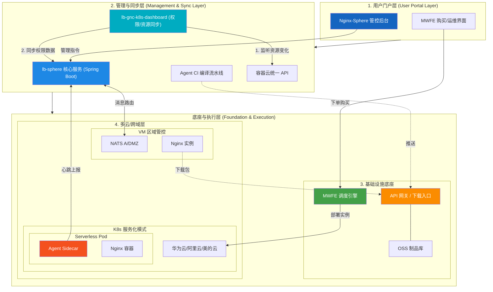

## 一、项目概述

### 1.1 项目背景与定位

Nginx-Sphere 作为一个企业级 Nginx 全生命周期管理系统，平台旨在解决传统运维中配置分散、变更风险高、缺乏统一管控等痛点。该平台支持虚拟机 (VM) 模式和容器化 (K8S) 模式两种部署形态，实现了从版本管理、自动化分发安装、配置管理、性能监控到服务化部署的全流程闭环管理。目前，该平台已在全公司测试与生产环境深度落地，稳定承载了多区域 5000+ Nginx 实例的全量精细化管控。

### 1.2 项目规模与影响力

- **服务范围**: 覆盖公司内部多个区域(顺德、贵安、多个公有云区域等)
- **管理实例**: 管理公司内部 5000+ Nginx 实例，支持近百台 Nginx 实例的统一管控
- **部署模式**: 同时支持传统 VM 部署和云原生 K8s 容器化部署
- **技术创新**: 国内首批实现 Nginx Serverless 化的企业级实践

## 二、系统架构设计
### 2.1 整体架构图


### 2.2 核心模块职责划分

| 模块名称 | 技术栈 | 核心职责 | 部署位置 |
|---------|--------|---------|---------|
| **lb-sphere** | Java 21, Spring Boot 3.2, MyBatis-Plus | **Nginx-Sphere 核心管控端**: 负责虚拟机(VM)及容器化 Nginx 的**统一管控与全生命周期管理**; 实现 Nginx 及其运维 Agent 的**自动化安装部署**、配置管理、高性能指令分发。通过 **APISIX 网关** 实现高可用接入。 | **双活部署**: 南海生产集群 & 贵安生产集群，通过APISIX 网关实现统一接入 |
| **lb-gnc-k8s-dashboard** | Java 21, Spring Boot 3.2, K8s Client | 监听 K8s 资源变化, 同步权限/实例数据到数据库。作为数据辅助模块, 无需多活。 | 南海生产集群 (单地域) |
| **nginx-agent** | Rust, Axum, Tokio, NATS | 高性能 Agent: 部署于端侧, 执行配置热更新、监控指标上报、进程生命周期管理。 | Nginx 主机 / Pod Sidecar |
| **nginx-serverless** | Helm Chart, Docker | **服务化方案**: 结合 Nginx + Agent 设计容器化镜像及全量生命周期管理 Helm 策略。 | Kubernetes 集群 (多云) |

## 三、核心功能模块详解

### 3.1 控制台模块 (lb-sphere)

#### 3.1.1 模块架构

`lb-sphere` 整体采用**多模块解耦架构**设计，确保了在双活部署及大规模并发场景下的稳定性：

*   **lb-controller**: 系统入口。负责暴露 RESTful API 接口、Web 端安全认证过滤器以及前端参数的合法性校验。
*   **lb-service**: 业务逻辑中枢。包含了 Nginx 核心配置解析、各区域 NATS 指令调度、Agent 升级策略以及与缓存系统的交互核心。
*   **lb-repository**: 数据访问层。基于 MyBatis-Plus 实现对 MariaDB 的高性能持久化操作，管理全量 Nginx 实例与资产的元数据状态。
*   **lb-model**: 模型层。统一定义 DTO（各层级数据交互对象）、Entity（数据库物理模型）及业务相关的枚举规范。
*   **lb-3rd**: 集成层。封装了对 CMDB 的资产同步逻辑，以及调用特定容器云 API 进行鉴权数据同步的接口。在服务化集成方面，通过提供标准化 Nginx+Agent 镜像给 MWFE，由 MWFE 负责 K8s 实例创建；管控端通过 NATS 与容器内 Agent 无缝交互，实现了与各云厂商底层 K8s 集群的解耦。

#### 3.1.2 核心功能矩阵

1.  **分域分环境实例管控**:
    - 支持虚拟机（VM）与容器化（K8s）环境下的 Nginx 及 Agent 的**全自动化安装部署**。
    - 实现对存量、老旧 Nginx 节点的快速收编与灰度接管。

2.  **企业级配置治理**:
    - 基于“草稿-发布”模型的配置版本化管理，支持一键回滚。
    - 提供高风险指令的安全过滤及配置语法合法性预检查（`nginx -t`）。

3.  **高性能指令调度**:
    - 针对常规内网、DMZ 等不同网络防区，通过 NATS 消息路由实现**毫秒级**指令下发。
    - `NginxDispatcher` 实现批量操作的流水线管理。

4.  **云原生服务化协同**:
    - 提供标准化 Nginx 容器镜像供 MWFE 集成，用户下单后由 MWFE 驱动云环境自动创建 Nginx 实例。
    - 实例内的 Agent 自动向管控端注册并保持心跳，平台无感对接各类底层云环境，实现了多云集群的统一透明纳管。
  
5.  **核心安全审计**:
    - 细粒度的 **RBAC 权限模型**，对所有配置变更（Reload/Restart等）进行全生命周期审计记录。

#### 3.1.3 技术栈详解

| 技术组件 | 版本 | 核心用途与实现细节 |
|---------|------|------|
| **Java / Spring Boot** | 21 / 3.2.x | 采用最新的 Java 21 LTS 版本，利用其优秀的性能与现代化开发范式。 |
| **MariaDB** | 10.5+ | 存储全量实例元数据、多版本配置快照及资产同步记录。 |
| **Redis** | 6.0+ | **高性能权限缓存**。针对复杂的 RBAC 权限（RBAC + 环境/系统多维管控），通过 Redis 缓存 `PermAuthDataDto`（24H 有效期），规避频繁的多表关联查询。 |
| **Redisson** | 3.26.0 | **Redis 高性能客户端底座**。目前作为通用 Redis 操作客户端引入，并为后续支持**分布式大对象（RMap）**或高级并发原语预留架构底座（当前业务分布任务锁采用 Shedlock + JDBC 实现）。 |
| **NATS** | 2.17.x | 替代传统 HTTP/SSH，实现轻量级、高性能、穿透多内网区域的指令下发通道。 |
| **Shedlock** | 5.x | 配合 JDBC Provider，保障双活部署（南海/贵安）模式下，资产定时同步任务的排他执行。 |
| **MyBatis-Plus** | 3.5.x | 实现低侵入、灵活的持久化交互逻辑。 |

---

### 3.2 权限与元数据同步模块 (lb-gnc-k8s-dashboard)

`lb-gnc-k8s-dashboard` 作为独立的 Kubernetes 资源监控和平台元数据支撑中心，保障了主控端免受 Kubernetes 集群事件洪峰的直接冲击。

#### 3.2.1 核心业务链路

1.  **Kubernetes 资源静默监听**
    - 利用 K8s Client Java 提供的 `SharedInformerFactory`，实时监听所在集群的 **Namespace**, **Service**, 以及 **RoleBinding** 事件状态。
    - 将无序的集群变动转化为规范的资源实体，并提取对应微服务所需的鉴权数据结构。
2.  **核心业务表同步 (自动同步引擎)**
    - 将资源变动数据自动化拆解，并幂等同步至公共业务表 (如 `lb_cluster_info`, `lb_service_group_info`, `lb_service_info`, `lb_role_info`)。
    - 解耦设计：通过数据库进行数据交互，避免 `lb-sphere` 直接压垮或高频轮询 K8s API。
3.  **权限中枢与 AK/SK 基础设施**
    - 管理整个体系的 Access Key 和 Secret Key 配置下发。
    - 提供以系统级、服务级的多维 RBAC 权限授权树。
    - **联动缓存**：为主管控端（`lb-sphere`）直接提供稳定的业务权限表查询基础，从而支撑 Redis（Auth Cache）的高性能认证过滤逻辑。

#### 3.2.2 技术栈视角

| 技术组件 | 核心用途与实现层细节 |
|---------|------|
| **K8s Client Java** | 提供原生、高性能的 API Client 与资源监听 (Informer) 支持。 |
| **Spring Boot 3.2** | 轻量级应用骨架，专门剥离出单独的容器进行运行，保证核心调度模块不被 K8s 监听事件阻塞。 |
| **MariaDB / MyBatis-Plus** | 作为数据承载中心进行双活高并发写操作（接收同步链路）。 |
| **MapStruct** | 在 K8s 原生泛型资源对象与本地持久化实体 (Entity/DTO) 间进行高性能的映射转换。 |

---

## 3.3 Agent 终端引擎 (nginx-agent)

#### 3.3.1 核心支持指令与职责边界

`nginx-agent` 是部署在边缘侧的管控触角。在双模部署下（VM/K8s Sidecar），其指令操作具有严格的职责边界划分：

1.  **高级配置管控 (Config Ops)**
    - 从 `lb-sphere` 主控端通过 REST/NATS 接收指令下发。
    - 负责 Nginx 配置文件的热更新、备份与历史版本原子还原。
    - **所有环境均支持**。
2.  **存活状态与性能遥测 (Status & Telemetry)**
    - 周期性向服务器维持 **NATS 心跳注册**。
    - 上报 Nginx 实时性能指标（连接数/并发数）以及宿主机/Pod 的 OS 级负载状态（CPU/内存）。
    - **所有环境均支持**。
3.  **核心 Nginx 指令与生命周期 (Lifecycle Constraints)**
    - **语法校验** (`nginx -t`)：检查待下发配置的合法性。**所有环境均支持**。
    - **平滑重载** (`nginx -s reload`)：发送 HUP 信号重载配置。**所有环境均支持**。
    - **启停指令** (`start / stop / restart`)：
        - **VM 模式**：完全支持。
        - **K8s 容器模式**：**强制禁用 (拦截)**。在云原生架构下，由宿主进程干预容器内主进程的存活是反模式的，所有实例的存活、重建与扩缩容必须通过 MWFE 调用 K8s API (Scale Up/Down) 在平台层解决。

#### 3.3.2 容器化 Sidecar 的隔离与控制哲学

为了在容器化场景中实现 Agent 对 Nginx 主进程的精细控制，系统利用 K8s 原生特性实现了 **“进程级的有限共享”与“文件级的精细挂载”**：

1.  **进程可见性穿透 (`shareProcessNamespace: true`)**
    - 默认状态下两个容器的 PID 空间相互隔离。开启共享后，处于不同容器内的 Nginx 与 Agent 被纳入同一 PID Namespace。
    - **架构效果**：Agent 因此能“看见” `nginx master process`，从而在执行 Reload 时拥有权限向主进程精确投递 `kill -HUP` 信号。
2.  **物理存储多维共享 (The Physics of Mounting)**
    - **配置共享** (`nginx-config-volume`)：Agent 与 Nginx 共享 `/apps/conf/nginx`，让 Agent 写入的配置文件对 Nginx 可见。
    - **PID 共享** (`nginx-run-volume`)：共享 `/apps/svr/run`，让 Agent 能精准读取 Nginx 主进程生成的 `nginx.pid`。
    - **二进制执行环境征用** (`nginx-bin-volume` & `nginx-lib-volume`)：Agent 容器本身不安装 Nginx。它通过挂载 Nginx 的执行路径和动态链接库，直接复用 Nginx 容器的二进制文件来执行轻量级的 `nginx -t` 语法检测，做到了极致轻量。

#### 3.3.3 技术体系

- **Rust**: 采用高性能、内存安全的 Rust 语言编写（编译目标支持多操作系统分发）。
- **Axum + Tokio**: 基于 Tokio 的异步运行时，使用 Axum 提供极高吞吐量的 Web 框架能力。
- **Async NATS**: 使用异步客户端在内外防区间建立海量心跳与指令双向通道。

#### 3.3.3 部署模式

**VM 模式**:
- 安装路径: `/apps/nginx-agent/`
- 独立进程运行
- 通过 systemd 管理

**K8s Sidecar 模式**:
- 与 Nginx 容器共享 Pod
- 共享进程命名空间(`shareProcessNamespace: true`)
- 共享配置文件卷

---

### 3.4 Nginx 服务化模块 (nginx-serverless)

#### 3.4.1 核心设计

**Pod 结构**:
```yaml
Pod: nginx-serverless
├── Container 1: Nginx
│   └── 挂载: /apps/conf/nginx (配置)
│            /apps/svr/run (PID)
│            /apps/logs (日志)
└── Container 2: Agent Sidecar
    └── 挂载: /apps/conf/nginx (配置)
             /apps/svr/run (PID)
             /apps/svr/nginx/sbin (二进制)
             /usr/lib64/nginx-libs (动态库)
```
#### 3.4.2 核心机制

1. **进程隔离与共享**
   - 通过 `shareProcessNamespace: true` 实现进程可见性
   - Agent 可以向 Nginx 进程发送信号(如 `kill -HUP` 实现 Reload)

2. **文件系统共享**
   - 使用 `emptyDir` 卷作为共享存储
   - Agent 写入配置,Nginx 读取配置
   - Agent 读取 `nginx.pid` 文件获取进程 ID

3. **配置持久化策略**
   - **物理存储**: Pod 临时卷(`emptyDir`)
   - **逻辑存储**: MariaDB 数据库(Source of Truth)
   - **恢复机制**: Pod 重启后,Agent 自动从控制台拉取配置

4. **生命周期管理**
   - **创建**: MWFE 执行 `helm install` → 回调控制台 → 同步数据库
   - **扩缩容**: MWFE 执行 `helm upgrade` → 回调控制台 → 更新 Pod 列表
   - **删除**: MWFE 执行 `helm uninstall` → 回调控制台 → 标记删除

#### 3.4.3 操作支持矩阵

| 操作 | VM 模式 | K8s 模式 | 说明 |
|------|---------|----------|------|
| **Test** | ✅ | ✅ | `nginx -t` 语法检查 |
| **Reload** | ✅ | ✅ | `nginx -s reload` 热加载 |
| **Config CRUD** | ✅ | ✅ | 配置文件读写 |
| **Status** | ✅ | ✅ | 进程状态查询 |
| **Start** | ✅ | ❌ | K8s 由 kubelet 管理 |
| **Stop** | ✅ | ❌ | 停止会导致容器 Crash |
| **Restart** | ✅ | ❌ | 需通过 `kubectl delete pod` |

---

## 四、数据流转与交互流程

### 4.1 配置下发流程(VM 模式)


